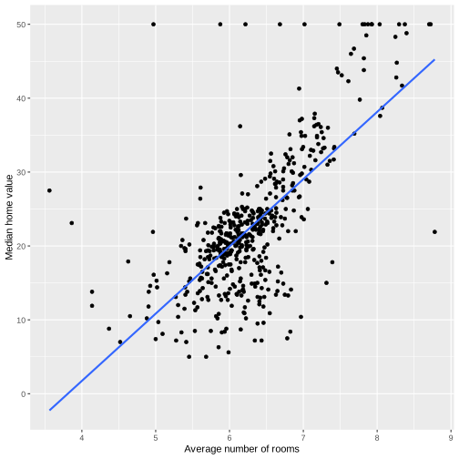

# Housing Values in Boston- Linear Regression 

---
The Boston housing dataset contused in this analysis contains information about median house value for 506 neighborhoods in Boston, MA. It is collected in 1970s. 

The variables in the data are: 

-crim per capita crime rate by heighborhood.

-zn proportion of residential land zoned for lots over 25,000 sq.ft.

-indus proportion of non-retail business acres per neighborhood.

-chas Charles River dummy variable (= 1 if tract bounds river; 0 otherwise). nox nitrogen oxides concentration (parts per 10 million).
rm average number of rooms per dwelling.

-age proportion of owner-occupied units built prior to 1940.

-dis weighted mean of distances to five Boston employment centres.

-rad index of accessibility to radial highways.

-tax full-value property-tax rate per $10,000

-ptratio pupil-teacher ratio by neighborhood.

-black 1000(Bk − 0.63)2 where Bk is the proportion of blacks by neighborhood. 

-lstat lower status of the population (percent).

-medv median value of owner-occupied homes in $1000s. 

# Setup
Loading libraries tidyverse


```R
# Load standard libraries
library("tidyverse")
```

    ── Attaching core tidyverse packages ──────────────────────── tidyverse 2.0.0 ──
    ✔ dplyr     1.1.4     ✔ readr     2.1.4
    ✔ forcats   1.0.0     ✔ stringr   1.5.1
    ✔ ggplot2   3.4.4     ✔ tibble    3.2.1
    ✔ lubridate 1.9.3     ✔ tidyr     1.3.0
    ✔ purrr     1.0.2     
    ── Conflicts ────────────────────────────────────────── tidyverse_conflicts() ──
    ✖ dplyr::filter() masks stats::filter()
    ✖ dplyr::lag()    masks stats::lag()
    ℹ Use the conflicted package (<http://conflicted.r-lib.org/>) to force all conflicts to become errors


Here we do the data cleaning of the Boston datase to make sure there aren't any missings.
We can see that there are 14 variables and 506 obs in boston data frame.


```R
boston<-read.delim("boston.csv.bz2")
head(na.omit(boston))
summary(boston)
```


<table class="dataframe">
<caption>A data.frame: 6 × 14</caption>
<thead>
	<tr><th></th><th scope=col>crim</th><th scope=col>zn</th><th scope=col>indus</th><th scope=col>chas</th><th scope=col>nox</th><th scope=col>rm</th><th scope=col>age</th><th scope=col>dis</th><th scope=col>rad</th><th scope=col>tax</th><th scope=col>ptratio</th><th scope=col>black</th><th scope=col>lstat</th><th scope=col>medv</th></tr>
	<tr><th></th><th scope=col>&lt;dbl&gt;</th><th scope=col>&lt;dbl&gt;</th><th scope=col>&lt;dbl&gt;</th><th scope=col>&lt;int&gt;</th><th scope=col>&lt;dbl&gt;</th><th scope=col>&lt;dbl&gt;</th><th scope=col>&lt;dbl&gt;</th><th scope=col>&lt;dbl&gt;</th><th scope=col>&lt;int&gt;</th><th scope=col>&lt;int&gt;</th><th scope=col>&lt;dbl&gt;</th><th scope=col>&lt;dbl&gt;</th><th scope=col>&lt;dbl&gt;</th><th scope=col>&lt;dbl&gt;</th></tr>
</thead>
<tbody>
	<tr><th scope=row>1</th><td>0.00632</td><td>18</td><td>2.31</td><td>0</td><td>0.538</td><td>6.575</td><td>65.2</td><td>4.0900</td><td>1</td><td>296</td><td>15.3</td><td>396.90</td><td>4.98</td><td>24.0</td></tr>
	<tr><th scope=row>2</th><td>0.02731</td><td> 0</td><td>7.07</td><td>0</td><td>0.469</td><td>6.421</td><td>78.9</td><td>4.9671</td><td>2</td><td>242</td><td>17.8</td><td>396.90</td><td>9.14</td><td>21.6</td></tr>
	<tr><th scope=row>3</th><td>0.02729</td><td> 0</td><td>7.07</td><td>0</td><td>0.469</td><td>7.185</td><td>61.1</td><td>4.9671</td><td>2</td><td>242</td><td>17.8</td><td>392.83</td><td>4.03</td><td>34.7</td></tr>
	<tr><th scope=row>4</th><td>0.03237</td><td> 0</td><td>2.18</td><td>0</td><td>0.458</td><td>6.998</td><td>45.8</td><td>6.0622</td><td>3</td><td>222</td><td>18.7</td><td>394.63</td><td>2.94</td><td>33.4</td></tr>
	<tr><th scope=row>5</th><td>0.06905</td><td> 0</td><td>2.18</td><td>0</td><td>0.458</td><td>7.147</td><td>54.2</td><td>6.0622</td><td>3</td><td>222</td><td>18.7</td><td>396.90</td><td>5.33</td><td>36.2</td></tr>
	<tr><th scope=row>6</th><td>0.02985</td><td> 0</td><td>2.18</td><td>0</td><td>0.458</td><td>6.430</td><td>58.7</td><td>6.0622</td><td>3</td><td>222</td><td>18.7</td><td>394.12</td><td>5.21</td><td>28.7</td></tr>
</tbody>
</table>


          crim                zn             indus            chas        
     Min.   : 0.00632   Min.   :  0.00   Min.   : 0.46   Min.   :0.00000  
     1st Qu.: 0.08205   1st Qu.:  0.00   1st Qu.: 5.19   1st Qu.:0.00000  
     Median : 0.25651   Median :  0.00   Median : 9.69   Median :0.00000  
     Mean   : 3.61352   Mean   : 11.36   Mean   :11.14   Mean   :0.06917  
     3rd Qu.: 3.67708   3rd Qu.: 12.50   3rd Qu.:18.10   3rd Qu.:0.00000  
     Max.   :88.97620   Max.   :100.00   Max.   :27.74   Max.   :1.00000  
          nox               rm             age              dis        
     Min.   :0.3850   Min.   :3.561   Min.   :  2.90   Min.   : 1.130  
     1st Qu.:0.4490   1st Qu.:5.886   1st Qu.: 45.02   1st Qu.: 2.100  
     Median :0.5380   Median :6.208   Median : 77.50   Median : 3.207  
     Mean   :0.5547   Mean   :6.285   Mean   : 68.57   Mean   : 3.795  
     3rd Qu.:0.6240   3rd Qu.:6.623   3rd Qu.: 94.08   3rd Qu.: 5.188  
     Max.   :0.8710   Max.   :8.780   Max.   :100.00   Max.   :12.127  
          rad              tax           ptratio          black       
     Min.   : 1.000   Min.   :187.0   Min.   :12.60   Min.   :  0.32  
     1st Qu.: 4.000   1st Qu.:279.0   1st Qu.:17.40   1st Qu.:375.38  
     Median : 5.000   Median :330.0   Median :19.05   Median :391.44  
     Mean   : 9.549   Mean   :408.2   Mean   :18.46   Mean   :356.67  
     3rd Qu.:24.000   3rd Qu.:666.0   3rd Qu.:20.20   3rd Qu.:396.23  
     Max.   :24.000   Max.   :711.0   Max.   :22.00   Max.   :396.90  
         lstat            medv      
     Min.   : 1.73   Min.   : 5.00  
     1st Qu.: 6.95   1st Qu.:17.02  
     Median :11.36   Median :21.20  
     Mean   :12.65   Mean   :22.53  
     3rd Qu.:16.95   3rd Qu.:25.00  
     Max.   :37.97   Max.   :50.00  


Next, we are estimating a series of simple regression models. We are modeling the neighborhood median house price medv and using the following predictors: rm and lstat.
Here, the scatterplot that displays how medv is related to that predictor and I add a  regression line to that plot. We can see that average number of rooms per dwelling and median value of owner-occupied homes has a positive relation, while the lower status of the population (percent) and the median value of owner-occupied homes has a negative relation.


```R
ggplot(boston, aes(rm, medv)) +
geom_point() +
geom_smooth(method="lm", se=FALSE) +
labs(x="Average number of rooms", y="Median home value")

ggplot(boston, aes(lstat, medv)) +
geom_point() +
geom_smooth(method="lm", se=FALSE) +
labs(x="Percentage of Lower Status of the Population", y="Median home value")

```

    `geom_smooth()` using formula = 'y ~ x'
    `geom_smooth()` using formula = 'y ~ x'


    

    


    

    


## Simple regression to predict medium home value
Here we make a simple linear regression model to predict the response. 

rm&medv-The slope for rm and medv is  9.102, since the p-value is extremely small(<2e-16), it is statistical significant. When the house size(average number of rooms) is larger will make the median value of homes bigger. I do think there is a positive relation between the two factors because usually bigger houses are more expensive.

lstat&medv-The slope for lstat and medv is -0.95005, since the p-value is extremely small(<2e-16), it is statistical significant.When the percentage of lower status of population is larger will make the median value of homes smaller, which means lower status population own smaller houses. There is a negative relative between the two factors.

Both the two models are statistical significant. Because the p-values are extremely small, which is <2e-16 and can reject the null hypothesis.

The H0 here is: There is no relation between rm(Average number of rooms) and medv(Median home value)
As we can see in the chart, the t-value here for rm is 21.72, it is calculated by the (estimate-H0)/std dev. 

The critical t-value can be found from the t-table. Under the confidence interval 95%, the df=1000, the critical t-value is 1.96. While the t-value is 21.72, which is much more larger than the critical t-value. We can reject the null hypothesis and prove that the model is statistically significant.


```R
rm_model <- lm(medv ~ rm, data = boston)
summary(rm_model)

lstat_model <- lm(medv ~ lstat, data = boston)
summary(lstat_model)
```


    
    Call:
    lm(formula = medv ~ rm, data = boston)
    
    Residuals:
        Min      1Q  Median      3Q     Max 
    -23.346  -2.547   0.090   2.986  39.433 
    
    Coefficients:
                Estimate Std. Error t value Pr(>|t|)    
    (Intercept)  -34.671      2.650  -13.08   <2e-16 ***
    rm             9.102      0.419   21.72   <2e-16 ***
    ---
    Signif. codes:  0 ‘***’ 0.001 ‘**’ 0.01 ‘*’ 0.05 ‘.’ 0.1 ‘ ’ 1
    
    Residual standard error: 6.616 on 504 degrees of freedom
    Multiple R-squared:  0.4835,	Adjusted R-squared:  0.4825 
    F-statistic: 471.8 on 1 and 504 DF,  p-value: < 2.2e-16


    
    Call:
    lm(formula = medv ~ lstat, data = boston)
    
    Residuals:
        Min      1Q  Median      3Q     Max 
    -15.168  -3.990  -1.318   2.034  24.500 
    
    Coefficients:
                Estimate Std. Error t value Pr(>|t|)    
    (Intercept) 34.55384    0.56263   61.41   <2e-16 ***
    lstat       -0.95005    0.03873  -24.53   <2e-16 ***
    ---
    Signif. codes:  0 ‘***’ 0.001 ‘**’ 0.01 ‘*’ 0.05 ‘.’ 0.1 ‘ ’ 1
    
    Residual standard error: 6.216 on 504 degrees of freedom
    Multiple R-squared:  0.5441,	Adjusted R-squared:  0.5432 
    F-statistic: 601.6 on 1 and 504 DF,  p-value: < 2.2e-16


# Simple regression to predict medium home value¶

Here we fit a multiple regression model to predict the response using all the predictors. 

One unit higher rm(average number of rooms per dwelling) gives 5 units higher home value while other variables does
not change.
One unit higher lstat(lower status of the population (percent)) gives 0.6 units lower home value while other variables does
not change.
One unit higher indus(proportion of non-retail business acres per neighborhood) gives 0.06 units lower home value while other variables does not change, but the p-value here is too large to reject the hypothesis.
Therefore, we can lead to the conclusion that rm, lstat variables are highly statistically significant, while indus variable is not statistical significant.


```R
multiple_model <- lm(medv ~ rm+lstat+crim, data = boston)
summary(multiple_model)
```


    
    Call:
    lm(formula = medv ~ rm + lstat + crim, data = boston)
    
    Residuals:
        Min      1Q  Median      3Q     Max 
    -17.925  -3.567  -1.157   1.906  29.024 
    
    Coefficients:
                Estimate Std. Error t value Pr(>|t|)    
    (Intercept) -2.56225    3.16602  -0.809  0.41873    
    rm           5.21695    0.44203  11.802  < 2e-16 ***
    lstat       -0.57849    0.04767 -12.135  < 2e-16 ***
    crim        -0.10294    0.03202  -3.215  0.00139 ** 
    ---
    Signif. codes:  0 ‘***’ 0.001 ‘**’ 0.01 ‘*’ 0.05 ‘.’ 0.1 ‘ ’ 1
    
    Residual standard error: 5.49 on 502 degrees of freedom
    Multiple R-squared:  0.6459,	Adjusted R-squared:  0.6437 
    F-statistic: 305.2 on 3 and 502 DF,  p-value: < 2.2e-16


## Compare the results from simple regression and multiple regression
The conclusion is the same in both models but the B0(intercept) and B1(slope) value is slightly different.
for B1
simple regression:rm:9.102, lstat:-0.95005, crim:-0.41519 
multiple regression:rm:5.21695, lstat:-0.57849, crim:-0.10294

The values may differ because the coeffcient is different inn different models, in multiple regression, the indirect factors will also have influence on each other. Simple regression is suitable when examining the direct relationship between two variables, whereas multiple regression is appropriate when analyzing the joint impact of multiple predictors on a dependent variable. 


```R

```
