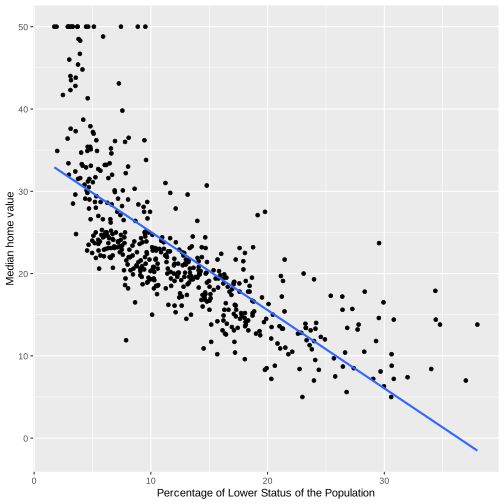

# Housing Values in Boston- Linear Regression 

---
The Boston housing dataset contused in this analysis contains information about median house value for 506 neighborhoods in Boston, MA. It is collected in 1970s. 

The variables in the data are: 

-crim per capita crime rate by heighborhood.

-zn proportion of residential land zoned for lots over 25,000 sq.ft.

-indus proportion of non-retail business acres per neighborhood.

-chas Charles River dummy variable (= 1 if tract bounds river; 0 otherwise). nox nitrogen oxides concentration (parts per 10 million).
rm average number of rooms per dwelling.

-age proportion of owner-occupied units built prior to 1940.

-dis weighted mean of distances to five Boston employment centres.

-rad index of accessibility to radial highways.

-tax full-value property-tax rate per $10,000

-ptratio pupil-teacher ratio by neighborhood.

-black 1000(Bk − 0.63)2 where Bk is the proportion of blacks by neighborhood. 

-lstat lower status of the population (percent).

-medv median value of owner-occupied homes in $1000s. 

# Setup
Loading libraries tidyverse


```R
# Load standard libraries
library("tidyverse")

Here we do the data cleaning of the Boston datase to make sure there aren't any missings.
We can see that there are 14 variables and 506 obs in boston data frame.


```R
boston<-read.delim("boston.csv.bz2")
head(na.omit(boston))
summary(boston)
```


          crim                zn             indus            chas        
     Min.   : 0.00632   Min.   :  0.00   Min.   : 0.46   Min.   :0.00000  
     1st Qu.: 0.08205   1st Qu.:  0.00   1st Qu.: 5.19   1st Qu.:0.00000  
     Median : 0.25651   Median :  0.00   Median : 9.69   Median :0.00000  
     Mean   : 3.61352   Mean   : 11.36   Mean   :11.14   Mean   :0.06917  
     3rd Qu.: 3.67708   3rd Qu.: 12.50   3rd Qu.:18.10   3rd Qu.:0.00000  
     Max.   :88.97620   Max.   :100.00   Max.   :27.74   Max.   :1.00000  
          nox               rm             age              dis        
     Min.   :0.3850   Min.   :3.561   Min.   :  2.90   Min.   : 1.130  
     1st Qu.:0.4490   1st Qu.:5.886   1st Qu.: 45.02   1st Qu.: 2.100  
     Median :0.5380   Median :6.208   Median : 77.50   Median : 3.207  
     Mean   :0.5547   Mean   :6.285   Mean   : 68.57   Mean   : 3.795  
     3rd Qu.:0.6240   3rd Qu.:6.623   3rd Qu.: 94.08   3rd Qu.: 5.188  
     Max.   :0.8710   Max.   :8.780   Max.   :100.00   Max.   :12.127  
          rad              tax           ptratio          black       
     Min.   : 1.000   Min.   :187.0   Min.   :12.60   Min.   :  0.32  
     1st Qu.: 4.000   1st Qu.:279.0   1st Qu.:17.40   1st Qu.:375.38  
     Median : 5.000   Median :330.0   Median :19.05   Median :391.44  
     Mean   : 9.549   Mean   :408.2   Mean   :18.46   Mean   :356.67  
     3rd Qu.:24.000   3rd Qu.:666.0   3rd Qu.:20.20   3rd Qu.:396.23  
     Max.   :24.000   Max.   :711.0   Max.   :22.00   Max.   :396.90  
         lstat            medv      
     Min.   : 1.73   Min.   : 5.00  
     1st Qu.: 6.95   1st Qu.:17.02  
     Median :11.36   Median :21.20  
     Mean   :12.65   Mean   :22.53  
     3rd Qu.:16.95   3rd Qu.:25.00  
     Max.   :37.97   Max.   :50.00  


Next, we are estimating a series of simple regression models. We are modeling the neighborhood median house price medv and using the following predictors: rm and lstat.
Here, the scatterplot that displays how medv is related to that predictor and I add a  regression line to that plot. We can see that average number of rooms per dwelling and median value of owner-occupied homes has a positive relation, while the lower status of the population (percent) and the median value of owner-occupied homes has a negative relation.


```R
ggplot(boston, aes(rm, medv)) +
geom_point() +
geom_smooth(method="lm", se=FALSE) +
labs(x="Average number of rooms", y="Median home value")

ggplot(boston, aes(lstat, medv)) +
geom_point() +
geom_smooth(method="lm", se=FALSE) +
labs(x="Percentage of Lower Status of the Population", y="Median home value")

```
    ![Uploading output_6_1.svg…]<?xml version="1.0" encoding="UTF-8"?>
<svg xmlns="http://www.w3.org/2000/svg" xmlns:xlink="http://www.w3.org/1999/xlink" width="504" height="504" viewBox="0 0 504 504">
<defs>
<g>
<g id="glyph-0-0">
<path d="M 4.546875 -3.03125 C 4.546875 -2.445312 4.488281 -1.957031 4.375 -1.5625 C 4.269531 -1.164062 4.117188 -0.84375 3.921875 -0.59375 C 3.734375 -0.351562 3.507812 -0.179688 3.25 -0.078125 C 3 0.0234375 2.726562 0.078125 2.4375 0.078125 C 2.144531 0.078125 1.867188 0.0234375 1.609375 -0.078125 C 1.359375 -0.179688 1.140625 -0.351562 0.953125 -0.59375 C 0.765625 -0.84375 0.613281 -1.164062 0.5 -1.5625 C 0.394531 -1.957031 0.34375 -2.445312 0.34375 -3.03125 C 0.34375 -3.632812 0.394531 -4.132812 0.5 -4.53125 C 0.613281 -4.9375 0.765625 -5.257812 0.953125 -5.5 C 1.140625 -5.738281 1.359375 -5.90625 1.609375 -6 C 1.867188 -6.09375 2.15625 -6.140625 2.46875 -6.140625 C 2.75 -6.140625 3.015625 -6.09375 3.265625 -6 C 3.523438 -5.90625 3.75 -5.738281 3.9375 -5.5 C 4.125 -5.257812 4.269531 -4.9375 4.375 -4.53125 C 4.488281 -4.132812 4.546875 -3.632812 4.546875 -3.03125 Z M 3.765625 -3.03125 C 3.765625 -3.507812 3.734375 -3.90625 3.671875 -4.21875 C 3.617188 -4.539062 3.535156 -4.796875 3.421875 -4.984375 C 3.304688 -5.179688 3.164062 -5.316406 3 -5.390625 C 2.84375 -5.472656 2.664062 -5.515625 2.46875 -5.515625 C 2.25 -5.515625 2.054688 -5.472656 1.890625 -5.390625 C 1.722656 -5.316406 1.582031 -5.179688 1.46875 -4.984375 C 1.351562 -4.796875 1.265625 -4.539062 1.203125 -4.21875 C 1.148438 -3.90625 1.125 -3.507812 1.125 -3.03125 C 1.125 -2.5625 1.148438 -2.164062 1.203125 -1.84375 C 1.265625 -1.53125 1.351562 -1.273438 1.46875 -1.078125 C 1.582031 -0.890625 1.71875 -0.753906 1.875 -0.671875 C 2.039062 -0.585938 2.226562 -0.546875 2.4375 -0.546875 C 2.644531 -0.546875 2.828125 -0.585938 2.984375 -0.671875 C 3.148438 -0.753906 3.289062 -0.890625 3.40625 -1.078125 C 3.519531 -1.273438 3.609375 -1.53125 3.671875 -1.84375 C 3.734375 -2.164062 3.765625 -2.5625 3.765625 -3.03125 Z M 3.765625 -3.03125 "/>
</g>
<g id="glyph-0-1">
<path d="M 0.671875 0 L 0.671875 -0.65625 L 2.21875 -0.65625 L 2.21875 -5.3125 L 0.84375 -4.34375 L 0.84375 -5.0625 L 2.28125 -6.046875 L 2.984375 -6.046875 L 2.984375 -0.65625 L 4.46875 -0.65625 L 4.46875 0 Z M 0.671875 0 "/>
</g>
<g id="glyph-0-2">
<path d="M 0.4375 0 L 0.4375 -0.546875 C 0.582031 -0.878906 0.757812 -1.171875 0.96875 -1.421875 C 1.1875 -1.679688 1.410156 -1.914062 1.640625 -2.125 C 1.867188 -2.332031 2.097656 -2.523438 2.328125 -2.703125 C 2.554688 -2.878906 2.757812 -3.054688 2.9375 -3.234375 C 3.125 -3.410156 3.273438 -3.597656 3.390625 -3.796875 C 3.503906 -3.992188 3.5625 -4.210938 3.5625 -4.453125 C 3.5625 -4.628906 3.535156 -4.78125 3.484375 -4.90625 C 3.429688 -5.039062 3.351562 -5.148438 3.25 -5.234375 C 3.15625 -5.328125 3.039062 -5.394531 2.90625 -5.4375 C 2.769531 -5.476562 2.617188 -5.5 2.453125 -5.5 C 2.296875 -5.5 2.148438 -5.476562 2.015625 -5.4375 C 1.878906 -5.394531 1.757812 -5.332031 1.65625 -5.25 C 1.550781 -5.164062 1.460938 -5.054688 1.390625 -4.921875 C 1.328125 -4.796875 1.285156 -4.648438 1.265625 -4.484375 L 0.484375 -4.5625 C 0.503906 -4.78125 0.5625 -4.984375 0.65625 -5.171875 C 0.75 -5.359375 0.878906 -5.523438 1.046875 -5.671875 C 1.210938 -5.816406 1.410156 -5.929688 1.640625 -6.015625 C 1.878906 -6.097656 2.148438 -6.140625 2.453125 -6.140625 C 2.753906 -6.140625 3.019531 -6.101562 3.25 -6.03125 C 3.488281 -5.957031 3.6875 -5.847656 3.84375 -5.703125 C 4.007812 -5.566406 4.132812 -5.394531 4.21875 -5.1875 C 4.3125 -4.988281 4.359375 -4.753906 4.359375 -4.484375 C 4.359375 -4.273438 4.320312 -4.078125 4.25 -3.890625 C 4.175781 -3.710938 4.078125 -3.539062 3.953125 -3.375 C 3.828125 -3.207031 3.6875 -3.046875 3.53125 -2.890625 C 3.375 -2.742188 3.207031 -2.59375 3.03125 -2.4375 C 2.851562 -2.289062 2.675781 -2.144531 2.5 -2 C 2.320312 -1.863281 2.15625 -1.722656 2 -1.578125 C 1.84375 -1.429688 1.703125 -1.28125 1.578125 -1.125 C 1.453125 -0.976562 1.359375 -0.820312 1.296875 -0.65625 L 4.453125 -0.65625 L 4.453125 0 Z M 0.4375 0 "/>
</g>
<g id="glyph-0-3">
<path d="M 4.5 -1.671875 C 4.5 -1.390625 4.453125 -1.140625 4.359375 -0.921875 C 4.273438 -0.703125 4.144531 -0.519531 3.96875 -0.375 C 3.800781 -0.226562 3.585938 -0.113281 3.328125 -0.03125 C 3.078125 0.0390625 2.785156 0.078125 2.453125 0.078125 C 2.078125 0.078125 1.757812 0.0351562 1.5 -0.046875 C 1.25 -0.140625 1.039062 -0.265625 0.875 -0.421875 C 0.707031 -0.578125 0.582031 -0.75 0.5 -0.9375 C 0.414062 -1.132812 0.359375 -1.34375 0.328125 -1.5625 L 1.140625 -1.625 C 1.160156 -1.46875 1.203125 -1.320312 1.265625 -1.1875 C 1.328125 -1.0625 1.410156 -0.945312 1.515625 -0.84375 C 1.617188 -0.75 1.75 -0.675781 1.90625 -0.625 C 2.0625 -0.570312 2.242188 -0.546875 2.453125 -0.546875 C 2.835938 -0.546875 3.140625 -0.640625 3.359375 -0.828125 C 3.585938 -1.023438 3.703125 -1.316406 3.703125 -1.703125 C 3.703125 -1.921875 3.648438 -2.097656 3.546875 -2.234375 C 3.453125 -2.367188 3.332031 -2.472656 3.1875 -2.546875 C 3.039062 -2.628906 2.878906 -2.679688 2.703125 -2.703125 C 2.523438 -2.734375 2.363281 -2.75 2.21875 -2.75 L 1.78125 -2.75 L 1.78125 -3.421875 L 2.203125 -3.421875 C 2.347656 -3.421875 2.5 -3.429688 2.65625 -3.453125 C 2.820312 -3.484375 2.96875 -3.535156 3.09375 -3.609375 C 3.226562 -3.691406 3.335938 -3.800781 3.421875 -3.9375 C 3.503906 -4.070312 3.546875 -4.242188 3.546875 -4.453125 C 3.546875 -4.773438 3.445312 -5.03125 3.25 -5.21875 C 3.0625 -5.40625 2.78125 -5.5 2.40625 -5.5 C 2.070312 -5.5 1.796875 -5.410156 1.578125 -5.234375 C 1.367188 -5.066406 1.25 -4.820312 1.21875 -4.5 L 0.4375 -4.5625 C 0.46875 -4.832031 0.539062 -5.066406 0.65625 -5.265625 C 0.769531 -5.460938 0.914062 -5.625 1.09375 -5.75 C 1.269531 -5.882812 1.46875 -5.984375 1.6875 -6.046875 C 1.914062 -6.109375 2.160156 -6.140625 2.421875 -6.140625 C 2.753906 -6.140625 3.039062 -6.097656 3.28125 -6.015625 C 3.53125 -5.929688 3.734375 -5.816406 3.890625 -5.671875 C 4.046875 -5.523438 4.160156 -5.351562 4.234375 -5.15625 C 4.304688 -4.96875 4.34375 -4.765625 4.34375 -4.546875 C 4.34375 -4.367188 4.316406 -4.203125 4.265625 -4.046875 C 4.210938 -3.890625 4.132812 -3.75 4.03125 -3.625 C 3.9375 -3.5 3.804688 -3.390625 3.640625 -3.296875 C 3.484375 -3.210938 3.296875 -3.148438 3.078125 -3.109375 L 3.078125 -3.09375 C 3.316406 -3.0625 3.523438 -3.003906 3.703125 -2.921875 C 3.890625 -2.835938 4.039062 -2.734375 4.15625 -2.609375 C 4.269531 -2.484375 4.351562 -2.335938 4.40625 -2.171875 C 4.46875 -2.015625 4.5 -1.847656 4.5 -1.671875 Z M 4.5 -1.671875 "/>
</g>
<g id="glyph-0-4">
<path d="M 3.78125 -1.375 L 3.78125 0 L 3.046875 0 L 3.046875 -1.375 L 0.203125 -1.375 L 0.203125 -1.96875 L 2.96875 -6.046875 L 3.78125 -6.046875 L 3.78125 -1.984375 L 4.640625 -1.984375 L 4.640625 -1.375 Z M 3.046875 -5.1875 C 3.046875 -5.164062 3.035156 -5.132812 3.015625 -5.09375 C 2.992188 -5.050781 2.96875 -5.003906 2.9375 -4.953125 C 2.90625 -4.898438 2.875 -4.847656 2.84375 -4.796875 C 2.8125 -4.742188 2.785156 -4.703125 2.765625 -4.671875 L 1.21875 -2.390625 C 1.195312 -2.359375 1.171875 -2.320312 1.140625 -2.28125 C 1.117188 -2.25 1.09375 -2.210938 1.0625 -2.171875 C 1.039062 -2.140625 1.015625 -2.101562 0.984375 -2.0625 C 0.953125 -2.03125 0.929688 -2.003906 0.921875 -1.984375 L 3.046875 -1.984375 Z M 3.046875 -5.1875 "/>
</g>
<g id="glyph-0-5">
<path d="M 4.515625 -1.96875 C 4.515625 -1.664062 4.46875 -1.390625 4.375 -1.140625 C 4.289062 -0.890625 4.15625 -0.671875 3.96875 -0.484375 C 3.789062 -0.304688 3.566406 -0.164062 3.296875 -0.0625 C 3.035156 0.03125 2.726562 0.078125 2.375 0.078125 C 2.0625 0.078125 1.785156 0.0390625 1.546875 -0.03125 C 1.304688 -0.101562 1.101562 -0.203125 0.9375 -0.328125 C 0.78125 -0.460938 0.648438 -0.613281 0.546875 -0.78125 C 0.453125 -0.957031 0.390625 -1.148438 0.359375 -1.359375 L 1.140625 -1.4375 C 1.171875 -1.320312 1.210938 -1.210938 1.265625 -1.109375 C 1.328125 -1.003906 1.40625 -0.910156 1.5 -0.828125 C 1.601562 -0.742188 1.722656 -0.675781 1.859375 -0.625 C 2.003906 -0.570312 2.179688 -0.546875 2.390625 -0.546875 C 2.585938 -0.546875 2.769531 -0.578125 2.9375 -0.640625 C 3.101562 -0.703125 3.242188 -0.789062 3.359375 -0.90625 C 3.472656 -1.03125 3.5625 -1.175781 3.625 -1.34375 C 3.6875 -1.519531 3.71875 -1.722656 3.71875 -1.953125 C 3.71875 -2.140625 3.6875 -2.3125 3.625 -2.46875 C 3.570312 -2.625 3.488281 -2.757812 3.375 -2.875 C 3.257812 -2.988281 3.117188 -3.078125 2.953125 -3.140625 C 2.796875 -3.203125 2.613281 -3.234375 2.40625 -3.234375 C 2.28125 -3.234375 2.160156 -3.21875 2.046875 -3.1875 C 1.941406 -3.164062 1.84375 -3.132812 1.75 -3.09375 C 1.65625 -3.0625 1.570312 -3.015625 1.5 -2.953125 C 1.425781 -2.898438 1.351562 -2.847656 1.28125 -2.796875 L 0.53125 -2.796875 L 0.734375 -6.046875 L 4.171875 -6.046875 L 4.171875 -5.390625 L 1.4375 -5.390625 L 1.3125 -3.46875 C 1.457031 -3.582031 1.628906 -3.675781 1.828125 -3.75 C 2.035156 -3.820312 2.28125 -3.859375 2.5625 -3.859375 C 2.863281 -3.859375 3.132812 -3.8125 3.375 -3.71875 C 3.613281 -3.632812 3.816406 -3.503906 3.984375 -3.328125 C 4.160156 -3.160156 4.289062 -2.960938 4.375 -2.734375 C 4.46875 -2.503906 4.515625 -2.25 4.515625 -1.96875 Z M 4.515625 -1.96875 "/>
</g>
<g id="glyph-0-6">
<path d="M 4.5 -1.984375 C 4.5 -1.679688 4.457031 -1.398438 4.375 -1.140625 C 4.289062 -0.890625 4.164062 -0.671875 4 -0.484375 C 3.84375 -0.304688 3.640625 -0.164062 3.390625 -0.0625 C 3.148438 0.03125 2.867188 0.078125 2.546875 0.078125 C 2.191406 0.078125 1.882812 0.015625 1.625 -0.109375 C 1.363281 -0.242188 1.144531 -0.4375 0.96875 -0.6875 C 0.789062 -0.945312 0.660156 -1.257812 0.578125 -1.625 C 0.492188 -2 0.453125 -2.421875 0.453125 -2.890625 C 0.453125 -3.421875 0.5 -3.890625 0.59375 -4.296875 C 0.695312 -4.703125 0.835938 -5.039062 1.015625 -5.3125 C 1.203125 -5.59375 1.429688 -5.800781 1.703125 -5.9375 C 1.972656 -6.070312 2.273438 -6.140625 2.609375 -6.140625 C 2.816406 -6.140625 3.007812 -6.117188 3.1875 -6.078125 C 3.375 -6.035156 3.539062 -5.960938 3.6875 -5.859375 C 3.832031 -5.765625 3.957031 -5.640625 4.0625 -5.484375 C 4.175781 -5.328125 4.269531 -5.132812 4.34375 -4.90625 L 3.59375 -4.78125 C 3.519531 -5.039062 3.394531 -5.226562 3.21875 -5.34375 C 3.039062 -5.457031 2.835938 -5.515625 2.609375 -5.515625 C 2.390625 -5.515625 2.191406 -5.460938 2.015625 -5.359375 C 1.847656 -5.265625 1.703125 -5.117188 1.578125 -4.921875 C 1.460938 -4.722656 1.375 -4.472656 1.3125 -4.171875 C 1.25 -3.867188 1.21875 -3.515625 1.21875 -3.109375 C 1.351562 -3.367188 1.546875 -3.566406 1.796875 -3.703125 C 2.054688 -3.835938 2.351562 -3.90625 2.6875 -3.90625 C 2.957031 -3.90625 3.203125 -3.859375 3.421875 -3.765625 C 3.648438 -3.679688 3.84375 -3.554688 4 -3.390625 C 4.164062 -3.222656 4.289062 -3.019531 4.375 -2.78125 C 4.457031 -2.539062 4.5 -2.273438 4.5 -1.984375 Z M 3.71875 -1.953125 C 3.71875 -2.160156 3.691406 -2.347656 3.640625 -2.515625 C 3.585938 -2.679688 3.507812 -2.820312 3.40625 -2.9375 C 3.300781 -3.0625 3.171875 -3.15625 3.015625 -3.21875 C 2.867188 -3.28125 2.695312 -3.3125 2.5 -3.3125 C 2.363281 -3.3125 2.222656 -3.289062 2.078125 -3.25 C 1.929688 -3.207031 1.800781 -3.140625 1.6875 -3.046875 C 1.570312 -2.953125 1.476562 -2.828125 1.40625 -2.671875 C 1.332031 -2.523438 1.296875 -2.34375 1.296875 -2.125 C 1.296875 -1.90625 1.320312 -1.695312 1.375 -1.5 C 1.4375 -1.3125 1.519531 -1.144531 1.625 -1 C 1.726562 -0.851562 1.851562 -0.738281 2 -0.65625 C 2.15625 -0.570312 2.332031 -0.53125 2.53125 -0.53125 C 2.71875 -0.53125 2.882812 -0.5625 3.03125 -0.625 C 3.175781 -0.695312 3.300781 -0.789062 3.40625 -0.90625 C 3.507812 -1.03125 3.585938 -1.179688 3.640625 -1.359375 C 3.691406 -1.535156 3.71875 -1.734375 3.71875 -1.953125 Z M 3.71875 -1.953125 "/>
</g>
<g id="glyph-0-7">
<path d="M 4.453125 -5.421875 C 4.148438 -4.960938 3.867188 -4.515625 3.609375 -4.078125 C 3.359375 -3.648438 3.140625 -3.21875 2.953125 -2.78125 C 2.773438 -2.351562 2.632812 -1.910156 2.53125 -1.453125 C 2.425781 -0.992188 2.375 -0.507812 2.375 0 L 1.5625 0 C 1.5625 -0.476562 1.617188 -0.953125 1.734375 -1.421875 C 1.847656 -1.890625 2.003906 -2.347656 2.203125 -2.796875 C 2.398438 -3.242188 2.625 -3.679688 2.875 -4.109375 C 3.132812 -4.546875 3.410156 -4.972656 3.703125 -5.390625 L 0.453125 -5.390625 L 0.453125 -6.046875 L 4.453125 -6.046875 Z M 4.453125 -5.421875 "/>
</g>
<g id="glyph-0-8">
<path d="M 4.515625 -1.6875 C 4.515625 -1.425781 4.472656 -1.1875 4.390625 -0.96875 C 4.304688 -0.757812 4.179688 -0.578125 4.015625 -0.421875 C 3.847656 -0.265625 3.632812 -0.140625 3.375 -0.046875 C 3.113281 0.0351562 2.804688 0.078125 2.453125 0.078125 C 2.097656 0.078125 1.789062 0.0351562 1.53125 -0.046875 C 1.269531 -0.140625 1.050781 -0.265625 0.875 -0.421875 C 0.707031 -0.578125 0.582031 -0.757812 0.5 -0.96875 C 0.414062 -1.1875 0.375 -1.421875 0.375 -1.671875 C 0.375 -1.898438 0.40625 -2.097656 0.46875 -2.265625 C 0.539062 -2.441406 0.632812 -2.59375 0.75 -2.71875 C 0.863281 -2.84375 0.992188 -2.941406 1.140625 -3.015625 C 1.285156 -3.085938 1.4375 -3.140625 1.59375 -3.171875 L 1.59375 -3.1875 C 1.414062 -3.226562 1.257812 -3.289062 1.125 -3.375 C 1 -3.46875 0.890625 -3.578125 0.796875 -3.703125 C 0.710938 -3.828125 0.644531 -3.960938 0.59375 -4.109375 C 0.550781 -4.265625 0.53125 -4.425781 0.53125 -4.59375 C 0.53125 -4.800781 0.566406 -5 0.640625 -5.1875 C 0.722656 -5.375 0.84375 -5.535156 1 -5.671875 C 1.164062 -5.816406 1.367188 -5.929688 1.609375 -6.015625 C 1.847656 -6.097656 2.125 -6.140625 2.4375 -6.140625 C 2.757812 -6.140625 3.039062 -6.097656 3.28125 -6.015625 C 3.53125 -5.929688 3.734375 -5.816406 3.890625 -5.671875 C 4.046875 -5.535156 4.160156 -5.375 4.234375 -5.1875 C 4.316406 -5 4.359375 -4.796875 4.359375 -4.578125 C 4.359375 -4.410156 4.332031 -4.25 4.28125 -4.09375 C 4.238281 -3.945312 4.171875 -3.8125 4.078125 -3.6875 C 3.992188 -3.5625 3.882812 -3.457031 3.75 -3.375 C 3.613281 -3.289062 3.457031 -3.226562 3.28125 -3.1875 L 3.28125 -3.171875 C 3.457031 -3.140625 3.617188 -3.085938 3.765625 -3.015625 C 3.921875 -2.941406 4.050781 -2.84375 4.15625 -2.71875 C 4.269531 -2.59375 4.359375 -2.441406 4.421875 -2.265625 C 4.484375 -2.097656 4.515625 -1.90625 4.515625 -1.6875 Z M 3.5625 -4.546875 C 3.5625 -4.691406 3.539062 -4.828125 3.5 -4.953125 C 3.457031 -5.078125 3.390625 -5.1875 3.296875 -5.28125 C 3.210938 -5.375 3.097656 -5.441406 2.953125 -5.484375 C 2.816406 -5.535156 2.644531 -5.5625 2.4375 -5.5625 C 2.226562 -5.5625 2.050781 -5.535156 1.90625 -5.484375 C 1.769531 -5.441406 1.65625 -5.375 1.5625 -5.28125 C 1.476562 -5.1875 1.414062 -5.078125 1.375 -4.953125 C 1.332031 -4.828125 1.3125 -4.691406 1.3125 -4.546875 C 1.3125 -4.421875 1.328125 -4.296875 1.359375 -4.171875 C 1.390625 -4.046875 1.445312 -3.929688 1.53125 -3.828125 C 1.613281 -3.722656 1.726562 -3.632812 1.875 -3.5625 C 2.019531 -3.5 2.207031 -3.46875 2.4375 -3.46875 C 2.6875 -3.46875 2.882812 -3.5 3.03125 -3.5625 C 3.175781 -3.632812 3.285156 -3.722656 3.359375 -3.828125 C 3.441406 -3.929688 3.492188 -4.046875 3.515625 -4.171875 C 3.546875 -4.296875 3.5625 -4.421875 3.5625 -4.546875 Z M 3.703125 -1.765625 C 3.703125 -1.910156 3.679688 -2.050781 3.640625 -2.1875 C 3.609375 -2.320312 3.539062 -2.441406 3.4375 -2.546875 C 3.34375 -2.648438 3.210938 -2.734375 3.046875 -2.796875 C 2.878906 -2.859375 2.675781 -2.890625 2.4375 -2.890625 C 2.207031 -2.890625 2.007812 -2.859375 1.84375 -2.796875 C 1.6875 -2.734375 1.554688 -2.648438 1.453125 -2.546875 C 1.359375 -2.441406 1.289062 -2.316406 1.25 -2.171875 C 1.207031 -2.035156 1.1875 -1.894531 1.1875 -1.75 C 1.1875 -1.5625 1.207031 -1.390625 1.25 -1.234375 C 1.289062 -1.078125 1.363281 -0.941406 1.46875 -0.828125 C 1.570312 -0.722656 1.703125 -0.640625 1.859375 -0.578125 C 2.023438 -0.523438 2.222656 -0.5 2.453125 -0.5 C 2.691406 -0.5 2.890625 -0.523438 3.046875 -0.578125 C 3.210938 -0.640625 3.34375 -0.722656 3.4375 -0.828125 C 3.53125 -0.941406 3.597656 -1.078125 3.640625 -1.234375 C 3.679688 -1.390625 3.703125 -1.566406 3.703125 -1.765625 Z M 3.703125 -1.765625 "/>
</g>
<g id="glyph-0-9">
<path d="M 4.46875 -3.15625 C 4.46875 -2.613281 4.414062 -2.140625 4.3125 -1.734375 C 4.21875 -1.328125 4.078125 -0.988281 3.890625 -0.71875 C 3.703125 -0.445312 3.472656 -0.242188 3.203125 -0.109375 C 2.929688 0.015625 2.625 0.078125 2.28125 0.078125 C 2.050781 0.078125 1.84375 0.0507812 1.65625 0 C 1.46875 -0.0390625 1.300781 -0.109375 1.15625 -0.203125 C 1.007812 -0.304688 0.882812 -0.4375 0.78125 -0.59375 C 0.675781 -0.757812 0.59375 -0.953125 0.53125 -1.171875 L 1.28125 -1.296875 C 1.351562 -1.035156 1.472656 -0.84375 1.640625 -0.71875 C 1.816406 -0.59375 2.035156 -0.53125 2.296875 -0.53125 C 2.503906 -0.53125 2.691406 -0.578125 2.859375 -0.671875 C 3.035156 -0.773438 3.1875 -0.925781 3.3125 -1.125 C 3.4375 -1.320312 3.53125 -1.566406 3.59375 -1.859375 C 3.664062 -2.160156 3.707031 -2.515625 3.71875 -2.921875 C 3.65625 -2.785156 3.570312 -2.664062 3.46875 -2.5625 C 3.363281 -2.457031 3.242188 -2.367188 3.109375 -2.296875 C 2.972656 -2.222656 2.828125 -2.164062 2.671875 -2.125 C 2.515625 -2.082031 2.359375 -2.0625 2.203125 -2.0625 C 1.929688 -2.0625 1.679688 -2.109375 1.453125 -2.203125 C 1.234375 -2.304688 1.046875 -2.445312 0.890625 -2.625 C 0.742188 -2.800781 0.625 -3.015625 0.53125 -3.265625 C 0.445312 -3.515625 0.40625 -3.796875 0.40625 -4.109375 C 0.40625 -4.421875 0.453125 -4.703125 0.546875 -4.953125 C 0.640625 -5.203125 0.769531 -5.414062 0.9375 -5.59375 C 1.113281 -5.769531 1.328125 -5.90625 1.578125 -6 C 1.828125 -6.09375 2.109375 -6.140625 2.421875 -6.140625 C 3.097656 -6.140625 3.609375 -5.890625 3.953125 -5.390625 C 4.296875 -4.890625 4.46875 -4.144531 4.46875 -3.15625 Z M 3.640625 -3.890625 C 3.640625 -4.117188 3.609375 -4.332031 3.546875 -4.53125 C 3.492188 -4.726562 3.414062 -4.898438 3.3125 -5.046875 C 3.207031 -5.191406 3.078125 -5.304688 2.921875 -5.390625 C 2.773438 -5.472656 2.601562 -5.515625 2.40625 -5.515625 C 2.21875 -5.515625 2.046875 -5.476562 1.890625 -5.40625 C 1.742188 -5.34375 1.617188 -5.25 1.515625 -5.125 C 1.410156 -5.007812 1.332031 -4.863281 1.28125 -4.6875 C 1.226562 -4.507812 1.203125 -4.316406 1.203125 -4.109375 C 1.203125 -3.898438 1.222656 -3.707031 1.265625 -3.53125 C 1.316406 -3.363281 1.394531 -3.210938 1.5 -3.078125 C 1.601562 -2.953125 1.726562 -2.851562 1.875 -2.78125 C 2.019531 -2.707031 2.191406 -2.671875 2.390625 -2.671875 C 2.535156 -2.671875 2.679688 -2.695312 2.828125 -2.75 C 2.972656 -2.800781 3.101562 -2.875 3.21875 -2.96875 C 3.34375 -3.070312 3.441406 -3.195312 3.515625 -3.34375 C 3.597656 -3.5 3.640625 -3.679688 3.640625 -3.890625 Z M 3.640625 -3.890625 "/>
</g>
<g id="glyph-1-0">
<path d="M 6.265625 0 L 5.40625 -2.21875 L 1.953125 -2.21875 L 1.078125 0 L 0.015625 0 L 3.109375 -7.5625 L 4.28125 -7.5625 L 7.3125 0 Z M 4.125 -5.515625 C 4.070312 -5.648438 4.019531 -5.789062 3.96875 -5.9375 C 3.914062 -6.09375 3.867188 -6.226562 3.828125 -6.34375 C 3.785156 -6.46875 3.75 -6.566406 3.71875 -6.640625 C 3.695312 -6.722656 3.679688 -6.773438 3.671875 -6.796875 C 3.671875 -6.773438 3.65625 -6.722656 3.625 -6.640625 C 3.601562 -6.554688 3.570312 -6.453125 3.53125 -6.328125 C 3.488281 -6.210938 3.441406 -6.082031 3.390625 -5.9375 C 3.335938 -5.789062 3.285156 -5.644531 3.234375 -5.5 L 2.265625 -3.015625 L 5.09375 -3.015625 Z M 4.125 -5.515625 "/>
</g>
<g id="glyph-1-1">
<path d="M 3.296875 0 L 2.15625 0 L 0.03125 -5.8125 L 1.0625 -5.8125 L 2.34375 -2.03125 C 2.375 -1.945312 2.40625 -1.847656 2.4375 -1.734375 C 2.46875 -1.628906 2.5 -1.515625 2.53125 -1.390625 C 2.570312 -1.265625 2.609375 -1.144531 2.640625 -1.03125 C 2.671875 -0.925781 2.695312 -0.832031 2.71875 -0.75 C 2.738281 -0.832031 2.765625 -0.925781 2.796875 -1.03125 C 2.835938 -1.144531 2.875 -1.257812 2.90625 -1.375 C 2.9375 -1.5 2.972656 -1.617188 3.015625 -1.734375 C 3.054688 -1.847656 3.085938 -1.941406 3.109375 -2.015625 L 4.4375 -5.8125 L 5.46875 -5.8125 Z M 3.296875 0 "/>
</g>
<g id="glyph-1-2">
<path d="M 1.484375 -2.703125 C 1.484375 -2.398438 1.515625 -2.117188 1.578125 -1.859375 C 1.640625 -1.609375 1.734375 -1.390625 1.859375 -1.203125 C 1.992188 -1.015625 2.160156 -0.867188 2.359375 -0.765625 C 2.566406 -0.671875 2.816406 -0.625 3.109375 -0.625 C 3.523438 -0.625 3.859375 -0.707031 4.109375 -0.875 C 4.359375 -1.039062 4.53125 -1.253906 4.625 -1.515625 L 5.46875 -1.265625 C 5.40625 -1.109375 5.316406 -0.945312 5.203125 -0.78125 C 5.097656 -0.613281 4.953125 -0.460938 4.765625 -0.328125 C 4.585938 -0.203125 4.363281 -0.0976562 4.09375 -0.015625 C 3.820312 0.0664062 3.492188 0.109375 3.109375 0.109375 C 2.242188 0.109375 1.585938 -0.144531 1.140625 -0.65625 C 0.691406 -1.164062 0.46875 -1.925781 0.46875 -2.9375 C 0.46875 -3.488281 0.535156 -3.953125 0.671875 -4.328125 C 0.804688 -4.703125 0.988281 -5.007812 1.21875 -5.25 C 1.457031 -5.488281 1.734375 -5.660156 2.046875 -5.765625 C 2.367188 -5.867188 2.707031 -5.921875 3.0625 -5.921875 C 3.550781 -5.921875 3.957031 -5.84375 4.28125 -5.6875 C 4.613281 -5.53125 4.878906 -5.3125 5.078125 -5.03125 C 5.273438 -4.75 5.414062 -4.421875 5.5 -4.046875 C 5.582031 -3.671875 5.625 -3.265625 5.625 -2.828125 L 5.625 -2.703125 Z M 4.625 -3.4375 C 4.570312 -4.050781 4.414062 -4.5 4.15625 -4.78125 C 3.90625 -5.0625 3.535156 -5.203125 3.046875 -5.203125 C 2.890625 -5.203125 2.722656 -5.175781 2.546875 -5.125 C 2.367188 -5.070312 2.203125 -4.976562 2.046875 -4.84375 C 1.898438 -4.71875 1.773438 -4.539062 1.671875 -4.3125 C 1.566406 -4.082031 1.507812 -3.789062 1.5 -3.4375 Z M 4.625 -3.4375 "/>
</g>
<g id="glyph-1-3">
<path d="M 0.765625 0 L 0.765625 -4.453125 C 0.765625 -4.578125 0.757812 -4.703125 0.75 -4.828125 C 0.75 -4.953125 0.75 -5.070312 0.75 -5.1875 C 0.75 -5.3125 0.742188 -5.425781 0.734375 -5.53125 C 0.734375 -5.632812 0.734375 -5.726562 0.734375 -5.8125 L 1.640625 -5.8125 C 1.648438 -5.726562 1.65625 -5.632812 1.65625 -5.53125 C 1.664062 -5.425781 1.671875 -5.316406 1.671875 -5.203125 C 1.679688 -5.085938 1.6875 -4.976562 1.6875 -4.875 C 1.6875 -4.78125 1.6875 -4.695312 1.6875 -4.625 L 1.703125 -4.625 C 1.773438 -4.84375 1.847656 -5.035156 1.921875 -5.203125 C 2.003906 -5.367188 2.097656 -5.503906 2.203125 -5.609375 C 2.304688 -5.710938 2.425781 -5.789062 2.5625 -5.84375 C 2.707031 -5.894531 2.882812 -5.921875 3.09375 -5.921875 C 3.164062 -5.921875 3.238281 -5.910156 3.3125 -5.890625 C 3.382812 -5.878906 3.441406 -5.867188 3.484375 -5.859375 L 3.484375 -4.984375 C 3.421875 -4.992188 3.34375 -5.003906 3.25 -5.015625 C 3.164062 -5.023438 3.070312 -5.03125 2.96875 -5.03125 C 2.738281 -5.03125 2.546875 -4.976562 2.390625 -4.875 C 2.242188 -4.78125 2.117188 -4.644531 2.015625 -4.46875 C 1.921875 -4.289062 1.847656 -4.078125 1.796875 -3.828125 C 1.753906 -3.585938 1.734375 -3.320312 1.734375 -3.03125 L 1.734375 0 Z M 0.765625 0 "/>
</g>
<g id="glyph-1-4">
<path d="M 2.21875 0.109375 C 1.632812 0.109375 1.195312 -0.0390625 0.90625 -0.34375 C 0.613281 -0.65625 0.46875 -1.082031 0.46875 -1.625 C 0.46875 -2.007812 0.539062 -2.320312 0.6875 -2.5625 C 0.832031 -2.8125 1.019531 -3.003906 1.25 -3.140625 C 1.488281 -3.285156 1.757812 -3.382812 2.0625 -3.4375 C 2.363281 -3.488281 2.664062 -3.519531 2.96875 -3.53125 L 4.28125 -3.546875 L 4.28125 -3.859375 C 4.28125 -4.097656 4.253906 -4.300781 4.203125 -4.46875 C 4.148438 -4.644531 4.070312 -4.78125 3.96875 -4.875 C 3.863281 -4.976562 3.734375 -5.054688 3.578125 -5.109375 C 3.429688 -5.160156 3.25 -5.1875 3.03125 -5.1875 C 2.84375 -5.1875 2.671875 -5.171875 2.515625 -5.140625 C 2.367188 -5.117188 2.238281 -5.070312 2.125 -5 C 2.019531 -4.925781 1.929688 -4.828125 1.859375 -4.703125 C 1.796875 -4.585938 1.753906 -4.441406 1.734375 -4.265625 L 0.71875 -4.34375 C 0.757812 -4.570312 0.828125 -4.78125 0.921875 -4.96875 C 1.023438 -5.164062 1.171875 -5.332031 1.359375 -5.46875 C 1.546875 -5.613281 1.773438 -5.722656 2.046875 -5.796875 C 2.328125 -5.878906 2.664062 -5.921875 3.0625 -5.921875 C 3.789062 -5.921875 4.335938 -5.753906 4.703125 -5.421875 C 5.078125 -5.085938 5.265625 -4.601562 5.265625 -3.96875 L 5.265625 -1.46875 C 5.265625 -1.175781 5.300781 -0.957031 5.375 -0.8125 C 5.445312 -0.664062 5.585938 -0.59375 5.796875 -0.59375 C 5.847656 -0.59375 5.898438 -0.597656 5.953125 -0.609375 C 6.015625 -0.617188 6.070312 -0.628906 6.125 -0.640625 L 6.125 -0.03125 C 6 0 5.875 0.0195312 5.75 0.03125 C 5.632812 0.0390625 5.507812 0.046875 5.375 0.046875 C 5.1875 0.046875 5.023438 0.0234375 4.890625 -0.015625 C 4.765625 -0.0664062 4.660156 -0.140625 4.578125 -0.234375 C 4.492188 -0.335938 4.429688 -0.460938 4.390625 -0.609375 C 4.347656 -0.753906 4.320312 -0.921875 4.3125 -1.109375 L 4.28125 -1.109375 C 4.175781 -0.921875 4.0625 -0.75 3.9375 -0.59375 C 3.8125 -0.445312 3.664062 -0.320312 3.5 -0.21875 C 3.34375 -0.113281 3.15625 -0.0351562 2.9375 0.015625 C 2.726562 0.078125 2.488281 0.109375 2.21875 0.109375 Z M 2.4375 -0.625 C 2.75 -0.625 3.019531 -0.675781 3.25 -0.78125 C 3.476562 -0.894531 3.671875 -1.039062 3.828125 -1.21875 C 3.984375 -1.394531 4.097656 -1.585938 4.171875 -1.796875 C 4.242188 -2.003906 4.28125 -2.203125 4.28125 -2.390625 L 4.28125 -2.875 L 3.21875 -2.84375 C 2.988281 -2.84375 2.765625 -2.828125 2.546875 -2.796875 C 2.335938 -2.765625 2.148438 -2.703125 1.984375 -2.609375 C 1.828125 -2.523438 1.703125 -2.398438 1.609375 -2.234375 C 1.515625 -2.078125 1.46875 -1.867188 1.46875 -1.609375 C 1.46875 -1.296875 1.550781 -1.050781 1.71875 -0.875 C 1.882812 -0.707031 2.125 -0.625 2.4375 -0.625 Z M 2.4375 -0.625 "/>
</g>
<g id="glyph-1-5">
<path d="M 2.9375 2.28125 C 2.601562 2.28125 2.304688 2.242188 2.046875 2.171875 C 1.796875 2.109375 1.578125 2.015625 1.390625 1.890625 C 1.210938 1.765625 1.066406 1.613281 0.953125 1.4375 C 0.835938 1.257812 0.753906 1.0625 0.703125 0.84375 L 1.671875 0.703125 C 1.734375 0.972656 1.875 1.179688 2.09375 1.328125 C 2.320312 1.472656 2.613281 1.546875 2.96875 1.546875 C 3.1875 1.546875 3.382812 1.515625 3.5625 1.453125 C 3.738281 1.390625 3.890625 1.289062 4.015625 1.15625 C 4.148438 1.03125 4.25 0.859375 4.3125 0.640625 C 4.382812 0.421875 4.421875 0.160156 4.421875 -0.140625 L 4.421875 -1.078125 L 4.40625 -1.078125 C 4.332031 -0.929688 4.242188 -0.789062 4.140625 -0.65625 C 4.035156 -0.519531 3.90625 -0.398438 3.75 -0.296875 C 3.601562 -0.191406 3.425781 -0.109375 3.21875 -0.046875 C 3.019531 0.015625 2.789062 0.046875 2.53125 0.046875 C 2.164062 0.046875 1.847656 -0.015625 1.578125 -0.140625 C 1.316406 -0.265625 1.101562 -0.445312 0.9375 -0.6875 C 0.769531 -0.9375 0.648438 -1.242188 0.578125 -1.609375 C 0.503906 -1.984375 0.46875 -2.410156 0.46875 -2.890625 C 0.46875 -3.359375 0.503906 -3.773438 0.578125 -4.140625 C 0.648438 -4.515625 0.773438 -4.832031 0.953125 -5.09375 C 1.128906 -5.351562 1.351562 -5.550781 1.625 -5.6875 C 1.90625 -5.832031 2.242188 -5.90625 2.640625 -5.90625 C 3.054688 -5.90625 3.414062 -5.8125 3.71875 -5.625 C 4.019531 -5.4375 4.253906 -5.164062 4.421875 -4.8125 C 4.421875 -4.90625 4.421875 -5.003906 4.421875 -5.109375 C 4.429688 -5.222656 4.4375 -5.328125 4.4375 -5.421875 C 4.445312 -5.523438 4.457031 -5.613281 4.46875 -5.6875 C 4.476562 -5.757812 4.484375 -5.800781 4.484375 -5.8125 L 5.40625 -5.8125 C 5.40625 -5.78125 5.398438 -5.722656 5.390625 -5.640625 C 5.390625 -5.566406 5.382812 -5.472656 5.375 -5.359375 C 5.375 -5.253906 5.375 -5.132812 5.375 -5 C 5.375 -4.875 5.375 -4.742188 5.375 -4.609375 L 5.375 -0.171875 C 5.375 0.640625 5.171875 1.25 4.765625 1.65625 C 4.367188 2.070312 3.757812 2.28125 2.9375 2.28125 Z M 4.421875 -2.90625 C 4.421875 -3.3125 4.375 -3.65625 4.28125 -3.9375 C 4.195312 -4.226562 4.082031 -4.460938 3.9375 -4.640625 C 3.789062 -4.828125 3.625 -4.960938 3.4375 -5.046875 C 3.257812 -5.140625 3.070312 -5.1875 2.875 -5.1875 C 2.632812 -5.1875 2.425781 -5.140625 2.25 -5.046875 C 2.070312 -4.960938 1.921875 -4.828125 1.796875 -4.640625 C 1.679688 -4.460938 1.597656 -4.226562 1.546875 -3.9375 C 1.492188 -3.644531 1.46875 -3.300781 1.46875 -2.90625 C 1.46875 -2.488281 1.492188 -2.132812 1.546875 -1.84375 C 1.597656 -1.5625 1.679688 -1.332031 1.796875 -1.15625 C 1.910156 -0.976562 2.054688 -0.851562 2.234375 -0.78125 C 2.410156 -0.707031 2.617188 -0.671875 2.859375 -0.671875 C 3.054688 -0.671875 3.242188 -0.710938 3.421875 -0.796875 C 3.609375 -0.878906 3.773438 -1.007812 3.921875 -1.1875 C 4.066406 -1.363281 4.1875 -1.59375 4.28125 -1.875 C 4.375 -2.15625 4.421875 -2.5 4.421875 -2.90625 Z M 4.421875 -2.90625 "/>
</g>
<g id="glyph-1-6">
</g>
<g id="glyph-1-7">
<path d="M 4.4375 0 L 4.4375 -3.6875 C 4.4375 -3.96875 4.414062 -4.203125 4.375 -4.390625 C 4.332031 -4.578125 4.265625 -4.726562 4.171875 -4.84375 C 4.078125 -4.96875 3.953125 -5.050781 3.796875 -5.09375 C 3.648438 -5.144531 3.460938 -5.171875 3.234375 -5.171875 C 3.003906 -5.171875 2.796875 -5.128906 2.609375 -5.046875 C 2.429688 -4.972656 2.273438 -4.859375 2.140625 -4.703125 C 2.003906 -4.546875 1.898438 -4.351562 1.828125 -4.125 C 1.765625 -3.90625 1.734375 -3.65625 1.734375 -3.375 L 1.734375 0 L 0.765625 0 L 0.765625 -4.578125 C 0.765625 -4.691406 0.757812 -4.816406 0.75 -4.953125 C 0.75 -5.085938 0.75 -5.210938 0.75 -5.328125 C 0.75 -5.453125 0.742188 -5.554688 0.734375 -5.640625 C 0.734375 -5.734375 0.734375 -5.789062 0.734375 -5.8125 L 1.640625 -5.8125 C 1.648438 -5.789062 1.65625 -5.738281 1.65625 -5.65625 C 1.65625 -5.582031 1.65625 -5.492188 1.65625 -5.390625 C 1.664062 -5.296875 1.671875 -5.191406 1.671875 -5.078125 C 1.679688 -4.972656 1.6875 -4.882812 1.6875 -4.8125 L 1.703125 -4.8125 C 1.796875 -4.988281 1.894531 -5.144531 2 -5.28125 C 2.113281 -5.414062 2.242188 -5.53125 2.390625 -5.625 C 2.535156 -5.71875 2.703125 -5.789062 2.890625 -5.84375 C 3.085938 -5.894531 3.3125 -5.921875 3.5625 -5.921875 C 3.882812 -5.921875 4.160156 -5.878906 4.390625 -5.796875 C 4.628906 -5.722656 4.820312 -5.601562 4.96875 -5.4375 C 5.113281 -5.269531 5.222656 -5.054688 5.296875 -4.796875 C 5.367188 -4.535156 5.40625 -4.226562 5.40625 -3.875 L 5.40625 0 Z M 4.4375 0 "/>
</g>
<g id="glyph-1-8">
<path d="M 1.6875 -5.8125 L 1.6875 -2.125 C 1.6875 -1.84375 1.707031 -1.609375 1.75 -1.421875 C 1.789062 -1.234375 1.859375 -1.078125 1.953125 -0.953125 C 2.046875 -0.835938 2.164062 -0.753906 2.3125 -0.703125 C 2.46875 -0.660156 2.660156 -0.640625 2.890625 -0.640625 C 3.117188 -0.640625 3.320312 -0.675781 3.5 -0.75 C 3.6875 -0.832031 3.84375 -0.953125 3.96875 -1.109375 C 4.101562 -1.265625 4.207031 -1.453125 4.28125 -1.671875 C 4.351562 -1.898438 4.390625 -2.15625 4.390625 -2.4375 L 4.390625 -5.8125 L 5.359375 -5.8125 L 5.359375 -1.234375 C 5.359375 -1.117188 5.359375 -0.992188 5.359375 -0.859375 C 5.359375 -0.722656 5.359375 -0.59375 5.359375 -0.46875 C 5.367188 -0.351562 5.375 -0.25 5.375 -0.15625 C 5.375 -0.0703125 5.378906 -0.0195312 5.390625 0 L 4.46875 0 C 4.46875 -0.0195312 4.460938 -0.0664062 4.453125 -0.140625 C 4.453125 -0.222656 4.445312 -0.3125 4.4375 -0.40625 C 4.4375 -0.507812 4.4375 -0.613281 4.4375 -0.71875 C 4.4375 -0.832031 4.4375 -0.925781 4.4375 -1 L 4.421875 -1 C 4.328125 -0.820312 4.222656 -0.664062 4.109375 -0.53125 C 3.992188 -0.394531 3.863281 -0.28125 3.71875 -0.1875 C 3.570312 -0.09375 3.40625 -0.0195312 3.21875 0.03125 C 3.03125 0.0820312 2.8125 0.109375 2.5625 0.109375 C 2.238281 0.109375 1.957031 0.0703125 1.71875 0 C 1.488281 -0.0820312 1.296875 -0.207031 1.140625 -0.375 C 0.992188 -0.539062 0.882812 -0.75 0.8125 -1 C 0.75 -1.257812 0.71875 -1.570312 0.71875 -1.9375 L 0.71875 -5.8125 Z M 1.6875 -5.8125 "/>
</g>
<g id="glyph-1-9">
<path d="M 4.125 0 L 4.125 -3.6875 C 4.125 -3.96875 4.101562 -4.203125 4.0625 -4.390625 C 4.03125 -4.578125 3.972656 -4.726562 3.890625 -4.84375 C 3.804688 -4.96875 3.695312 -5.050781 3.5625 -5.09375 C 3.425781 -5.144531 3.257812 -5.171875 3.0625 -5.171875 C 2.851562 -5.171875 2.664062 -5.128906 2.5 -5.046875 C 2.34375 -4.972656 2.203125 -4.859375 2.078125 -4.703125 C 1.960938 -4.546875 1.875 -4.351562 1.8125 -4.125 C 1.75 -3.90625 1.71875 -3.65625 1.71875 -3.375 L 1.71875 0 L 0.765625 0 L 0.765625 -4.578125 C 0.765625 -4.691406 0.757812 -4.816406 0.75 -4.953125 C 0.75 -5.085938 0.75 -5.210938 0.75 -5.328125 C 0.75 -5.453125 0.742188 -5.554688 0.734375 -5.640625 C 0.734375 -5.734375 0.734375 -5.789062 0.734375 -5.8125 L 1.640625 -5.8125 C 1.648438 -5.789062 1.65625 -5.738281 1.65625 -5.65625 C 1.65625 -5.582031 1.65625 -5.492188 1.65625 -5.390625 C 1.664062 -5.296875 1.671875 -5.191406 1.671875 -5.078125 C 1.679688 -4.972656 1.6875 -4.882812 1.6875 -4.8125 L 1.703125 -4.8125 C 1.785156 -4.988281 1.875 -5.144531 1.96875 -5.28125 C 2.070312 -5.414062 2.191406 -5.53125 2.328125 -5.625 C 2.460938 -5.71875 2.617188 -5.789062 2.796875 -5.84375 C 2.972656 -5.894531 3.175781 -5.921875 3.40625 -5.921875 C 3.84375 -5.921875 4.1875 -5.832031 4.4375 -5.65625 C 4.695312 -5.476562 4.878906 -5.195312 4.984375 -4.8125 L 5 -4.8125 C 5.082031 -4.988281 5.175781 -5.144531 5.28125 -5.28125 C 5.394531 -5.414062 5.519531 -5.53125 5.65625 -5.625 C 5.800781 -5.71875 5.960938 -5.789062 6.140625 -5.84375 C 6.316406 -5.894531 6.519531 -5.921875 6.75 -5.921875 C 7.050781 -5.921875 7.304688 -5.878906 7.515625 -5.796875 C 7.734375 -5.722656 7.910156 -5.601562 8.046875 -5.4375 C 8.179688 -5.269531 8.28125 -5.054688 8.34375 -4.796875 C 8.40625 -4.535156 8.4375 -4.226562 8.4375 -3.875 L 8.4375 0 L 7.484375 0 L 7.484375 -3.6875 C 7.484375 -3.96875 7.460938 -4.203125 7.421875 -4.390625 C 7.390625 -4.578125 7.332031 -4.726562 7.25 -4.84375 C 7.164062 -4.96875 7.054688 -5.050781 6.921875 -5.09375 C 6.785156 -5.144531 6.617188 -5.171875 6.421875 -5.171875 C 6.210938 -5.171875 6.023438 -5.128906 5.859375 -5.046875 C 5.703125 -4.972656 5.5625 -4.859375 5.4375 -4.703125 C 5.320312 -4.554688 5.234375 -4.367188 5.171875 -4.140625 C 5.109375 -3.921875 5.078125 -3.664062 5.078125 -3.375 L 5.078125 0 Z M 4.125 0 "/>
</g>
<g id="glyph-1-10">
<path d="M 5.65625 -2.9375 C 5.65625 -0.90625 4.941406 0.109375 3.515625 0.109375 C 3.078125 0.109375 2.710938 0.03125 2.421875 -0.125 C 2.128906 -0.289062 1.890625 -0.550781 1.703125 -0.90625 C 1.703125 -0.8125 1.695312 -0.710938 1.6875 -0.609375 C 1.6875 -0.515625 1.679688 -0.421875 1.671875 -0.328125 C 1.671875 -0.242188 1.664062 -0.171875 1.65625 -0.109375 C 1.65625 -0.046875 1.648438 -0.0078125 1.640625 0 L 0.703125 0 C 0.710938 -0.03125 0.71875 -0.0820312 0.71875 -0.15625 C 0.71875 -0.238281 0.71875 -0.332031 0.71875 -0.4375 C 0.726562 -0.550781 0.734375 -0.671875 0.734375 -0.796875 C 0.734375 -0.921875 0.734375 -1.054688 0.734375 -1.203125 L 0.734375 -7.96875 L 1.703125 -7.96875 L 1.703125 -5.703125 C 1.703125 -5.585938 1.703125 -5.484375 1.703125 -5.390625 C 1.703125 -5.296875 1.703125 -5.207031 1.703125 -5.125 C 1.691406 -5.039062 1.6875 -4.957031 1.6875 -4.875 L 1.703125 -4.875 C 1.890625 -5.25 2.128906 -5.515625 2.421875 -5.671875 C 2.710938 -5.835938 3.078125 -5.921875 3.515625 -5.921875 C 4.253906 -5.921875 4.796875 -5.671875 5.140625 -5.171875 C 5.484375 -4.679688 5.65625 -3.9375 5.65625 -2.9375 Z M 4.640625 -2.90625 C 4.640625 -3.300781 4.613281 -3.640625 4.5625 -3.921875 C 4.507812 -4.210938 4.425781 -4.453125 4.3125 -4.640625 C 4.207031 -4.828125 4.066406 -4.960938 3.890625 -5.046875 C 3.722656 -5.128906 3.515625 -5.171875 3.265625 -5.171875 C 3.015625 -5.171875 2.789062 -5.128906 2.59375 -5.046875 C 2.394531 -4.960938 2.226562 -4.828125 2.09375 -4.640625 C 1.96875 -4.460938 1.867188 -4.222656 1.796875 -3.921875 C 1.734375 -3.628906 1.703125 -3.269531 1.703125 -2.84375 C 1.703125 -2.425781 1.734375 -2.078125 1.796875 -1.796875 C 1.867188 -1.515625 1.96875 -1.285156 2.09375 -1.109375 C 2.226562 -0.929688 2.394531 -0.800781 2.59375 -0.71875 C 2.789062 -0.644531 3.015625 -0.609375 3.265625 -0.609375 C 3.492188 -0.609375 3.691406 -0.648438 3.859375 -0.734375 C 4.035156 -0.816406 4.179688 -0.945312 4.296875 -1.125 C 4.410156 -1.3125 4.492188 -1.550781 4.546875 -1.84375 C 4.609375 -2.132812 4.640625 -2.488281 4.640625 -2.90625 Z M 4.640625 -2.90625 "/>
</g>
<g id="glyph-1-11">
<path d="M 5.65625 -2.90625 C 5.65625 -1.894531 5.429688 -1.140625 4.984375 -0.640625 C 4.535156 -0.140625 3.882812 0.109375 3.03125 0.109375 C 2.625 0.109375 2.257812 0.046875 1.9375 -0.078125 C 1.625 -0.203125 1.359375 -0.390625 1.140625 -0.640625 C 0.921875 -0.890625 0.753906 -1.203125 0.640625 -1.578125 C 0.523438 -1.953125 0.46875 -2.394531 0.46875 -2.90625 C 0.46875 -4.914062 1.332031 -5.921875 3.0625 -5.921875 C 3.519531 -5.921875 3.910156 -5.859375 4.234375 -5.734375 C 4.566406 -5.609375 4.835938 -5.421875 5.046875 -5.171875 C 5.253906 -4.921875 5.40625 -4.601562 5.5 -4.21875 C 5.601562 -3.84375 5.65625 -3.40625 5.65625 -2.90625 Z M 4.640625 -2.90625 C 4.640625 -3.363281 4.601562 -3.738281 4.53125 -4.03125 C 4.46875 -4.320312 4.367188 -4.554688 4.234375 -4.734375 C 4.097656 -4.910156 3.929688 -5.03125 3.734375 -5.09375 C 3.546875 -5.164062 3.328125 -5.203125 3.078125 -5.203125 C 2.835938 -5.203125 2.613281 -5.164062 2.40625 -5.09375 C 2.207031 -5.019531 2.039062 -4.894531 1.90625 -4.71875 C 1.769531 -4.539062 1.664062 -4.304688 1.59375 -4.015625 C 1.519531 -3.722656 1.484375 -3.351562 1.484375 -2.90625 C 1.484375 -2.457031 1.519531 -2.082031 1.59375 -1.78125 C 1.675781 -1.488281 1.785156 -1.253906 1.921875 -1.078125 C 2.054688 -0.910156 2.21875 -0.789062 2.40625 -0.71875 C 2.59375 -0.644531 2.800781 -0.609375 3.03125 -0.609375 C 3.269531 -0.609375 3.488281 -0.640625 3.6875 -0.703125 C 3.894531 -0.773438 4.066406 -0.898438 4.203125 -1.078125 C 4.347656 -1.253906 4.457031 -1.488281 4.53125 -1.78125 C 4.601562 -2.082031 4.640625 -2.457031 4.640625 -2.90625 Z M 4.640625 -2.90625 "/>
</g>
<g id="glyph-1-12">
<path d="M 1.9375 -5.109375 L 1.9375 0 L 0.96875 0 L 0.96875 -5.109375 L 0.15625 -5.109375 L 0.15625 -5.8125 L 0.96875 -5.8125 L 0.96875 -6.46875 C 0.96875 -6.675781 0.988281 -6.867188 1.03125 -7.046875 C 1.070312 -7.234375 1.144531 -7.394531 1.25 -7.53125 C 1.351562 -7.664062 1.492188 -7.769531 1.671875 -7.84375 C 1.859375 -7.914062 2.097656 -7.953125 2.390625 -7.953125 C 2.503906 -7.953125 2.625 -7.945312 2.75 -7.9375 C 2.875 -7.925781 2.984375 -7.910156 3.078125 -7.890625 L 3.078125 -7.15625 C 3.015625 -7.164062 2.941406 -7.175781 2.859375 -7.1875 C 2.773438 -7.195312 2.703125 -7.203125 2.640625 -7.203125 C 2.492188 -7.203125 2.375 -7.179688 2.28125 -7.140625 C 2.195312 -7.097656 2.128906 -7.039062 2.078125 -6.96875 C 2.023438 -6.894531 1.988281 -6.804688 1.96875 -6.703125 C 1.945312 -6.597656 1.9375 -6.472656 1.9375 -6.328125 L 1.9375 -5.8125 L 3.078125 -5.8125 L 3.078125 -5.109375 Z M 1.9375 -5.109375 "/>
</g>
<g id="glyph-1-13">
<path d="M 5.109375 -1.609375 C 5.109375 -1.335938 5.050781 -1.09375 4.9375 -0.875 C 4.832031 -0.664062 4.679688 -0.488281 4.484375 -0.34375 C 4.285156 -0.195312 4.039062 -0.0820312 3.75 0 C 3.457031 0.0703125 3.125 0.109375 2.75 0.109375 C 2.40625 0.109375 2.097656 0.0820312 1.828125 0.03125 C 1.554688 -0.0195312 1.316406 -0.101562 1.109375 -0.21875 C 0.910156 -0.332031 0.742188 -0.484375 0.609375 -0.671875 C 0.472656 -0.859375 0.375 -1.085938 0.3125 -1.359375 L 1.15625 -1.53125 C 1.238281 -1.21875 1.410156 -0.988281 1.671875 -0.84375 C 1.929688 -0.695312 2.289062 -0.625 2.75 -0.625 C 2.957031 -0.625 3.144531 -0.640625 3.3125 -0.671875 C 3.488281 -0.703125 3.640625 -0.75 3.765625 -0.8125 C 3.890625 -0.882812 3.984375 -0.976562 4.046875 -1.09375 C 4.117188 -1.207031 4.15625 -1.351562 4.15625 -1.53125 C 4.15625 -1.707031 4.113281 -1.847656 4.03125 -1.953125 C 3.957031 -2.066406 3.84375 -2.160156 3.6875 -2.234375 C 3.539062 -2.316406 3.363281 -2.382812 3.15625 -2.4375 C 2.945312 -2.5 2.71875 -2.5625 2.46875 -2.625 C 2.238281 -2.6875 2.007812 -2.753906 1.78125 -2.828125 C 1.550781 -2.898438 1.34375 -3 1.15625 -3.125 C 0.96875 -3.25 0.816406 -3.398438 0.703125 -3.578125 C 0.585938 -3.765625 0.53125 -4 0.53125 -4.28125 C 0.53125 -4.8125 0.71875 -5.210938 1.09375 -5.484375 C 1.476562 -5.765625 2.03125 -5.90625 2.75 -5.90625 C 3.394531 -5.90625 3.90625 -5.789062 4.28125 -5.5625 C 4.65625 -5.332031 4.894531 -4.972656 5 -4.484375 L 4.125 -4.375 C 4.09375 -4.519531 4.035156 -4.644531 3.953125 -4.75 C 3.867188 -4.851562 3.765625 -4.9375 3.640625 -5 C 3.515625 -5.0625 3.375 -5.101562 3.21875 -5.125 C 3.070312 -5.15625 2.914062 -5.171875 2.75 -5.171875 C 2.3125 -5.171875 1.988281 -5.101562 1.78125 -4.96875 C 1.582031 -4.84375 1.484375 -4.644531 1.484375 -4.375 C 1.484375 -4.21875 1.519531 -4.085938 1.59375 -3.984375 C 1.664062 -3.878906 1.769531 -3.789062 1.90625 -3.71875 C 2.050781 -3.65625 2.21875 -3.597656 2.40625 -3.546875 C 2.601562 -3.492188 2.816406 -3.4375 3.046875 -3.375 C 3.203125 -3.332031 3.359375 -3.289062 3.515625 -3.25 C 3.679688 -3.207031 3.835938 -3.15625 3.984375 -3.09375 C 4.140625 -3.03125 4.285156 -2.957031 4.421875 -2.875 C 4.554688 -2.789062 4.671875 -2.6875 4.765625 -2.5625 C 4.867188 -2.445312 4.953125 -2.3125 5.015625 -2.15625 C 5.078125 -2 5.109375 -1.816406 5.109375 -1.609375 Z M 5.109375 -1.609375 "/>
</g>
<g id="glyph-2-0">
<path d="M 0 -7.34375 L -5.046875 -7.34375 C -5.234375 -7.34375 -5.421875 -7.34375 -5.609375 -7.34375 C -5.796875 -7.34375 -5.96875 -7.347656 -6.125 -7.359375 C -6.3125 -7.367188 -6.488281 -7.378906 -6.65625 -7.390625 C -6.476562 -7.335938 -6.300781 -7.285156 -6.125 -7.234375 C -5.96875 -7.179688 -5.800781 -7.128906 -5.625 -7.078125 C -5.445312 -7.023438 -5.289062 -6.96875 -5.15625 -6.90625 L 0 -4.953125 L 0 -4.234375 L -5.15625 -2.25 C -5.207031 -2.226562 -5.269531 -2.207031 -5.34375 -2.1875 C -5.414062 -2.164062 -5.488281 -2.140625 -5.5625 -2.109375 C -5.644531 -2.085938 -5.726562 -2.0625 -5.8125 -2.03125 C -5.90625 -2.007812 -5.988281 -1.984375 -6.0625 -1.953125 C -6.257812 -1.890625 -6.457031 -1.832031 -6.65625 -1.78125 C -6.457031 -1.78125 -6.257812 -1.785156 -6.0625 -1.796875 C -5.894531 -1.804688 -5.71875 -1.8125 -5.53125 -1.8125 C -5.351562 -1.8125 -5.191406 -1.8125 -5.046875 -1.8125 L 0 -1.8125 L 0 -0.90625 L -7.5625 -0.90625 L -7.5625 -2.25 L -2.328125 -4.265625 C -2.253906 -4.285156 -2.160156 -4.3125 -2.046875 -4.34375 C -1.929688 -4.382812 -1.8125 -4.421875 -1.6875 -4.453125 C -1.570312 -4.484375 -1.460938 -4.515625 -1.359375 -4.546875 C -1.253906 -4.578125 -1.175781 -4.597656 -1.125 -4.609375 C -1.175781 -4.617188 -1.253906 -4.632812 -1.359375 -4.65625 C -1.472656 -4.6875 -1.585938 -4.71875 -1.703125 -4.75 C -1.816406 -4.789062 -1.929688 -4.828125 -2.046875 -4.859375 C -2.160156 -4.898438 -2.253906 -4.9375 -2.328125 -4.96875 L -7.5625 -6.9375 L -7.5625 -8.265625 L 0 -8.265625 Z M 0 -7.34375 "/>
</g>
<g id="glyph-2-1">
<path d="M -2.703125 -1.484375 C -2.398438 -1.484375 -2.117188 -1.515625 -1.859375 -1.578125 C -1.609375 -1.640625 -1.390625 -1.734375 -1.203125 -1.859375 C -1.015625 -1.992188 -0.867188 -2.160156 -0.765625 -2.359375 C -0.671875 -2.566406 -0.625 -2.816406 -0.625 -3.109375 C -0.625 -3.523438 -0.707031 -3.859375 -0.875 -4.109375 C -1.039062 -4.359375 -1.253906 -4.53125 -1.515625 -4.625 L -1.265625 -5.46875 C -1.109375 -5.40625 -0.945312 -5.316406 -0.78125 -5.203125 C -0.613281 -5.097656 -0.460938 -4.953125 -0.328125 -4.765625 C -0.203125 -4.585938 -0.0976562 -4.363281 -0.015625 -4.09375 C 0.0664062 -3.820312 0.109375 -3.492188 0.109375 -3.109375 C 0.109375 -2.242188 -0.144531 -1.585938 -0.65625 -1.140625 C -1.164062 -0.691406 -1.925781 -0.46875 -2.9375 -0.46875 C -3.488281 -0.46875 -3.953125 -0.535156 -4.328125 -0.671875 C -4.703125 -0.804688 -5.007812 -0.988281 -5.25 -1.21875 C -5.488281 -1.457031 -5.660156 -1.734375 -5.765625 -2.046875 C -5.867188 -2.367188 -5.921875 -2.707031 -5.921875 -3.0625 C -5.921875 -3.550781 -5.84375 -3.957031 -5.6875 -4.28125 C -5.53125 -4.613281 -5.3125 -4.878906 -5.03125 -5.078125 C -4.75 -5.273438 -4.421875 -5.414062 -4.046875 -5.5 C -3.671875 -5.582031 -3.265625 -5.625 -2.828125 -5.625 L -2.703125 -5.625 Z M -3.4375 -4.625 C -4.050781 -4.570312 -4.5 -4.414062 -4.78125 -4.15625 C -5.0625 -3.90625 -5.203125 -3.535156 -5.203125 -3.046875 C -5.203125 -2.890625 -5.175781 -2.722656 -5.125 -2.546875 C -5.070312 -2.367188 -4.976562 -2.203125 -4.84375 -2.046875 C -4.71875 -1.898438 -4.539062 -1.773438 -4.3125 -1.671875 C -4.082031 -1.566406 -3.789062 -1.507812 -3.4375 -1.5 Z M -3.4375 -4.625 "/>
</g>
<g id="glyph-2-2">
<path d="M -0.9375 -4.40625 C -0.5625 -4.226562 -0.289062 -3.988281 -0.125 -3.6875 C 0.03125 -3.394531 0.109375 -3.03125 0.109375 -2.59375 C 0.109375 -1.863281 -0.132812 -1.328125 -0.625 -0.984375 C -1.125 -0.640625 -1.875 -0.46875 -2.875 -0.46875 C -4.90625 -0.46875 -5.921875 -1.175781 -5.921875 -2.59375 C -5.921875 -3.039062 -5.835938 -3.410156 -5.671875 -3.703125 C -5.515625 -3.992188 -5.257812 -4.226562 -4.90625 -4.40625 L -4.90625 -4.421875 C -4.945312 -4.421875 -5.003906 -4.421875 -5.078125 -4.421875 C -5.148438 -4.421875 -5.226562 -4.414062 -5.3125 -4.40625 C -5.40625 -4.40625 -5.488281 -4.40625 -5.5625 -4.40625 C -5.632812 -4.40625 -5.6875 -4.40625 -5.71875 -4.40625 L -7.96875 -4.40625 L -7.96875 -5.375 L -1.203125 -5.375 C -1.054688 -5.375 -0.921875 -5.375 -0.796875 -5.375 C -0.671875 -5.375 -0.550781 -5.375 -0.4375 -5.375 C -0.332031 -5.382812 -0.238281 -5.390625 -0.15625 -5.390625 C -0.0820312 -5.398438 -0.03125 -5.40625 0 -5.40625 L 0 -4.484375 C -0.03125 -4.472656 -0.078125 -4.460938 -0.140625 -4.453125 C -0.210938 -4.453125 -0.289062 -4.445312 -0.375 -4.4375 C -0.46875 -4.4375 -0.5625 -4.4375 -0.65625 -4.4375 C -0.75 -4.4375 -0.84375 -4.4375 -0.9375 -4.4375 Z M -2.90625 -1.484375 C -2.507812 -1.484375 -2.164062 -1.503906 -1.875 -1.546875 C -1.59375 -1.597656 -1.359375 -1.675781 -1.171875 -1.78125 C -0.984375 -1.894531 -0.847656 -2.035156 -0.765625 -2.203125 C -0.679688 -2.378906 -0.640625 -2.59375 -0.640625 -2.84375 C -0.640625 -3.101562 -0.679688 -3.328125 -0.765625 -3.515625 C -0.847656 -3.710938 -0.976562 -3.875 -1.15625 -4 C -1.34375 -4.132812 -1.582031 -4.234375 -1.875 -4.296875 C -2.175781 -4.367188 -2.539062 -4.40625 -2.96875 -4.40625 C -3.382812 -4.40625 -3.734375 -4.367188 -4.015625 -4.296875 C -4.304688 -4.234375 -4.535156 -4.132812 -4.703125 -4 C -4.878906 -3.875 -5.003906 -3.710938 -5.078125 -3.515625 C -5.160156 -3.328125 -5.203125 -3.109375 -5.203125 -2.859375 C -5.203125 -2.617188 -5.160156 -2.410156 -5.078125 -2.234375 C -4.992188 -2.066406 -4.859375 -1.925781 -4.671875 -1.8125 C -4.492188 -1.695312 -4.257812 -1.613281 -3.96875 -1.5625 C -3.675781 -1.507812 -3.320312 -1.484375 -2.90625 -1.484375 Z M -2.90625 -1.484375 "/>
</g>
<g id="glyph-2-3">
<path d="M -7.046875 -0.734375 L -7.96875 -0.734375 L -7.96875 -1.703125 L -7.046875 -1.703125 Z M 0 -0.734375 L -5.8125 -0.734375 L -5.8125 -1.703125 L 0 -1.703125 Z M 0 -0.734375 "/>
</g>
<g id="glyph-2-4">
<path d="M 0.109375 -2.21875 C 0.109375 -1.632812 -0.0390625 -1.195312 -0.34375 -0.90625 C -0.65625 -0.613281 -1.082031 -0.46875 -1.625 -0.46875 C -2.007812 -0.46875 -2.320312 -0.539062 -2.5625 -0.6875 C -2.8125 -0.832031 -3.003906 -1.019531 -3.140625 -1.25 C -3.285156 -1.488281 -3.382812 -1.757812 -3.4375 -2.0625 C -3.488281 -2.363281 -3.519531 -2.664062 -3.53125 -2.96875 L -3.546875 -4.28125 L -3.859375 -4.28125 C -4.097656 -4.28125 -4.300781 -4.253906 -4.46875 -4.203125 C -4.644531 -4.148438 -4.78125 -4.070312 -4.875 -3.96875 C -4.976562 -3.863281 -5.054688 -3.734375 -5.109375 -3.578125 C -5.160156 -3.429688 -5.1875 -3.25 -5.1875 -3.03125 C -5.1875 -2.84375 -5.171875 -2.671875 -5.140625 -2.515625 C -5.117188 -2.367188 -5.070312 -2.238281 -5 -2.125 C -4.925781 -2.019531 -4.828125 -1.929688 -4.703125 -1.859375 C -4.585938 -1.796875 -4.441406 -1.753906 -4.265625 -1.734375 L -4.34375 -0.71875 C -4.570312 -0.757812 -4.78125 -0.828125 -4.96875 -0.921875 C -5.164062 -1.023438 -5.332031 -1.171875 -5.46875 -1.359375 C -5.613281 -1.546875 -5.722656 -1.773438 -5.796875 -2.046875 C -5.878906 -2.328125 -5.921875 -2.664062 -5.921875 -3.0625 C -5.921875 -3.789062 -5.753906 -4.335938 -5.421875 -4.703125 C -5.085938 -5.078125 -4.601562 -5.265625 -3.96875 -5.265625 L -1.46875 -5.265625 C -1.175781 -5.265625 -0.957031 -5.300781 -0.8125 -5.375 C -0.664062 -5.445312 -0.59375 -5.585938 -0.59375 -5.796875 C -0.59375 -5.847656 -0.597656 -5.898438 -0.609375 -5.953125 C -0.617188 -6.015625 -0.628906 -6.070312 -0.640625 -6.125 L -0.03125 -6.125 C 0 -6 0.0195312 -5.875 0.03125 -5.75 C 0.0390625 -5.632812 0.046875 -5.507812 0.046875 -5.375 C 0.046875 -5.1875 0.0234375 -5.023438 -0.015625 -4.890625 C -0.0664062 -4.765625 -0.140625 -4.660156 -0.234375 -4.578125 C -0.335938 -4.492188 -0.460938 -4.429688 -0.609375 -4.390625 C -0.753906 -4.347656 -0.921875 -4.320312 -1.109375 -4.3125 L -1.109375 -4.28125 C -0.921875 -4.175781 -0.75 -4.0625 -0.59375 -3.9375 C -0.445312 -3.8125 -0.320312 -3.664062 -0.21875 -3.5 C -0.113281 -3.34375 -0.0351562 -3.15625 0.015625 -2.9375 C 0.078125 -2.726562 0.109375 -2.488281 0.109375 -2.21875 Z M -0.625 -2.4375 C -0.625 -2.75 -0.675781 -3.019531 -0.78125 -3.25 C -0.894531 -3.476562 -1.039062 -3.671875 -1.21875 -3.828125 C -1.394531 -3.984375 -1.585938 -4.097656 -1.796875 -4.171875 C -2.003906 -4.242188 -2.203125 -4.28125 -2.390625 -4.28125 L -2.875 -4.28125 L -2.84375 -3.21875 C -2.84375 -2.988281 -2.828125 -2.765625 -2.796875 -2.546875 C -2.765625 -2.335938 -2.703125 -2.148438 -2.609375 -1.984375 C -2.523438 -1.828125 -2.398438 -1.703125 -2.234375 -1.609375 C -2.078125 -1.515625 -1.867188 -1.46875 -1.609375 -1.46875 C -1.296875 -1.46875 -1.050781 -1.550781 -0.875 -1.71875 C -0.707031 -1.882812 -0.625 -2.125 -0.625 -2.4375 Z M -0.625 -2.4375 "/>
</g>
<g id="glyph-2-5">
<path d="M 0 -4.4375 L -3.6875 -4.4375 C -3.96875 -4.4375 -4.203125 -4.414062 -4.390625 -4.375 C -4.578125 -4.332031 -4.726562 -4.265625 -4.84375 -4.171875 C -4.96875 -4.078125 -5.050781 -3.953125 -5.09375 -3.796875 C -5.144531 -3.648438 -5.171875 -3.460938 -5.171875 -3.234375 C -5.171875 -3.003906 -5.128906 -2.796875 -5.046875 -2.609375 C -4.972656 -2.429688 -4.859375 -2.273438 -4.703125 -2.140625 C -4.546875 -2.003906 -4.351562 -1.898438 -4.125 -1.828125 C -3.90625 -1.765625 -3.65625 -1.734375 -3.375 -1.734375 L 0 -1.734375 L 0 -0.765625 L -4.578125 -0.765625 C -4.691406 -0.765625 -4.816406 -0.757812 -4.953125 -0.75 C -5.085938 -0.75 -5.210938 -0.75 -5.328125 -0.75 C -5.453125 -0.75 -5.554688 -0.742188 -5.640625 -0.734375 C -5.734375 -0.734375 -5.789062 -0.734375 -5.8125 -0.734375 L -5.8125 -1.640625 C -5.789062 -1.648438 -5.738281 -1.65625 -5.65625 -1.65625 C -5.582031 -1.65625 -5.492188 -1.65625 -5.390625 -1.65625 C -5.296875 -1.664062 -5.191406 -1.671875 -5.078125 -1.671875 C -4.972656 -1.679688 -4.882812 -1.6875 -4.8125 -1.6875 L -4.8125 -1.703125 C -4.988281 -1.796875 -5.144531 -1.894531 -5.28125 -2 C -5.414062 -2.113281 -5.53125 -2.242188 -5.625 -2.390625 C -5.71875 -2.535156 -5.789062 -2.703125 -5.84375 -2.890625 C -5.894531 -3.085938 -5.921875 -3.3125 -5.921875 -3.5625 C -5.921875 -3.882812 -5.878906 -4.160156 -5.796875 -4.390625 C -5.722656 -4.628906 -5.601562 -4.820312 -5.4375 -4.96875 C -5.269531 -5.113281 -5.054688 -5.222656 -4.796875 -5.296875 C -4.535156 -5.367188 -4.226562 -5.40625 -3.875 -5.40625 L 0 -5.40625 Z M 0 -4.4375 "/>
</g>
<g id="glyph-2-6">
</g>
<g id="glyph-2-7">
<path d="M -4.8125 -1.703125 C -5.007812 -1.804688 -5.175781 -1.921875 -5.3125 -2.046875 C -5.457031 -2.171875 -5.570312 -2.304688 -5.65625 -2.453125 C -5.75 -2.609375 -5.816406 -2.773438 -5.859375 -2.953125 C -5.898438 -3.140625 -5.921875 -3.34375 -5.921875 -3.5625 C -5.921875 -3.9375 -5.867188 -4.238281 -5.765625 -4.46875 C -5.671875 -4.707031 -5.53125 -4.894531 -5.34375 -5.03125 C -5.164062 -5.175781 -4.953125 -5.273438 -4.703125 -5.328125 C -4.453125 -5.378906 -4.175781 -5.40625 -3.875 -5.40625 L 0 -5.40625 L 0 -4.4375 L -3.6875 -4.4375 C -3.9375 -4.4375 -4.148438 -4.421875 -4.328125 -4.390625 C -4.515625 -4.359375 -4.671875 -4.296875 -4.796875 -4.203125 C -4.921875 -4.117188 -5.015625 -4 -5.078125 -3.84375 C -5.140625 -3.6875 -5.171875 -3.484375 -5.171875 -3.234375 C -5.171875 -3.003906 -5.128906 -2.796875 -5.046875 -2.609375 C -4.960938 -2.429688 -4.84375 -2.273438 -4.6875 -2.140625 C -4.539062 -2.003906 -4.359375 -1.898438 -4.140625 -1.828125 C -3.929688 -1.765625 -3.691406 -1.734375 -3.421875 -1.734375 L 0 -1.734375 L 0 -0.765625 L -7.96875 -0.765625 L -7.96875 -1.734375 L -5.890625 -1.734375 C -5.773438 -1.734375 -5.65625 -1.726562 -5.53125 -1.71875 C -5.414062 -1.71875 -5.304688 -1.710938 -5.203125 -1.703125 C -5.109375 -1.703125 -5.023438 -1.695312 -4.953125 -1.6875 C -4.890625 -1.6875 -4.84375 -1.6875 -4.8125 -1.6875 Z M -4.8125 -1.703125 "/>
</g>
<g id="glyph-2-8">
<path d="M -2.90625 -5.65625 C -1.894531 -5.65625 -1.140625 -5.429688 -0.640625 -4.984375 C -0.140625 -4.535156 0.109375 -3.882812 0.109375 -3.03125 C 0.109375 -2.625 0.046875 -2.257812 -0.078125 -1.9375 C -0.203125 -1.625 -0.390625 -1.359375 -0.640625 -1.140625 C -0.890625 -0.921875 -1.203125 -0.753906 -1.578125 -0.640625 C -1.953125 -0.523438 -2.394531 -0.46875 -2.90625 -0.46875 C -4.914062 -0.46875 -5.921875 -1.332031 -5.921875 -3.0625 C -5.921875 -3.519531 -5.859375 -3.910156 -5.734375 -4.234375 C -5.609375 -4.566406 -5.421875 -4.835938 -5.171875 -5.046875 C -4.921875 -5.253906 -4.601562 -5.40625 -4.21875 -5.5 C -3.84375 -5.601562 -3.40625 -5.65625 -2.90625 -5.65625 Z M -2.90625 -4.640625 C -3.363281 -4.640625 -3.738281 -4.601562 -4.03125 -4.53125 C -4.320312 -4.46875 -4.554688 -4.367188 -4.734375 -4.234375 C -4.910156 -4.097656 -5.03125 -3.929688 -5.09375 -3.734375 C -5.164062 -3.546875 -5.203125 -3.328125 -5.203125 -3.078125 C -5.203125 -2.835938 -5.164062 -2.613281 -5.09375 -2.40625 C -5.019531 -2.207031 -4.894531 -2.039062 -4.71875 -1.90625 C -4.539062 -1.769531 -4.304688 -1.664062 -4.015625 -1.59375 C -3.722656 -1.519531 -3.351562 -1.484375 -2.90625 -1.484375 C -2.457031 -1.484375 -2.082031 -1.519531 -1.78125 -1.59375 C -1.488281 -1.675781 -1.253906 -1.785156 -1.078125 -1.921875 C -0.910156 -2.054688 -0.789062 -2.21875 -0.71875 -2.40625 C -0.644531 -2.59375 -0.609375 -2.800781 -0.609375 -3.03125 C -0.609375 -3.269531 -0.640625 -3.488281 -0.703125 -3.6875 C -0.773438 -3.894531 -0.898438 -4.066406 -1.078125 -4.203125 C -1.253906 -4.347656 -1.488281 -4.457031 -1.78125 -4.53125 C -2.082031 -4.601562 -2.457031 -4.640625 -2.90625 -4.640625 Z M -2.90625 -4.640625 "/>
</g>
<g id="glyph-2-9">
<path d="M 0 -4.125 L -3.6875 -4.125 C -3.96875 -4.125 -4.203125 -4.101562 -4.390625 -4.0625 C -4.578125 -4.03125 -4.726562 -3.972656 -4.84375 -3.890625 C -4.96875 -3.804688 -5.050781 -3.695312 -5.09375 -3.5625 C -5.144531 -3.425781 -5.171875 -3.257812 -5.171875 -3.0625 C -5.171875 -2.851562 -5.128906 -2.664062 -5.046875 -2.5 C -4.972656 -2.34375 -4.859375 -2.203125 -4.703125 -2.078125 C -4.546875 -1.960938 -4.351562 -1.875 -4.125 -1.8125 C -3.90625 -1.75 -3.65625 -1.71875 -3.375 -1.71875 L 0 -1.71875 L 0 -0.765625 L -4.578125 -0.765625 C -4.691406 -0.765625 -4.816406 -0.757812 -4.953125 -0.75 C -5.085938 -0.75 -5.210938 -0.75 -5.328125 -0.75 C -5.453125 -0.75 -5.554688 -0.742188 -5.640625 -0.734375 C -5.734375 -0.734375 -5.789062 -0.734375 -5.8125 -0.734375 L -5.8125 -1.640625 C -5.789062 -1.648438 -5.738281 -1.65625 -5.65625 -1.65625 C -5.582031 -1.65625 -5.492188 -1.65625 -5.390625 -1.65625 C -5.296875 -1.664062 -5.191406 -1.671875 -5.078125 -1.671875 C -4.972656 -1.679688 -4.882812 -1.6875 -4.8125 -1.6875 L -4.8125 -1.703125 C -4.988281 -1.785156 -5.144531 -1.875 -5.28125 -1.96875 C -5.414062 -2.070312 -5.53125 -2.191406 -5.625 -2.328125 C -5.71875 -2.460938 -5.789062 -2.617188 -5.84375 -2.796875 C -5.894531 -2.972656 -5.921875 -3.175781 -5.921875 -3.40625 C -5.921875 -3.84375 -5.832031 -4.1875 -5.65625 -4.4375 C -5.476562 -4.695312 -5.195312 -4.878906 -4.8125 -4.984375 L -4.8125 -5 C -4.988281 -5.082031 -5.144531 -5.175781 -5.28125 -5.28125 C -5.414062 -5.394531 -5.53125 -5.519531 -5.625 -5.65625 C -5.71875 -5.800781 -5.789062 -5.960938 -5.84375 -6.140625 C -5.894531 -6.316406 -5.921875 -6.519531 -5.921875 -6.75 C -5.921875 -7.050781 -5.878906 -7.304688 -5.796875 -7.515625 C -5.722656 -7.734375 -5.601562 -7.910156 -5.4375 -8.046875 C -5.269531 -8.179688 -5.054688 -8.28125 -4.796875 -8.34375 C -4.535156 -8.40625 -4.226562 -8.4375 -3.875 -8.4375 L 0 -8.4375 L 0 -7.484375 L -3.6875 -7.484375 C -3.96875 -7.484375 -4.203125 -7.460938 -4.390625 -7.421875 C -4.578125 -7.390625 -4.726562 -7.332031 -4.84375 -7.25 C -4.96875 -7.164062 -5.050781 -7.054688 -5.09375 -6.921875 C -5.144531 -6.785156 -5.171875 -6.617188 -5.171875 -6.421875 C -5.171875 -6.210938 -5.128906 -6.023438 -5.046875 -5.859375 C -4.972656 -5.703125 -4.859375 -5.5625 -4.703125 -5.4375 C -4.554688 -5.320312 -4.367188 -5.234375 -4.140625 -5.171875 C -3.921875 -5.109375 -3.664062 -5.078125 -3.375 -5.078125 L 0 -5.078125 Z M 0 -4.125 "/>
</g>
<g id="glyph-2-10">
<path d="M 0 -3.296875 L 0 -2.15625 L -5.8125 -0.03125 L -5.8125 -1.0625 L -2.03125 -2.34375 C -1.945312 -2.375 -1.847656 -2.40625 -1.734375 -2.4375 C -1.628906 -2.46875 -1.515625 -2.5 -1.390625 -2.53125 C -1.265625 -2.570312 -1.144531 -2.609375 -1.03125 -2.640625 C -0.925781 -2.671875 -0.832031 -2.695312 -0.75 -2.71875 C -0.832031 -2.738281 -0.925781 -2.765625 -1.03125 -2.796875 C -1.144531 -2.835938 -1.257812 -2.875 -1.375 -2.90625 C -1.5 -2.9375 -1.617188 -2.972656 -1.734375 -3.015625 C -1.847656 -3.054688 -1.941406 -3.085938 -2.015625 -3.109375 L -5.8125 -4.4375 L -5.8125 -5.46875 Z M 0 -3.296875 "/>
</g>
<g id="glyph-2-11">
<path d="M 0 -0.734375 L -7.96875 -0.734375 L -7.96875 -1.703125 L 0 -1.703125 Z M 0 -0.734375 "/>
</g>
<g id="glyph-2-12">
<path d="M -5.8125 -1.6875 L -2.125 -1.6875 C -1.84375 -1.6875 -1.609375 -1.707031 -1.421875 -1.75 C -1.234375 -1.789062 -1.078125 -1.859375 -0.953125 -1.953125 C -0.835938 -2.046875 -0.753906 -2.164062 -0.703125 -2.3125 C -0.660156 -2.46875 -0.640625 -2.660156 -0.640625 -2.890625 C -0.640625 -3.117188 -0.675781 -3.320312 -0.75 -3.5 C -0.832031 -3.6875 -0.953125 -3.84375 -1.109375 -3.96875 C -1.265625 -4.101562 -1.453125 -4.207031 -1.671875 -4.28125 C -1.898438 -4.351562 -2.15625 -4.390625 -2.4375 -4.390625 L -5.8125 -4.390625 L -5.8125 -5.359375 L -1.234375 -5.359375 C -1.117188 -5.359375 -0.992188 -5.359375 -0.859375 -5.359375 C -0.722656 -5.359375 -0.59375 -5.359375 -0.46875 -5.359375 C -0.351562 -5.367188 -0.25 -5.375 -0.15625 -5.375 C -0.0703125 -5.375 -0.0195312 -5.378906 0 -5.390625 L 0 -4.46875 C -0.0195312 -4.46875 -0.0664062 -4.460938 -0.140625 -4.453125 C -0.222656 -4.453125 -0.3125 -4.445312 -0.40625 -4.4375 C -0.507812 -4.4375 -0.613281 -4.4375 -0.71875 -4.4375 C -0.832031 -4.4375 -0.925781 -4.4375 -1 -4.4375 L -1 -4.421875 C -0.820312 -4.328125 -0.664062 -4.222656 -0.53125 -4.109375 C -0.394531 -3.992188 -0.28125 -3.863281 -0.1875 -3.71875 C -0.09375 -3.570312 -0.0195312 -3.40625 0.03125 -3.21875 C 0.0820312 -3.03125 0.109375 -2.8125 0.109375 -2.5625 C 0.109375 -2.238281 0.0703125 -1.957031 0 -1.71875 C -0.0820312 -1.488281 -0.207031 -1.296875 -0.375 -1.140625 C -0.539062 -0.992188 -0.75 -0.882812 -1 -0.8125 C -1.257812 -0.75 -1.570312 -0.71875 -1.9375 -0.71875 L -5.8125 -0.71875 Z M -5.8125 -1.6875 "/>
</g>
</g>
<clipPath id="clip-0">
<path clip-rule="nonzero" d="M 33.152344 5.480469 L 498.523438 5.480469 L 498.523438 471.851562 L 33.152344 471.851562 Z M 33.152344 5.480469 "/>
</clipPath>
<clipPath id="clip-1">
<path clip-rule="nonzero" d="M 33.152344 391 L 498.523438 391 L 498.523438 393 L 33.152344 393 Z M 33.152344 391 "/>
</clipPath>
<clipPath id="clip-2">
<path clip-rule="nonzero" d="M 33.152344 310 L 498.523438 310 L 498.523438 311 L 33.152344 311 Z M 33.152344 310 "/>
</clipPath>
<clipPath id="clip-3">
<path clip-rule="nonzero" d="M 33.152344 229 L 498.523438 229 L 498.523438 230 L 33.152344 230 Z M 33.152344 229 "/>
</clipPath>
<clipPath id="clip-4">
<path clip-rule="nonzero" d="M 33.152344 148 L 498.523438 148 L 498.523438 149 L 33.152344 149 Z M 33.152344 148 "/>
</clipPath>
<clipPath id="clip-5">
<path clip-rule="nonzero" d="M 33.152344 66 L 498.523438 66 L 498.523438 68 L 33.152344 68 Z M 33.152344 66 "/>
</clipPath>
<clipPath id="clip-6">
<path clip-rule="nonzero" d="M 49 5.480469 L 50 5.480469 L 50 471.851562 L 49 471.851562 Z M 49 5.480469 "/>
</clipPath>
<clipPath id="clip-7">
<path clip-rule="nonzero" d="M 130 5.480469 L 131 5.480469 L 131 471.851562 L 130 471.851562 Z M 130 5.480469 "/>
</clipPath>
<clipPath id="clip-8">
<path clip-rule="nonzero" d="M 211 5.480469 L 212 5.480469 L 212 471.851562 L 211 471.851562 Z M 211 5.480469 "/>
</clipPath>
<clipPath id="clip-9">
<path clip-rule="nonzero" d="M 292 5.480469 L 293 5.480469 L 293 471.851562 L 292 471.851562 Z M 292 5.480469 "/>
</clipPath>
<clipPath id="clip-10">
<path clip-rule="nonzero" d="M 373 5.480469 L 374 5.480469 L 374 471.851562 L 373 471.851562 Z M 373 5.480469 "/>
</clipPath>
<clipPath id="clip-11">
<path clip-rule="nonzero" d="M 454 5.480469 L 455 5.480469 L 455 471.851562 L 454 471.851562 Z M 454 5.480469 "/>
</clipPath>
<clipPath id="clip-12">
<path clip-rule="nonzero" d="M 33.152344 431 L 498.523438 431 L 498.523438 433 L 33.152344 433 Z M 33.152344 431 "/>
</clipPath>
<clipPath id="clip-13">
<path clip-rule="nonzero" d="M 33.152344 350 L 498.523438 350 L 498.523438 352 L 33.152344 352 Z M 33.152344 350 "/>
</clipPath>
<clipPath id="clip-14">
<path clip-rule="nonzero" d="M 33.152344 269 L 498.523438 269 L 498.523438 271 L 33.152344 271 Z M 33.152344 269 "/>
</clipPath>
<clipPath id="clip-15">
<path clip-rule="nonzero" d="M 33.152344 188 L 498.523438 188 L 498.523438 190 L 33.152344 190 Z M 33.152344 188 "/>
</clipPath>
<clipPath id="clip-16">
<path clip-rule="nonzero" d="M 33.152344 107 L 498.523438 107 L 498.523438 109 L 33.152344 109 Z M 33.152344 107 "/>
</clipPath>
<clipPath id="clip-17">
<path clip-rule="nonzero" d="M 33.152344 26 L 498.523438 26 L 498.523438 28 L 33.152344 28 Z M 33.152344 26 "/>
</clipPath>
<clipPath id="clip-18">
<path clip-rule="nonzero" d="M 89 5.480469 L 91 5.480469 L 91 471.851562 L 89 471.851562 Z M 89 5.480469 "/>
</clipPath>
<clipPath id="clip-19">
<path clip-rule="nonzero" d="M 170 5.480469 L 172 5.480469 L 172 471.851562 L 170 471.851562 Z M 170 5.480469 "/>
</clipPath>
<clipPath id="clip-20">
<path clip-rule="nonzero" d="M 251 5.480469 L 253 5.480469 L 253 471.851562 L 251 471.851562 Z M 251 5.480469 "/>
</clipPath>
<clipPath id="clip-21">
<path clip-rule="nonzero" d="M 332 5.480469 L 334 5.480469 L 334 471.851562 L 332 471.851562 Z M 332 5.480469 "/>
</clipPath>
<clipPath id="clip-22">
<path clip-rule="nonzero" d="M 413 5.480469 L 415 5.480469 L 415 471.851562 L 413 471.851562 Z M 413 5.480469 "/>
</clipPath>
<clipPath id="clip-23">
<path clip-rule="nonzero" d="M 494 5.480469 L 496 5.480469 L 496 471.851562 L 494 471.851562 Z M 494 5.480469 "/>
</clipPath>
</defs>
<rect x="-50.4" y="-50.4" width="604.8" height="604.8" fill="rgb(100%, 100%, 100%)" fill-opacity="1"/>
<rect x="-50.4" y="-50.4" width="604.8" height="604.8" fill="rgb(100%, 100%, 100%)" fill-opacity="1"/>
<path fill="none" stroke-width="1.066978" stroke-linecap="round" stroke-linejoin="round" stroke="rgb(100%, 100%, 100%)" stroke-opacity="1" stroke-miterlimit="10" d="M 0 504 L 504 504 L 504 0 L 0 0 Z M 0 504 "/>
<g clip-path="url(#clip-0)">
<path fill-rule="nonzero" fill="rgb(92.156863%, 92.156863%, 92.156863%)" fill-opacity="1" d="M 33.152344 471.847656 L 498.523438 471.847656 L 498.523438 5.476562 L 33.152344 5.476562 Z M 33.152344 471.847656 "/>
</g>
<g clip-path="url(#clip-1)">
<path fill="none" stroke-width="0.533489" stroke-linecap="butt" stroke-linejoin="round" stroke="rgb(100%, 100%, 100%)" stroke-opacity="1" stroke-miterlimit="10" d="M 33.152344 391.765625 L 498.519531 391.765625 "/>
</g>
<g clip-path="url(#clip-2)">
<path fill="none" stroke-width="0.533489" stroke-linecap="butt" stroke-linejoin="round" stroke="rgb(100%, 100%, 100%)" stroke-opacity="1" stroke-miterlimit="10" d="M 33.152344 310.636719 L 498.519531 310.636719 "/>
</g>
<g clip-path="url(#clip-3)">
<path fill="none" stroke-width="0.533489" stroke-linecap="butt" stroke-linejoin="round" stroke="rgb(100%, 100%, 100%)" stroke-opacity="1" stroke-miterlimit="10" d="M 33.152344 229.503906 L 498.519531 229.503906 "/>
</g>
<g clip-path="url(#clip-4)">
<path fill="none" stroke-width="0.533489" stroke-linecap="butt" stroke-linejoin="round" stroke="rgb(100%, 100%, 100%)" stroke-opacity="1" stroke-miterlimit="10" d="M 33.152344 148.375 L 498.519531 148.375 "/>
</g>
<g clip-path="url(#clip-5)">
<path fill="none" stroke-width="0.533489" stroke-linecap="butt" stroke-linejoin="round" stroke="rgb(100%, 100%, 100%)" stroke-opacity="1" stroke-miterlimit="10" d="M 33.152344 67.242188 L 498.519531 67.242188 "/>
</g>
<g clip-path="url(#clip-6)">
<path fill="none" stroke-width="0.533489" stroke-linecap="butt" stroke-linejoin="round" stroke="rgb(100%, 100%, 100%)" stroke-opacity="1" stroke-miterlimit="10" d="M 49.359375 471.847656 L 49.359375 5.480469 "/>
</g>
<g clip-path="url(#clip-7)">
<path fill="none" stroke-width="0.533489" stroke-linecap="butt" stroke-linejoin="round" stroke="rgb(100%, 100%, 100%)" stroke-opacity="1" stroke-miterlimit="10" d="M 130.421875 471.847656 L 130.421875 5.480469 "/>
</g>
<g clip-path="url(#clip-8)">
<path fill="none" stroke-width="0.533489" stroke-linecap="butt" stroke-linejoin="round" stroke="rgb(100%, 100%, 100%)" stroke-opacity="1" stroke-miterlimit="10" d="M 211.484375 471.847656 L 211.484375 5.480469 "/>
</g>
<g clip-path="url(#clip-9)">
<path fill="none" stroke-width="0.533489" stroke-linecap="butt" stroke-linejoin="round" stroke="rgb(100%, 100%, 100%)" stroke-opacity="1" stroke-miterlimit="10" d="M 292.546875 471.847656 L 292.546875 5.480469 "/>
</g>
<g clip-path="url(#clip-10)">
<path fill="none" stroke-width="0.533489" stroke-linecap="butt" stroke-linejoin="round" stroke="rgb(100%, 100%, 100%)" stroke-opacity="1" stroke-miterlimit="10" d="M 373.609375 471.847656 L 373.609375 5.480469 "/>
</g>
<g clip-path="url(#clip-11)">
<path fill="none" stroke-width="0.533489" stroke-linecap="butt" stroke-linejoin="round" stroke="rgb(100%, 100%, 100%)" stroke-opacity="1" stroke-miterlimit="10" d="M 454.671875 471.847656 L 454.671875 5.480469 "/>
</g>
<g clip-path="url(#clip-12)">
<path fill="none" stroke-width="1.066978" stroke-linecap="butt" stroke-linejoin="round" stroke="rgb(100%, 100%, 100%)" stroke-opacity="1" stroke-miterlimit="10" d="M 33.152344 432.332031 L 498.519531 432.332031 "/>
</g>
<g clip-path="url(#clip-13)">
<path fill="none" stroke-width="1.066978" stroke-linecap="butt" stroke-linejoin="round" stroke="rgb(100%, 100%, 100%)" stroke-opacity="1" stroke-miterlimit="10" d="M 33.152344 351.199219 L 498.519531 351.199219 "/>
</g>
<g clip-path="url(#clip-14)">
<path fill="none" stroke-width="1.066978" stroke-linecap="butt" stroke-linejoin="round" stroke="rgb(100%, 100%, 100%)" stroke-opacity="1" stroke-miterlimit="10" d="M 33.152344 270.070312 L 498.519531 270.070312 "/>
</g>
<g clip-path="url(#clip-15)">
<path fill="none" stroke-width="1.066978" stroke-linecap="butt" stroke-linejoin="round" stroke="rgb(100%, 100%, 100%)" stroke-opacity="1" stroke-miterlimit="10" d="M 33.152344 188.9375 L 498.519531 188.9375 "/>
</g>
<g clip-path="url(#clip-16)">
<path fill="none" stroke-width="1.066978" stroke-linecap="butt" stroke-linejoin="round" stroke="rgb(100%, 100%, 100%)" stroke-opacity="1" stroke-miterlimit="10" d="M 33.152344 107.808594 L 498.519531 107.808594 "/>
</g>
<g clip-path="url(#clip-17)">
<path fill="none" stroke-width="1.066978" stroke-linecap="butt" stroke-linejoin="round" stroke="rgb(100%, 100%, 100%)" stroke-opacity="1" stroke-miterlimit="10" d="M 33.152344 26.679688 L 498.519531 26.679688 "/>
</g>
<g clip-path="url(#clip-18)">
<path fill="none" stroke-width="1.066978" stroke-linecap="butt" stroke-linejoin="round" stroke="rgb(100%, 100%, 100%)" stroke-opacity="1" stroke-miterlimit="10" d="M 89.890625 471.847656 L 89.890625 5.480469 "/>
</g>
<g clip-path="url(#clip-19)">
<path fill="none" stroke-width="1.066978" stroke-linecap="butt" stroke-linejoin="round" stroke="rgb(100%, 100%, 100%)" stroke-opacity="1" stroke-miterlimit="10" d="M 170.953125 471.847656 L 170.953125 5.480469 "/>
</g>
<g clip-path="url(#clip-20)">
<path fill="none" stroke-width="1.066978" stroke-linecap="butt" stroke-linejoin="round" stroke="rgb(100%, 100%, 100%)" stroke-opacity="1" stroke-miterlimit="10" d="M 252.015625 471.847656 L 252.015625 5.480469 "/>
</g>
<g clip-path="url(#clip-21)">
<path fill="none" stroke-width="1.066978" stroke-linecap="butt" stroke-linejoin="round" stroke="rgb(100%, 100%, 100%)" stroke-opacity="1" stroke-miterlimit="10" d="M 333.078125 471.847656 L 333.078125 5.480469 "/>
</g>
<g clip-path="url(#clip-22)">
<path fill="none" stroke-width="1.066978" stroke-linecap="butt" stroke-linejoin="round" stroke="rgb(100%, 100%, 100%)" stroke-opacity="1" stroke-miterlimit="10" d="M 414.140625 471.847656 L 414.140625 5.480469 "/>
</g>
<g clip-path="url(#clip-23)">
<path fill="none" stroke-width="1.066978" stroke-linecap="butt" stroke-linejoin="round" stroke="rgb(100%, 100%, 100%)" stroke-opacity="1" stroke-miterlimit="10" d="M 495.199219 471.847656 L 495.199219 5.480469 "/>
</g>
<path fill-rule="nonzero" fill="rgb(0%, 0%, 0%)" fill-opacity="1" stroke-width="0.708661" stroke-linecap="round" stroke-linejoin="round" stroke="rgb(0%, 0%, 0%)" stroke-opacity="1" stroke-miterlimit="10" d="M 300.578125 237.617188 C 300.578125 240.222656 296.671875 240.222656 296.671875 237.617188 C 296.671875 235.011719 300.578125 235.011719 300.578125 237.617188 "/>
<path fill-rule="nonzero" fill="rgb(0%, 0%, 0%)" fill-opacity="1" stroke-width="0.708661" stroke-linecap="round" stroke-linejoin="round" stroke="rgb(0%, 0%, 0%)" stroke-opacity="1" stroke-miterlimit="10" d="M 288.097656 257.089844 C 288.097656 259.695312 284.1875 259.695312 284.1875 257.089844 C 284.1875 254.484375 288.097656 254.484375 288.097656 257.089844 "/>
<path fill-rule="nonzero" fill="rgb(0%, 0%, 0%)" fill-opacity="1" stroke-width="0.708661" stroke-linecap="round" stroke-linejoin="round" stroke="rgb(0%, 0%, 0%)" stroke-opacity="1" stroke-miterlimit="10" d="M 350.027344 150.808594 C 350.027344 153.414062 346.117188 153.414062 346.117188 150.808594 C 346.117188 148.203125 350.027344 148.203125 350.027344 150.808594 "/>
<path fill-rule="nonzero" fill="rgb(0%, 0%, 0%)" fill-opacity="1" stroke-width="0.708661" stroke-linecap="round" stroke-linejoin="round" stroke="rgb(0%, 0%, 0%)" stroke-opacity="1" stroke-miterlimit="10" d="M 334.871094 161.355469 C 334.871094 163.960938 330.960938 163.960938 330.960938 161.355469 C 330.960938 158.75 334.871094 158.75 334.871094 161.355469 "/>
<path fill-rule="nonzero" fill="rgb(0%, 0%, 0%)" fill-opacity="1" stroke-width="0.708661" stroke-linecap="round" stroke-linejoin="round" stroke="rgb(0%, 0%, 0%)" stroke-opacity="1" stroke-miterlimit="10" d="M 346.949219 138.636719 C 346.949219 141.246094 343.039062 141.246094 343.039062 138.636719 C 343.039062 136.03125 346.949219 136.03125 346.949219 138.636719 "/>
<path fill-rule="nonzero" fill="rgb(0%, 0%, 0%)" fill-opacity="1" stroke-width="0.708661" stroke-linecap="round" stroke-linejoin="round" stroke="rgb(0%, 0%, 0%)" stroke-opacity="1" stroke-miterlimit="10" d="M 288.824219 199.488281 C 288.824219 202.09375 284.917969 202.09375 284.917969 199.488281 C 284.917969 196.878906 288.824219 196.878906 288.824219 199.488281 "/>
<path fill-rule="nonzero" fill="rgb(0%, 0%, 0%)" fill-opacity="1" stroke-width="0.708661" stroke-linecap="round" stroke-linejoin="round" stroke="rgb(0%, 0%, 0%)" stroke-opacity="1" stroke-miterlimit="10" d="M 254.941406 246.542969 C 254.941406 249.148438 251.03125 249.148438 251.03125 246.542969 C 251.03125 243.9375 254.941406 243.9375 254.941406 246.542969 "/>
<path fill-rule="nonzero" fill="rgb(0%, 0%, 0%)" fill-opacity="1" stroke-width="0.708661" stroke-linecap="round" stroke-linejoin="round" stroke="rgb(0%, 0%, 0%)" stroke-opacity="1" stroke-miterlimit="10" d="M 267.910156 212.46875 C 267.910156 215.074219 264.003906 215.074219 264.003906 212.46875 C 264.003906 209.859375 267.910156 209.859375 267.910156 212.46875 "/>
<path fill-rule="nonzero" fill="rgb(0%, 0%, 0%)" fill-opacity="1" stroke-width="0.708661" stroke-linecap="round" stroke-linejoin="round" stroke="rgb(0%, 0%, 0%)" stroke-opacity="1" stroke-miterlimit="10" d="M 224.058594 298.464844 C 224.058594 301.070312 220.148438 301.070312 220.148438 298.464844 C 220.148438 295.859375 224.058594 295.859375 224.058594 298.464844 "/>
<path fill-rule="nonzero" fill="rgb(0%, 0%, 0%)" fill-opacity="1" stroke-width="0.708661" stroke-linecap="round" stroke-linejoin="round" stroke="rgb(0%, 0%, 0%)" stroke-opacity="1" stroke-miterlimit="10" d="M 254.292969 278.996094 C 254.292969 281.601562 250.382812 281.601562 250.382812 278.996094 C 250.382812 276.386719 254.292969 276.386719 254.292969 278.996094 "/>
<path fill-rule="nonzero" fill="rgb(0%, 0%, 0%)" fill-opacity="1" stroke-width="0.708661" stroke-linecap="round" stroke-linejoin="round" stroke="rgb(0%, 0%, 0%)" stroke-opacity="1" stroke-miterlimit="10" d="M 284.53125 310.636719 C 284.53125 313.242188 280.621094 313.242188 280.621094 310.636719 C 280.621094 308.027344 284.53125 308.027344 284.53125 310.636719 "/>
<path fill-rule="nonzero" fill="rgb(0%, 0%, 0%)" fill-opacity="1" stroke-width="0.708661" stroke-linecap="round" stroke-linejoin="round" stroke="rgb(0%, 0%, 0%)" stroke-opacity="1" stroke-miterlimit="10" d="M 254.699219 278.996094 C 254.699219 281.601562 250.789062 281.601562 250.789062 278.996094 C 250.789062 276.386719 254.699219 276.386719 254.699219 278.996094 "/>
<path fill-rule="nonzero" fill="rgb(0%, 0%, 0%)" fill-opacity="1" stroke-width="0.708661" stroke-linecap="round" stroke-linejoin="round" stroke="rgb(0%, 0%, 0%)" stroke-opacity="1" stroke-miterlimit="10" d="M 244.972656 256.277344 C 244.972656 258.882812 241.0625 258.882812 241.0625 256.277344 C 241.0625 253.671875 244.972656 253.671875 244.972656 256.277344 "/>
<path fill-rule="nonzero" fill="rgb(0%, 0%, 0%)" fill-opacity="1" stroke-width="0.708661" stroke-linecap="round" stroke-linejoin="round" stroke="rgb(0%, 0%, 0%)" stroke-opacity="1" stroke-miterlimit="10" d="M 249.835938 266.824219 C 249.835938 269.429688 245.925781 269.429688 245.925781 266.824219 C 245.925781 264.21875 249.835938 264.21875 249.835938 266.824219 "/>
<path fill-rule="nonzero" fill="rgb(0%, 0%, 0%)" fill-opacity="1" stroke-width="0.708661" stroke-linecap="round" stroke-linejoin="round" stroke="rgb(0%, 0%, 0%)" stroke-opacity="1" stroke-miterlimit="10" d="M 261.75 284.671875 C 261.75 287.28125 257.839844 287.28125 257.839844 284.671875 C 257.839844 282.066406 261.75 282.066406 261.75 284.671875 "/>
<path fill-rule="nonzero" fill="rgb(0%, 0%, 0%)" fill-opacity="1" stroke-width="0.708661" stroke-linecap="round" stroke-linejoin="round" stroke="rgb(0%, 0%, 0%)" stroke-opacity="1" stroke-miterlimit="10" d="M 240.511719 270.882812 C 240.511719 273.488281 236.601562 273.488281 236.601562 270.882812 C 236.601562 268.273438 240.511719 268.273438 240.511719 270.882812 "/>
<path fill-rule="nonzero" fill="rgb(0%, 0%, 0%)" fill-opacity="1" stroke-width="0.708661" stroke-linecap="round" stroke-linejoin="round" stroke="rgb(0%, 0%, 0%)" stroke-opacity="1" stroke-miterlimit="10" d="M 248.699219 244.917969 C 248.699219 247.527344 244.789062 247.527344 244.789062 244.917969 C 244.789062 242.3125 248.699219 242.3125 248.699219 244.917969 "/>
<path fill-rule="nonzero" fill="rgb(0%, 0%, 0%)" fill-opacity="1" stroke-width="0.708661" stroke-linecap="round" stroke-linejoin="round" stroke="rgb(0%, 0%, 0%)" stroke-opacity="1" stroke-miterlimit="10" d="M 253.160156 290.351562 C 253.160156 292.960938 249.25 292.960938 249.25 290.351562 C 249.25 287.746094 253.160156 287.746094 253.160156 290.351562 "/>
<path fill-rule="nonzero" fill="rgb(0%, 0%, 0%)" fill-opacity="1" stroke-width="0.708661" stroke-linecap="round" stroke-linejoin="round" stroke="rgb(0%, 0%, 0%)" stroke-opacity="1" stroke-miterlimit="10" d="M 209.871094 268.449219 C 209.871094 271.054688 205.960938 271.054688 205.960938 268.449219 C 205.960938 265.839844 209.871094 265.839844 209.871094 268.449219 "/>
<path fill-rule="nonzero" fill="rgb(0%, 0%, 0%)" fill-opacity="1" stroke-width="0.708661" stroke-linecap="round" stroke-linejoin="round" stroke="rgb(0%, 0%, 0%)" stroke-opacity="1" stroke-miterlimit="10" d="M 231.839844 284.671875 C 231.839844 287.28125 227.929688 287.28125 227.929688 284.671875 C 227.929688 282.066406 231.839844 282.066406 231.839844 284.671875 "/>
<path fill-rule="nonzero" fill="rgb(0%, 0%, 0%)" fill-opacity="1" stroke-width="0.708661" stroke-linecap="round" stroke-linejoin="round" stroke="rgb(0%, 0%, 0%)" stroke-opacity="1" stroke-miterlimit="10" d="M 219.113281 321.992188 C 219.113281 324.601562 215.203125 324.601562 215.203125 321.992188 C 215.203125 319.386719 219.113281 319.386719 219.113281 321.992188 "/>
<path fill-rule="nonzero" fill="rgb(0%, 0%, 0%)" fill-opacity="1" stroke-width="0.708661" stroke-linecap="round" stroke-linejoin="round" stroke="rgb(0%, 0%, 0%)" stroke-opacity="1" stroke-miterlimit="10" d="M 251.132812 273.316406 C 251.132812 275.921875 247.222656 275.921875 247.222656 273.316406 C 247.222656 270.707031 251.132812 270.707031 251.132812 273.316406 "/>
<path fill-rule="nonzero" fill="rgb(0%, 0%, 0%)" fill-opacity="1" stroke-width="0.708661" stroke-linecap="round" stroke-linejoin="round" stroke="rgb(0%, 0%, 0%)" stroke-opacity="1" stroke-miterlimit="10" d="M 265.480469 309.011719 C 265.480469 311.617188 261.570312 311.617188 261.570312 309.011719 C 261.570312 306.40625 265.480469 306.40625 265.480469 309.011719 "/>
<path fill-rule="nonzero" fill="rgb(0%, 0%, 0%)" fill-opacity="1" stroke-width="0.708661" stroke-linecap="round" stroke-linejoin="round" stroke="rgb(0%, 0%, 0%)" stroke-opacity="1" stroke-miterlimit="10" d="M 238.8125 314.691406 C 238.8125 317.296875 234.902344 317.296875 234.902344 314.691406 C 234.902344 312.085938 238.8125 312.085938 238.8125 314.691406 "/>
<path fill-rule="nonzero" fill="rgb(0%, 0%, 0%)" fill-opacity="1" stroke-width="0.708661" stroke-linecap="round" stroke-linejoin="round" stroke="rgb(0%, 0%, 0%)" stroke-opacity="1" stroke-miterlimit="10" d="M 247.808594 305.765625 C 247.808594 308.375 243.898438 308.375 243.898438 305.765625 C 243.898438 303.160156 247.808594 303.160156 247.808594 305.765625 "/>
<path fill-rule="nonzero" fill="rgb(0%, 0%, 0%)" fill-opacity="1" stroke-width="0.708661" stroke-linecap="round" stroke-linejoin="round" stroke="rgb(0%, 0%, 0%)" stroke-opacity="1" stroke-miterlimit="10" d="M 221.464844 319.558594 C 221.464844 322.167969 217.554688 322.167969 217.554688 319.558594 C 217.554688 316.953125 221.464844 316.953125 221.464844 319.558594 "/>
<path fill-rule="nonzero" fill="rgb(0%, 0%, 0%)" fill-opacity="1" stroke-width="0.708661" stroke-linecap="round" stroke-linejoin="round" stroke="rgb(0%, 0%, 0%)" stroke-opacity="1" stroke-miterlimit="10" d="M 238.8125 297.65625 C 238.8125 300.261719 234.902344 300.261719 234.902344 297.65625 C 234.902344 295.046875 238.8125 295.046875 238.8125 297.65625 "/>
<path fill-rule="nonzero" fill="rgb(0%, 0%, 0%)" fill-opacity="1" stroke-width="0.708661" stroke-linecap="round" stroke-linejoin="round" stroke="rgb(0%, 0%, 0%)" stroke-opacity="1" stroke-miterlimit="10" d="M 257.777344 312.257812 C 257.777344 314.863281 253.871094 314.863281 253.871094 312.257812 C 253.871094 309.652344 257.777344 309.652344 257.777344 312.257812 "/>
<path fill-rule="nonzero" fill="rgb(0%, 0%, 0%)" fill-opacity="1" stroke-width="0.708661" stroke-linecap="round" stroke-linejoin="round" stroke="rgb(0%, 0%, 0%)" stroke-opacity="1" stroke-miterlimit="10" d="M 294.09375 283.050781 C 294.09375 285.65625 290.183594 285.65625 290.183594 283.050781 C 290.183594 280.445312 294.09375 280.445312 294.09375 283.050781 "/>
<path fill-rule="nonzero" fill="rgb(0%, 0%, 0%)" fill-opacity="1" stroke-width="0.708661" stroke-linecap="round" stroke-linejoin="round" stroke="rgb(0%, 0%, 0%)" stroke-opacity="1" stroke-miterlimit="10" d="M 308.605469 261.957031 C 308.605469 264.5625 304.695312 264.5625 304.695312 261.957031 C 304.695312 259.351562 308.605469 259.351562 308.605469 261.957031 "/>
<path fill-rule="nonzero" fill="rgb(0%, 0%, 0%)" fill-opacity="1" stroke-width="0.708661" stroke-linecap="round" stroke-linejoin="round" stroke="rgb(0%, 0%, 0%)" stroke-opacity="1" stroke-miterlimit="10" d="M 230.703125 329.296875 C 230.703125 331.902344 226.792969 331.902344 226.792969 329.296875 C 226.792969 326.6875 230.703125 326.6875 230.703125 329.296875 "/>
<path fill-rule="nonzero" fill="rgb(0%, 0%, 0%)" fill-opacity="1" stroke-width="0.708661" stroke-linecap="round" stroke-linejoin="round" stroke="rgb(0%, 0%, 0%)" stroke-opacity="1" stroke-miterlimit="10" d="M 259.804688 314.691406 C 259.804688 317.296875 255.894531 317.296875 255.894531 314.691406 C 255.894531 312.085938 259.804688 312.085938 259.804688 314.691406 "/>
<path fill-rule="nonzero" fill="rgb(0%, 0%, 0%)" fill-opacity="1" stroke-width="0.708661" stroke-linecap="round" stroke-linejoin="round" stroke="rgb(0%, 0%, 0%)" stroke-opacity="1" stroke-miterlimit="10" d="M 249.917969 325.238281 C 249.917969 327.84375 246.007812 327.84375 246.007812 325.238281 C 246.007812 322.632812 249.917969 322.632812 249.917969 325.238281 "/>
<path fill-rule="nonzero" fill="rgb(0%, 0%, 0%)" fill-opacity="1" stroke-width="0.708661" stroke-linecap="round" stroke-linejoin="round" stroke="rgb(0%, 0%, 0%)" stroke-opacity="1" stroke-miterlimit="10" d="M 229.730469 326.050781 C 229.730469 328.65625 225.820312 328.65625 225.820312 326.050781 C 225.820312 323.445312 229.730469 323.445312 229.730469 326.050781 "/>
<path fill-rule="nonzero" fill="rgb(0%, 0%, 0%)" fill-opacity="1" stroke-width="0.708661" stroke-linecap="round" stroke-linejoin="round" stroke="rgb(0%, 0%, 0%)" stroke-opacity="1" stroke-miterlimit="10" d="M 261.75 322.804688 C 261.75 325.410156 257.839844 325.410156 257.839844 322.804688 C 257.839844 320.199219 261.75 320.199219 261.75 322.804688 "/>
<path fill-rule="nonzero" fill="rgb(0%, 0%, 0%)" fill-opacity="1" stroke-width="0.708661" stroke-linecap="round" stroke-linejoin="round" stroke="rgb(0%, 0%, 0%)" stroke-opacity="1" stroke-miterlimit="10" d="M 248.539062 278.996094 C 248.539062 281.601562 244.628906 281.601562 244.628906 278.996094 C 244.628906 276.386719 248.539062 276.386719 248.539062 278.996094 "/>
<path fill-rule="nonzero" fill="rgb(0%, 0%, 0%)" fill-opacity="1" stroke-width="0.708661" stroke-linecap="round" stroke-linejoin="round" stroke="rgb(0%, 0%, 0%)" stroke-opacity="1" stroke-miterlimit="10" d="M 241.082031 270.070312 C 241.082031 272.675781 237.171875 272.675781 237.171875 270.070312 C 237.171875 267.464844 241.082031 267.464844 241.082031 270.070312 "/>
<path fill-rule="nonzero" fill="rgb(0%, 0%, 0%)" fill-opacity="1" stroke-width="0.708661" stroke-linecap="round" stroke-linejoin="round" stroke="rgb(0%, 0%, 0%)" stroke-opacity="1" stroke-miterlimit="10" d="M 241.808594 261.957031 C 241.808594 264.5625 237.898438 264.5625 237.898438 261.957031 C 237.898438 259.351562 241.808594 259.351562 241.808594 261.957031 "/>
<path fill-rule="nonzero" fill="rgb(0%, 0%, 0%)" fill-opacity="1" stroke-width="0.708661" stroke-linecap="round" stroke-linejoin="round" stroke="rgb(0%, 0%, 0%)" stroke-opacity="1" stroke-miterlimit="10" d="M 251.214844 231.9375 C 251.214844 234.546875 247.304688 234.546875 247.304688 231.9375 C 247.304688 229.332031 251.214844 229.332031 251.214844 231.9375 "/>
<path fill-rule="nonzero" fill="rgb(0%, 0%, 0%)" fill-opacity="1" stroke-width="0.708661" stroke-linecap="round" stroke-linejoin="round" stroke="rgb(0%, 0%, 0%)" stroke-opacity="1" stroke-miterlimit="10" d="M 302.203125 182.449219 C 302.203125 185.054688 298.292969 185.054688 298.292969 182.449219 C 298.292969 179.84375 302.203125 179.84375 302.203125 182.449219 "/>
<path fill-rule="nonzero" fill="rgb(0%, 0%, 0%)" fill-opacity="1" stroke-width="0.708661" stroke-linecap="round" stroke-linejoin="round" stroke="rgb(0%, 0%, 0%)" stroke-opacity="1" stroke-miterlimit="10" d="M 336.976562 149.183594 C 336.976562 151.792969 333.066406 151.792969 333.066406 149.183594 C 333.066406 146.578125 336.976562 146.578125 336.976562 149.183594 "/>
<path fill-rule="nonzero" fill="rgb(0%, 0%, 0%)" fill-opacity="1" stroke-width="0.708661" stroke-linecap="round" stroke-linejoin="round" stroke="rgb(0%, 0%, 0%)" stroke-opacity="1" stroke-miterlimit="10" d="M 316.386719 216.523438 C 316.386719 219.128906 312.476562 219.128906 312.476562 216.523438 C 312.476562 213.917969 316.386719 213.917969 316.386719 216.523438 "/>
<path fill-rule="nonzero" fill="rgb(0%, 0%, 0%)" fill-opacity="1" stroke-width="0.708661" stroke-linecap="round" stroke-linejoin="round" stroke="rgb(0%, 0%, 0%)" stroke-opacity="1" stroke-miterlimit="10" d="M 267.667969 227.070312 C 267.667969 229.675781 263.757812 229.675781 263.757812 227.070312 C 263.757812 224.464844 267.667969 224.464844 267.667969 227.070312 "/>
<path fill-rule="nonzero" fill="rgb(0%, 0%, 0%)" fill-opacity="1" stroke-width="0.708661" stroke-linecap="round" stroke-linejoin="round" stroke="rgb(0%, 0%, 0%)" stroke-opacity="1" stroke-miterlimit="10" d="M 271.074219 231.9375 C 271.074219 234.546875 267.164062 234.546875 267.164062 231.9375 C 267.164062 229.332031 271.074219 229.332031 271.074219 231.9375 "/>
<path fill-rule="nonzero" fill="rgb(0%, 0%, 0%)" fill-opacity="1" stroke-width="0.708661" stroke-linecap="round" stroke-linejoin="round" stroke="rgb(0%, 0%, 0%)" stroke-opacity="1" stroke-miterlimit="10" d="M 259.5625 260.335938 C 259.5625 262.941406 255.652344 262.941406 255.652344 260.335938 C 255.652344 257.726562 259.5625 257.726562 259.5625 260.335938 "/>
<path fill-rule="nonzero" fill="rgb(0%, 0%, 0%)" fill-opacity="1" stroke-width="0.708661" stroke-linecap="round" stroke-linejoin="round" stroke="rgb(0%, 0%, 0%)" stroke-opacity="1" stroke-miterlimit="10" d="M 228.191406 275.75 C 228.191406 278.355469 224.28125 278.355469 224.28125 275.75 C 224.28125 273.144531 228.191406 273.144531 228.191406 275.75 "/>
<path fill-rule="nonzero" fill="rgb(0%, 0%, 0%)" fill-opacity="1" stroke-width="0.708661" stroke-linecap="round" stroke-linejoin="round" stroke="rgb(0%, 0%, 0%)" stroke-opacity="1" stroke-miterlimit="10" d="M 236.621094 270.070312 C 236.621094 272.675781 232.710938 272.675781 232.710938 270.070312 C 232.710938 267.464844 236.621094 267.464844 236.621094 270.070312 "/>
<path fill-rule="nonzero" fill="rgb(0%, 0%, 0%)" fill-opacity="1" stroke-width="0.708661" stroke-linecap="round" stroke-linejoin="round" stroke="rgb(0%, 0%, 0%)" stroke-opacity="1" stroke-miterlimit="10" d="M 256.402344 297.65625 C 256.402344 300.261719 252.492188 300.261719 252.492188 297.65625 C 252.492188 295.046875 256.402344 295.046875 256.402344 297.65625 "/>
<path fill-rule="nonzero" fill="rgb(0%, 0%, 0%)" fill-opacity="1" stroke-width="0.708661" stroke-linecap="round" stroke-linejoin="round" stroke="rgb(0%, 0%, 0%)" stroke-opacity="1" stroke-miterlimit="10" d="M 205.25 315.503906 C 205.25 318.109375 201.339844 318.109375 201.339844 315.503906 C 201.339844 312.898438 205.25 312.898438 205.25 315.503906 "/>
<path fill-rule="nonzero" fill="rgb(0%, 0%, 0%)" fill-opacity="1" stroke-width="0.708661" stroke-linecap="round" stroke-linejoin="round" stroke="rgb(0%, 0%, 0%)" stroke-opacity="1" stroke-miterlimit="10" d="M 221.707031 274.9375 C 221.707031 277.542969 217.796875 277.542969 217.796875 274.9375 C 217.796875 272.332031 221.707031 272.332031 221.707031 274.9375 "/>
<path fill-rule="nonzero" fill="rgb(0%, 0%, 0%)" fill-opacity="1" stroke-width="0.708661" stroke-linecap="round" stroke-linejoin="round" stroke="rgb(0%, 0%, 0%)" stroke-opacity="1" stroke-miterlimit="10" d="M 250.96875 272.503906 C 250.96875 275.109375 247.058594 275.109375 247.058594 272.503906 C 247.058594 269.898438 250.96875 269.898438 250.96875 272.503906 "/>
<path fill-rule="nonzero" fill="rgb(0%, 0%, 0%)" fill-opacity="1" stroke-width="0.708661" stroke-linecap="round" stroke-linejoin="round" stroke="rgb(0%, 0%, 0%)" stroke-opacity="1" stroke-miterlimit="10" d="M 263.292969 266.011719 C 263.292969 268.621094 259.382812 268.621094 259.382812 266.011719 C 259.382812 263.40625 263.292969 263.40625 263.292969 266.011719 "/>
<path fill-rule="nonzero" fill="rgb(0%, 0%, 0%)" fill-opacity="1" stroke-width="0.708661" stroke-linecap="round" stroke-linejoin="round" stroke="rgb(0%, 0%, 0%)" stroke-opacity="1" stroke-miterlimit="10" d="M 295.390625 229.503906 C 295.390625 232.109375 291.484375 232.109375 291.484375 229.503906 C 291.484375 226.898438 295.390625 226.898438 295.390625 229.503906 "/>
<path fill-rule="nonzero" fill="rgb(0%, 0%, 0%)" fill-opacity="1" stroke-width="0.708661" stroke-linecap="round" stroke-linejoin="round" stroke="rgb(0%, 0%, 0%)" stroke-opacity="1" stroke-miterlimit="10" d="M 253.808594 242.484375 C 253.808594 245.09375 249.898438 245.09375 249.898438 242.484375 C 249.898438 239.878906 253.808594 239.878906 253.808594 242.484375 "/>
<path fill-rule="nonzero" fill="rgb(0%, 0%, 0%)" fill-opacity="1" stroke-width="0.708661" stroke-linecap="round" stroke-linejoin="round" stroke="rgb(0%, 0%, 0%)" stroke-opacity="1" stroke-miterlimit="10" d="M 244.890625 278.996094 C 244.890625 281.601562 240.980469 281.601562 240.980469 278.996094 C 240.980469 276.386719 244.890625 276.386719 244.890625 278.996094 "/>
<path fill-rule="nonzero" fill="rgb(0%, 0%, 0%)" fill-opacity="1" stroke-width="0.708661" stroke-linecap="round" stroke-linejoin="round" stroke="rgb(0%, 0%, 0%)" stroke-opacity="1" stroke-miterlimit="10" d="M 355.214844 145.128906 C 355.214844 147.734375 351.304688 147.734375 351.304688 145.128906 C 351.304688 142.523438 355.214844 142.523438 355.214844 145.128906 "/>
<path fill-rule="nonzero" fill="rgb(0%, 0%, 0%)" fill-opacity="1" stroke-width="0.708661" stroke-linecap="round" stroke-linejoin="round" stroke="rgb(0%, 0%, 0%)" stroke-opacity="1" stroke-miterlimit="10" d="M 285.015625 231.9375 C 285.015625 234.546875 281.105469 234.546875 281.105469 231.9375 C 281.105469 229.332031 285.015625 229.332031 285.015625 231.9375 "/>
<path fill-rule="nonzero" fill="rgb(0%, 0%, 0%)" fill-opacity="1" stroke-width="0.708661" stroke-linecap="round" stroke-linejoin="round" stroke="rgb(0%, 0%, 0%)" stroke-opacity="1" stroke-miterlimit="10" d="M 320.117188 175.957031 C 320.117188 178.566406 316.207031 178.566406 316.207031 175.957031 C 316.207031 173.351562 320.117188 173.351562 320.117188 175.957031 "/>
<path fill-rule="nonzero" fill="rgb(0%, 0%, 0%)" fill-opacity="1" stroke-width="0.708661" stroke-linecap="round" stroke-linejoin="round" stroke="rgb(0%, 0%, 0%)" stroke-opacity="1" stroke-miterlimit="10" d="M 265.722656 243.296875 C 265.722656 245.902344 261.8125 245.902344 261.8125 243.296875 C 261.8125 240.691406 265.722656 240.691406 265.722656 243.296875 "/>
<path fill-rule="nonzero" fill="rgb(0%, 0%, 0%)" fill-opacity="1" stroke-width="0.708661" stroke-linecap="round" stroke-linejoin="round" stroke="rgb(0%, 0%, 0%)" stroke-opacity="1" stroke-miterlimit="10" d="M 248.050781 273.316406 C 248.050781 275.921875 244.140625 275.921875 244.140625 273.316406 C 244.140625 270.707031 248.050781 270.707031 248.050781 273.316406 "/>
<path fill-rule="nonzero" fill="rgb(0%, 0%, 0%)" fill-opacity="1" stroke-width="0.708661" stroke-linecap="round" stroke-linejoin="round" stroke="rgb(0%, 0%, 0%)" stroke-opacity="1" stroke-miterlimit="10" d="M 232.972656 280.617188 C 232.972656 283.222656 229.066406 283.222656 229.066406 280.617188 C 229.066406 278.011719 232.972656 278.011719 232.972656 280.617188 "/>
<path fill-rule="nonzero" fill="rgb(0%, 0%, 0%)" fill-opacity="1" stroke-width="0.708661" stroke-linecap="round" stroke-linejoin="round" stroke="rgb(0%, 0%, 0%)" stroke-opacity="1" stroke-miterlimit="10" d="M 251.214844 302.523438 C 251.214844 305.128906 247.304688 305.128906 247.304688 302.523438 C 247.304688 299.914062 251.214844 299.914062 251.214844 302.523438 "/>
<path fill-rule="nonzero" fill="rgb(0%, 0%, 0%)" fill-opacity="1" stroke-width="0.708661" stroke-linecap="round" stroke-linejoin="round" stroke="rgb(0%, 0%, 0%)" stroke-opacity="1" stroke-miterlimit="10" d="M 290.933594 252.222656 C 290.933594 254.828125 287.023438 254.828125 287.023438 252.222656 C 287.023438 249.613281 290.933594 249.613281 290.933594 252.222656 "/>
<path fill-rule="nonzero" fill="rgb(0%, 0%, 0%)" fill-opacity="1" stroke-width="0.708661" stroke-linecap="round" stroke-linejoin="round" stroke="rgb(0%, 0%, 0%)" stroke-opacity="1" stroke-miterlimit="10" d="M 315.738281 229.503906 C 315.738281 232.109375 311.828125 232.109375 311.828125 229.503906 C 311.828125 226.898438 315.738281 226.898438 315.738281 229.503906 "/>
<path fill-rule="nonzero" fill="rgb(0%, 0%, 0%)" fill-opacity="1" stroke-width="0.708661" stroke-linecap="round" stroke-linejoin="round" stroke="rgb(0%, 0%, 0%)" stroke-opacity="1" stroke-miterlimit="10" d="M 343.460938 164.601562 C 343.460938 167.207031 339.550781 167.207031 339.550781 164.601562 C 339.550781 161.992188 343.460938 161.992188 343.460938 164.601562 "/>
<path fill-rule="nonzero" fill="rgb(0%, 0%, 0%)" fill-opacity="1" stroke-width="0.708661" stroke-linecap="round" stroke-linejoin="round" stroke="rgb(0%, 0%, 0%)" stroke-opacity="1" stroke-miterlimit="10" d="M 277.476562 241.675781 C 277.476562 244.28125 273.566406 244.28125 273.566406 241.675781 C 273.566406 239.066406 277.476562 239.066406 277.476562 241.675781 "/>
<path fill-rule="nonzero" fill="rgb(0%, 0%, 0%)" fill-opacity="1" stroke-width="0.708661" stroke-linecap="round" stroke-linejoin="round" stroke="rgb(0%, 0%, 0%)" stroke-opacity="1" stroke-miterlimit="10" d="M 236.703125 274.9375 C 236.703125 277.542969 232.792969 277.542969 232.792969 274.9375 C 232.792969 272.332031 236.703125 272.332031 236.703125 274.9375 "/>
<path fill-rule="nonzero" fill="rgb(0%, 0%, 0%)" fill-opacity="1" stroke-width="0.708661" stroke-linecap="round" stroke-linejoin="round" stroke="rgb(0%, 0%, 0%)" stroke-opacity="1" stroke-miterlimit="10" d="M 244.078125 253.84375 C 244.078125 256.449219 240.171875 256.449219 240.171875 253.84375 C 240.171875 251.238281 244.078125 251.238281 244.078125 253.84375 "/>
<path fill-rule="nonzero" fill="rgb(0%, 0%, 0%)" fill-opacity="1" stroke-width="0.708661" stroke-linecap="round" stroke-linejoin="round" stroke="rgb(0%, 0%, 0%)" stroke-opacity="1" stroke-miterlimit="10" d="M 221.058594 291.164062 C 221.058594 293.769531 217.148438 293.769531 217.148438 291.164062 C 217.148438 288.558594 221.058594 288.558594 221.058594 291.164062 "/>
<path fill-rule="nonzero" fill="rgb(0%, 0%, 0%)" fill-opacity="1" stroke-width="0.708661" stroke-linecap="round" stroke-linejoin="round" stroke="rgb(0%, 0%, 0%)" stroke-opacity="1" stroke-miterlimit="10" d="M 244.648438 262.769531 C 244.648438 265.375 240.738281 265.375 240.738281 262.769531 C 240.738281 260.160156 244.648438 260.160156 244.648438 262.769531 "/>
<path fill-rule="nonzero" fill="rgb(0%, 0%, 0%)" fill-opacity="1" stroke-width="0.708661" stroke-linecap="round" stroke-linejoin="round" stroke="rgb(0%, 0%, 0%)" stroke-opacity="1" stroke-miterlimit="10" d="M 287.773438 235.996094 C 287.773438 238.601562 283.863281 238.601562 283.863281 235.996094 C 283.863281 233.390625 287.773438 233.390625 287.773438 235.996094 "/>
<path fill-rule="nonzero" fill="rgb(0%, 0%, 0%)" fill-opacity="1" stroke-width="0.708661" stroke-linecap="round" stroke-linejoin="round" stroke="rgb(0%, 0%, 0%)" stroke-opacity="1" stroke-miterlimit="10" d="M 250.808594 256.277344 C 250.808594 258.882812 246.898438 258.882812 246.898438 256.277344 C 246.898438 253.671875 250.808594 253.671875 250.808594 256.277344 "/>
<path fill-rule="nonzero" fill="rgb(0%, 0%, 0%)" fill-opacity="1" stroke-width="0.708661" stroke-linecap="round" stroke-linejoin="round" stroke="rgb(0%, 0%, 0%)" stroke-opacity="1" stroke-miterlimit="10" d="M 259.238281 247.351562 C 259.238281 249.960938 255.328125 249.960938 255.328125 247.351562 C 255.328125 244.746094 259.238281 244.746094 259.238281 247.351562 "/>
<path fill-rule="nonzero" fill="rgb(0%, 0%, 0%)" fill-opacity="1" stroke-width="0.708661" stroke-linecap="round" stroke-linejoin="round" stroke="rgb(0%, 0%, 0%)" stroke-opacity="1" stroke-miterlimit="10" d="M 273.828125 242.484375 C 273.828125 245.09375 269.921875 245.09375 269.921875 242.484375 C 269.921875 239.878906 273.828125 239.878906 273.828125 242.484375 "/>
<path fill-rule="nonzero" fill="rgb(0%, 0%, 0%)" fill-opacity="1" stroke-width="0.708661" stroke-linecap="round" stroke-linejoin="round" stroke="rgb(0%, 0%, 0%)" stroke-opacity="1" stroke-miterlimit="10" d="M 276.097656 236.804688 C 276.097656 239.414062 272.191406 239.414062 272.191406 236.804688 C 272.191406 234.199219 276.097656 234.199219 276.097656 236.804688 "/>
<path fill-rule="nonzero" fill="rgb(0%, 0%, 0%)" fill-opacity="1" stroke-width="0.708661" stroke-linecap="round" stroke-linejoin="round" stroke="rgb(0%, 0%, 0%)" stroke-opacity="1" stroke-miterlimit="10" d="M 277.152344 258.710938 C 277.152344 261.316406 273.242188 261.316406 273.242188 258.710938 C 273.242188 256.105469 277.152344 256.105469 277.152344 258.710938 "/>
<path fill-rule="nonzero" fill="rgb(0%, 0%, 0%)" fill-opacity="1" stroke-width="0.708661" stroke-linecap="round" stroke-linejoin="round" stroke="rgb(0%, 0%, 0%)" stroke-opacity="1" stroke-miterlimit="10" d="M 276.585938 270.070312 C 276.585938 272.675781 272.675781 272.675781 272.675781 270.070312 C 272.675781 267.464844 276.585938 267.464844 276.585938 270.070312 "/>
<path fill-rule="nonzero" fill="rgb(0%, 0%, 0%)" fill-opacity="1" stroke-width="0.708661" stroke-linecap="round" stroke-linejoin="round" stroke="rgb(0%, 0%, 0%)" stroke-opacity="1" stroke-miterlimit="10" d="M 265.316406 263.578125 C 265.316406 266.1875 261.410156 266.1875 261.410156 263.578125 C 261.410156 260.972656 265.316406 260.972656 265.316406 263.578125 "/>
<path fill-rule="nonzero" fill="rgb(0%, 0%, 0%)" fill-opacity="1" stroke-width="0.708661" stroke-linecap="round" stroke-linejoin="round" stroke="rgb(0%, 0%, 0%)" stroke-opacity="1" stroke-miterlimit="10" d="M 272.777344 260.335938 C 272.777344 262.941406 268.867188 262.941406 268.867188 260.335938 C 268.867188 257.726562 272.777344 257.726562 272.777344 260.335938 "/>
<path fill-rule="nonzero" fill="rgb(0%, 0%, 0%)" fill-opacity="1" stroke-width="0.708661" stroke-linecap="round" stroke-linejoin="round" stroke="rgb(0%, 0%, 0%)" stroke-opacity="1" stroke-miterlimit="10" d="M 243.753906 267.636719 C 243.753906 270.242188 239.847656 270.242188 239.847656 267.636719 C 239.847656 265.03125 243.753906 265.03125 243.753906 267.636719 "/>
<path fill-rule="nonzero" fill="rgb(0%, 0%, 0%)" fill-opacity="1" stroke-width="0.708661" stroke-linecap="round" stroke-linejoin="round" stroke="rgb(0%, 0%, 0%)" stroke-opacity="1" stroke-miterlimit="10" d="M 312.902344 205.164062 C 312.902344 207.773438 308.992188 207.773438 308.992188 205.164062 C 308.992188 202.558594 312.902344 202.558594 312.902344 205.164062 "/>
<path fill-rule="nonzero" fill="rgb(0%, 0%, 0%)" fill-opacity="1" stroke-width="0.708661" stroke-linecap="round" stroke-linejoin="round" stroke="rgb(0%, 0%, 0%)" stroke-opacity="1" stroke-miterlimit="10" d="M 304.148438 238.429688 C 304.148438 241.035156 300.238281 241.035156 300.238281 238.429688 C 300.238281 235.824219 304.148438 235.824219 304.148438 238.429688 "/>
<path fill-rule="nonzero" fill="rgb(0%, 0%, 0%)" fill-opacity="1" stroke-width="0.708661" stroke-linecap="round" stroke-linejoin="round" stroke="rgb(0%, 0%, 0%)" stroke-opacity="1" stroke-miterlimit="10" d="M 278.449219 231.128906 C 278.449219 233.734375 274.539062 233.734375 274.539062 231.128906 C 274.539062 228.519531 278.449219 228.519531 278.449219 231.128906 "/>
<path fill-rule="nonzero" fill="rgb(0%, 0%, 0%)" fill-opacity="1" stroke-width="0.708661" stroke-linecap="round" stroke-linejoin="round" stroke="rgb(0%, 0%, 0%)" stroke-opacity="1" stroke-miterlimit="10" d="M 267.507812 246.542969 C 267.507812 249.148438 263.597656 249.148438 263.597656 246.542969 C 263.597656 243.9375 267.507812 243.9375 267.507812 246.542969 "/>
<path fill-rule="nonzero" fill="rgb(0%, 0%, 0%)" fill-opacity="1" stroke-width="0.708661" stroke-linecap="round" stroke-linejoin="round" stroke="rgb(0%, 0%, 0%)" stroke-opacity="1" stroke-miterlimit="10" d="M 285.503906 238.429688 C 285.503906 241.035156 281.59375 241.035156 281.59375 238.429688 C 281.59375 235.824219 285.503906 235.824219 285.503906 238.429688 "/>
<path fill-rule="nonzero" fill="rgb(0%, 0%, 0%)" fill-opacity="1" stroke-width="0.708661" stroke-linecap="round" stroke-linejoin="round" stroke="rgb(0%, 0%, 0%)" stroke-opacity="1" stroke-miterlimit="10" d="M 305.039062 216.523438 C 305.039062 219.128906 301.128906 219.128906 301.128906 216.523438 C 301.128906 213.917969 305.039062 213.917969 305.039062 216.523438 "/>
<path fill-rule="nonzero" fill="rgb(0%, 0%, 0%)" fill-opacity="1" stroke-width="0.708661" stroke-linecap="round" stroke-linejoin="round" stroke="rgb(0%, 0%, 0%)" stroke-opacity="1" stroke-miterlimit="10" d="M 255.183594 249.789062 C 255.183594 252.394531 251.277344 252.394531 251.277344 249.789062 C 251.277344 247.179688 255.183594 247.179688 255.183594 249.789062 "/>
<path fill-rule="nonzero" fill="rgb(0%, 0%, 0%)" fill-opacity="1" stroke-width="0.708661" stroke-linecap="round" stroke-linejoin="round" stroke="rgb(0%, 0%, 0%)" stroke-opacity="1" stroke-miterlimit="10" d="M 263.777344 252.222656 C 263.777344 254.828125 259.867188 254.828125 259.867188 252.222656 C 259.867188 249.613281 263.777344 249.613281 263.777344 252.222656 "/>
<path fill-rule="nonzero" fill="rgb(0%, 0%, 0%)" fill-opacity="1" stroke-width="0.708661" stroke-linecap="round" stroke-linejoin="round" stroke="rgb(0%, 0%, 0%)" stroke-opacity="1" stroke-miterlimit="10" d="M 335.597656 240.863281 C 335.597656 243.46875 331.6875 243.46875 331.6875 240.863281 C 331.6875 238.257812 335.597656 238.257812 335.597656 240.863281 "/>
<path fill-rule="nonzero" fill="rgb(0%, 0%, 0%)" fill-opacity="1" stroke-width="0.708661" stroke-linecap="round" stroke-linejoin="round" stroke="rgb(0%, 0%, 0%)" stroke-opacity="1" stroke-miterlimit="10" d="M 341.433594 199.488281 C 341.433594 202.09375 337.527344 202.09375 337.527344 199.488281 C 337.527344 196.878906 341.433594 196.878906 341.433594 199.488281 "/>
<path fill-rule="nonzero" fill="rgb(0%, 0%, 0%)" fill-opacity="1" stroke-width="0.708661" stroke-linecap="round" stroke-linejoin="round" stroke="rgb(0%, 0%, 0%)" stroke-opacity="1" stroke-miterlimit="10" d="M 287.773438 248.976562 C 287.773438 251.582031 283.863281 251.582031 283.863281 248.976562 C 283.863281 246.371094 287.773438 246.371094 287.773438 248.976562 "/>
<path fill-rule="nonzero" fill="rgb(0%, 0%, 0%)" fill-opacity="1" stroke-width="0.708661" stroke-linecap="round" stroke-linejoin="round" stroke="rgb(0%, 0%, 0%)" stroke-opacity="1" stroke-miterlimit="10" d="M 286.800781 253.84375 C 286.800781 256.449219 282.890625 256.449219 282.890625 253.84375 C 282.890625 251.238281 286.800781 251.238281 286.800781 253.84375 "/>
<path fill-rule="nonzero" fill="rgb(0%, 0%, 0%)" fill-opacity="1" stroke-width="0.708661" stroke-linecap="round" stroke-linejoin="round" stroke="rgb(0%, 0%, 0%)" stroke-opacity="1" stroke-miterlimit="10" d="M 289.796875 246.542969 C 289.796875 249.148438 285.890625 249.148438 285.890625 246.542969 C 285.890625 243.9375 289.796875 243.9375 289.796875 246.542969 "/>
<path fill-rule="nonzero" fill="rgb(0%, 0%, 0%)" fill-opacity="1" stroke-width="0.708661" stroke-linecap="round" stroke-linejoin="round" stroke="rgb(0%, 0%, 0%)" stroke-opacity="1" stroke-miterlimit="10" d="M 271.074219 229.503906 C 271.074219 232.109375 267.164062 232.109375 267.164062 229.503906 C 267.164062 226.898438 271.074219 226.898438 271.074219 229.503906 "/>
<path fill-rule="nonzero" fill="rgb(0%, 0%, 0%)" fill-opacity="1" stroke-width="0.708661" stroke-linecap="round" stroke-linejoin="round" stroke="rgb(0%, 0%, 0%)" stroke-opacity="1" stroke-miterlimit="10" d="M 274.152344 265.203125 C 274.152344 267.808594 270.246094 267.808594 270.246094 265.203125 C 270.246094 262.597656 274.152344 262.597656 274.152344 265.203125 "/>
<path fill-rule="nonzero" fill="rgb(0%, 0%, 0%)" fill-opacity="1" stroke-width="0.708661" stroke-linecap="round" stroke-linejoin="round" stroke="rgb(0%, 0%, 0%)" stroke-opacity="1" stroke-miterlimit="10" d="M 304.632812 201.921875 C 304.632812 204.527344 300.722656 204.527344 300.722656 201.921875 C 300.722656 199.3125 304.632812 199.3125 304.632812 201.921875 "/>
<path fill-rule="nonzero" fill="rgb(0%, 0%, 0%)" fill-opacity="1" stroke-width="0.708661" stroke-linecap="round" stroke-linejoin="round" stroke="rgb(0%, 0%, 0%)" stroke-opacity="1" stroke-miterlimit="10" d="M 267.183594 258.710938 C 267.183594 261.316406 263.273438 261.316406 263.273438 258.710938 C 263.273438 256.105469 267.183594 256.105469 267.183594 258.710938 "/>
<path fill-rule="nonzero" fill="rgb(0%, 0%, 0%)" fill-opacity="1" stroke-width="0.708661" stroke-linecap="round" stroke-linejoin="round" stroke="rgb(0%, 0%, 0%)" stroke-opacity="1" stroke-miterlimit="10" d="M 421.6875 118.355469 C 421.6875 120.960938 417.777344 120.960938 417.777344 118.355469 C 417.777344 115.75 421.6875 115.75 421.6875 118.355469 "/>
<path fill-rule="nonzero" fill="rgb(0%, 0%, 0%)" fill-opacity="1" stroke-width="0.708661" stroke-linecap="round" stroke-linejoin="round" stroke="rgb(0%, 0%, 0%)" stroke-opacity="1" stroke-miterlimit="10" d="M 401.503906 76.980469 C 401.503906 79.585938 397.59375 79.585938 397.59375 76.980469 C 397.59375 74.371094 401.503906 74.371094 401.503906 76.980469 "/>
<path fill-rule="nonzero" fill="rgb(0%, 0%, 0%)" fill-opacity="1" stroke-width="0.708661" stroke-linecap="round" stroke-linejoin="round" stroke="rgb(0%, 0%, 0%)" stroke-opacity="1" stroke-miterlimit="10" d="M 368.753906 162.976562 C 368.753906 165.582031 364.84375 165.582031 364.84375 162.976562 C 364.84375 160.371094 368.753906 160.371094 368.753906 162.976562 "/>
<path fill-rule="nonzero" fill="rgb(0%, 0%, 0%)" fill-opacity="1" stroke-width="0.708661" stroke-linecap="round" stroke-linejoin="round" stroke="rgb(0%, 0%, 0%)" stroke-opacity="1" stroke-miterlimit="10" d="M 312.902344 209.222656 C 312.902344 211.828125 308.992188 211.828125 308.992188 209.222656 C 308.992188 206.617188 312.902344 206.617188 312.902344 209.222656 "/>
<path fill-rule="nonzero" fill="rgb(0%, 0%, 0%)" fill-opacity="1" stroke-width="0.708661" stroke-linecap="round" stroke-linejoin="round" stroke="rgb(0%, 0%, 0%)" stroke-opacity="1" stroke-miterlimit="10" d="M 317.277344 217.335938 C 317.277344 219.941406 313.371094 219.941406 313.371094 217.335938 C 313.371094 214.730469 317.277344 214.730469 317.277344 217.335938 "/>
<path fill-rule="nonzero" fill="rgb(0%, 0%, 0%)" fill-opacity="1" stroke-width="0.708661" stroke-linecap="round" stroke-linejoin="round" stroke="rgb(0%, 0%, 0%)" stroke-opacity="1" stroke-miterlimit="10" d="M 286.800781 281.429688 C 286.800781 284.035156 282.890625 284.035156 282.890625 281.429688 C 282.890625 278.820312 286.800781 278.820312 286.800781 281.429688 "/>
<path fill-rule="nonzero" fill="rgb(0%, 0%, 0%)" fill-opacity="1" stroke-width="0.708661" stroke-linecap="round" stroke-linejoin="round" stroke="rgb(0%, 0%, 0%)" stroke-opacity="1" stroke-miterlimit="10" d="M 265.074219 275.75 C 265.074219 278.355469 261.164062 278.355469 261.164062 275.75 C 261.164062 273.144531 265.074219 273.144531 265.074219 275.75 "/>
<path fill-rule="nonzero" fill="rgb(0%, 0%, 0%)" fill-opacity="1" stroke-width="0.708661" stroke-linecap="round" stroke-linejoin="round" stroke="rgb(0%, 0%, 0%)" stroke-opacity="1" stroke-miterlimit="10" d="M 267.507812 269.257812 C 267.507812 271.863281 263.597656 271.863281 263.597656 269.257812 C 263.597656 266.652344 267.507812 266.652344 267.507812 269.257812 "/>
<path fill-rule="nonzero" fill="rgb(0%, 0%, 0%)" fill-opacity="1" stroke-width="0.708661" stroke-linecap="round" stroke-linejoin="round" stroke="rgb(0%, 0%, 0%)" stroke-opacity="1" stroke-miterlimit="10" d="M 241.890625 274.125 C 241.890625 276.734375 237.980469 276.734375 237.980469 274.125 C 237.980469 271.519531 241.890625 271.519531 241.890625 274.125 "/>
<path fill-rule="nonzero" fill="rgb(0%, 0%, 0%)" fill-opacity="1" stroke-width="0.708661" stroke-linecap="round" stroke-linejoin="round" stroke="rgb(0%, 0%, 0%)" stroke-opacity="1" stroke-miterlimit="10" d="M 240.675781 274.125 C 240.675781 276.734375 236.765625 276.734375 236.765625 274.125 C 236.765625 271.519531 240.675781 271.519531 240.675781 274.125 "/>
<path fill-rule="nonzero" fill="rgb(0%, 0%, 0%)" fill-opacity="1" stroke-width="0.708661" stroke-linecap="round" stroke-linejoin="round" stroke="rgb(0%, 0%, 0%)" stroke-opacity="1" stroke-miterlimit="10" d="M 264.265625 266.824219 C 264.265625 269.429688 260.355469 269.429688 260.355469 266.824219 C 260.355469 264.21875 264.265625 264.21875 264.265625 266.824219 "/>
<path fill-rule="nonzero" fill="rgb(0%, 0%, 0%)" fill-opacity="1" stroke-width="0.708661" stroke-linecap="round" stroke-linejoin="round" stroke="rgb(0%, 0%, 0%)" stroke-opacity="1" stroke-miterlimit="10" d="M 292.394531 271.691406 C 292.394531 274.300781 288.484375 274.300781 288.484375 271.691406 C 288.484375 269.085938 292.394531 269.085938 292.394531 271.691406 "/>
<path fill-rule="nonzero" fill="rgb(0%, 0%, 0%)" fill-opacity="1" stroke-width="0.708661" stroke-linecap="round" stroke-linejoin="round" stroke="rgb(0%, 0%, 0%)" stroke-opacity="1" stroke-miterlimit="10" d="M 272.53125 274.9375 C 272.53125 277.542969 268.621094 277.542969 268.621094 274.9375 C 268.621094 272.332031 272.53125 272.332031 272.53125 274.9375 "/>
<path fill-rule="nonzero" fill="rgb(0%, 0%, 0%)" fill-opacity="1" stroke-width="0.708661" stroke-linecap="round" stroke-linejoin="round" stroke="rgb(0%, 0%, 0%)" stroke-opacity="1" stroke-miterlimit="10" d="M 269.777344 256.277344 C 269.777344 258.882812 265.867188 258.882812 265.867188 256.277344 C 265.867188 253.671875 269.777344 253.671875 269.777344 256.277344 "/>
<path fill-rule="nonzero" fill="rgb(0%, 0%, 0%)" fill-opacity="1" stroke-width="0.708661" stroke-linecap="round" stroke-linejoin="round" stroke="rgb(0%, 0%, 0%)" stroke-opacity="1" stroke-miterlimit="10" d="M 311.929688 247.351562 C 311.929688 249.960938 308.019531 249.960938 308.019531 247.351562 C 308.019531 244.746094 311.929688 244.746094 311.929688 247.351562 "/>
<path fill-rule="nonzero" fill="rgb(0%, 0%, 0%)" fill-opacity="1" stroke-width="0.708661" stroke-linecap="round" stroke-linejoin="round" stroke="rgb(0%, 0%, 0%)" stroke-opacity="1" stroke-miterlimit="10" d="M 246.917969 279.804688 C 246.917969 282.410156 243.007812 282.410156 243.007812 279.804688 C 243.007812 277.199219 246.917969 277.199219 246.917969 279.804688 "/>
<path fill-rule="nonzero" fill="rgb(0%, 0%, 0%)" fill-opacity="1" stroke-width="0.708661" stroke-linecap="round" stroke-linejoin="round" stroke="rgb(0%, 0%, 0%)" stroke-opacity="1" stroke-miterlimit="10" d="M 261.425781 280.617188 C 261.425781 283.222656 257.515625 283.222656 257.515625 280.617188 C 257.515625 278.011719 261.425781 278.011719 261.425781 280.617188 "/>
<path fill-rule="nonzero" fill="rgb(0%, 0%, 0%)" fill-opacity="1" stroke-width="0.708661" stroke-linecap="round" stroke-linejoin="round" stroke="rgb(0%, 0%, 0%)" stroke-opacity="1" stroke-miterlimit="10" d="M 274.558594 282.238281 C 274.558594 284.847656 270.648438 284.847656 270.648438 282.238281 C 270.648438 279.632812 274.558594 279.632812 274.558594 282.238281 "/>
<path fill-rule="nonzero" fill="rgb(0%, 0%, 0%)" fill-opacity="1" stroke-width="0.708661" stroke-linecap="round" stroke-linejoin="round" stroke="rgb(0%, 0%, 0%)" stroke-opacity="1" stroke-miterlimit="10" d="M 248.132812 283.863281 C 248.132812 286.46875 244.222656 286.46875 244.222656 283.863281 C 244.222656 281.253906 248.132812 281.253906 248.132812 283.863281 "/>
<path fill-rule="nonzero" fill="rgb(0%, 0%, 0%)" fill-opacity="1" stroke-width="0.708661" stroke-linecap="round" stroke-linejoin="round" stroke="rgb(0%, 0%, 0%)" stroke-opacity="1" stroke-miterlimit="10" d="M 268.234375 260.335938 C 268.234375 262.941406 264.328125 262.941406 264.328125 260.335938 C 264.328125 257.726562 268.234375 257.726562 268.234375 260.335938 "/>
<path fill-rule="nonzero" fill="rgb(0%, 0%, 0%)" fill-opacity="1" stroke-width="0.708661" stroke-linecap="round" stroke-linejoin="round" stroke="rgb(0%, 0%, 0%)" stroke-opacity="1" stroke-miterlimit="10" d="M 255.671875 276.558594 C 255.671875 279.167969 251.761719 279.167969 251.761719 276.558594 C 251.761719 273.953125 255.671875 273.953125 255.671875 276.558594 "/>
<path fill-rule="nonzero" fill="rgb(0%, 0%, 0%)" fill-opacity="1" stroke-width="0.708661" stroke-linecap="round" stroke-linejoin="round" stroke="rgb(0%, 0%, 0%)" stroke-opacity="1" stroke-miterlimit="10" d="M 243.59375 266.824219 C 243.59375 269.429688 239.683594 269.429688 239.683594 266.824219 C 239.683594 264.21875 243.59375 264.21875 243.59375 266.824219 "/>
<path fill-rule="nonzero" fill="rgb(0%, 0%, 0%)" fill-opacity="1" stroke-width="0.708661" stroke-linecap="round" stroke-linejoin="round" stroke="rgb(0%, 0%, 0%)" stroke-opacity="1" stroke-miterlimit="10" d="M 232.164062 275.75 C 232.164062 278.355469 228.253906 278.355469 228.253906 275.75 C 228.253906 273.144531 232.164062 273.144531 232.164062 275.75 "/>
<path fill-rule="nonzero" fill="rgb(0%, 0%, 0%)" fill-opacity="1" stroke-width="0.708661" stroke-linecap="round" stroke-linejoin="round" stroke="rgb(0%, 0%, 0%)" stroke-opacity="1" stroke-miterlimit="10" d="M 243.429688 253.84375 C 243.429688 256.449219 239.523438 256.449219 239.523438 253.84375 C 239.523438 251.238281 243.429688 251.238281 243.429688 253.84375 "/>
<path fill-rule="nonzero" fill="rgb(0%, 0%, 0%)" fill-opacity="1" stroke-width="0.708661" stroke-linecap="round" stroke-linejoin="round" stroke="rgb(0%, 0%, 0%)" stroke-opacity="1" stroke-miterlimit="10" d="M 254.292969 267.636719 C 254.292969 270.242188 250.382812 270.242188 250.382812 267.636719 C 250.382812 265.03125 254.292969 265.03125 254.292969 267.636719 "/>
<path fill-rule="nonzero" fill="rgb(0%, 0%, 0%)" fill-opacity="1" stroke-width="0.708661" stroke-linecap="round" stroke-linejoin="round" stroke="rgb(0%, 0%, 0%)" stroke-opacity="1" stroke-miterlimit="10" d="M 250.808594 266.011719 C 250.808594 268.621094 246.898438 268.621094 246.898438 266.011719 C 246.898438 263.40625 250.808594 263.40625 250.808594 266.011719 "/>
<path fill-rule="nonzero" fill="rgb(0%, 0%, 0%)" fill-opacity="1" stroke-width="0.708661" stroke-linecap="round" stroke-linejoin="round" stroke="rgb(0%, 0%, 0%)" stroke-opacity="1" stroke-miterlimit="10" d="M 242.296875 291.976562 C 242.296875 294.582031 238.386719 294.582031 238.386719 291.976562 C 238.386719 289.367188 242.296875 289.367188 242.296875 291.976562 "/>
<path fill-rule="nonzero" fill="rgb(0%, 0%, 0%)" fill-opacity="1" stroke-width="0.708661" stroke-linecap="round" stroke-linejoin="round" stroke="rgb(0%, 0%, 0%)" stroke-opacity="1" stroke-miterlimit="10" d="M 244.160156 279.804688 C 244.160156 282.410156 240.25 282.410156 240.25 279.804688 C 240.25 277.199219 244.160156 277.199219 244.160156 279.804688 "/>
<path fill-rule="nonzero" fill="rgb(0%, 0%, 0%)" fill-opacity="1" stroke-width="0.708661" stroke-linecap="round" stroke-linejoin="round" stroke="rgb(0%, 0%, 0%)" stroke-opacity="1" stroke-miterlimit="10" d="M 252.835938 258.710938 C 252.835938 261.316406 248.925781 261.316406 248.925781 258.710938 C 248.925781 256.105469 252.835938 256.105469 252.835938 258.710938 "/>
<path fill-rule="nonzero" fill="rgb(0%, 0%, 0%)" fill-opacity="1" stroke-width="0.708661" stroke-linecap="round" stroke-linejoin="round" stroke="rgb(0%, 0%, 0%)" stroke-opacity="1" stroke-miterlimit="10" d="M 222.597656 304.957031 C 222.597656 307.5625 218.6875 307.5625 218.6875 304.957031 C 218.6875 302.351562 222.597656 302.351562 222.597656 304.957031 "/>
<path fill-rule="nonzero" fill="rgb(0%, 0%, 0%)" fill-opacity="1" stroke-width="0.708661" stroke-linecap="round" stroke-linejoin="round" stroke="rgb(0%, 0%, 0%)" stroke-opacity="1" stroke-miterlimit="10" d="M 229.082031 300.898438 C 229.082031 303.507812 225.171875 303.507812 225.171875 300.898438 C 225.171875 298.292969 229.082031 298.292969 229.082031 300.898438 "/>
<path fill-rule="nonzero" fill="rgb(0%, 0%, 0%)" fill-opacity="1" stroke-width="0.708661" stroke-linecap="round" stroke-linejoin="round" stroke="rgb(0%, 0%, 0%)" stroke-opacity="1" stroke-miterlimit="10" d="M 288.90625 286.296875 C 288.90625 288.902344 284.996094 288.902344 284.996094 286.296875 C 284.996094 283.691406 288.90625 283.691406 288.90625 286.296875 "/>
<path fill-rule="nonzero" fill="rgb(0%, 0%, 0%)" fill-opacity="1" stroke-width="0.708661" stroke-linecap="round" stroke-linejoin="round" stroke="rgb(0%, 0%, 0%)" stroke-opacity="1" stroke-miterlimit="10" d="M 224.542969 316.316406 C 224.542969 318.921875 220.632812 318.921875 220.632812 316.316406 C 220.632812 313.707031 224.542969 313.707031 224.542969 316.316406 "/>
<path fill-rule="nonzero" fill="rgb(0%, 0%, 0%)" fill-opacity="1" stroke-width="0.708661" stroke-linecap="round" stroke-linejoin="round" stroke="rgb(0%, 0%, 0%)" stroke-opacity="1" stroke-miterlimit="10" d="M 291.097656 276.558594 C 291.097656 279.167969 287.1875 279.167969 287.1875 276.558594 C 287.1875 273.953125 291.097656 273.953125 291.097656 276.558594 "/>
<path fill-rule="nonzero" fill="rgb(0%, 0%, 0%)" fill-opacity="1" stroke-width="0.708661" stroke-linecap="round" stroke-linejoin="round" stroke="rgb(0%, 0%, 0%)" stroke-opacity="1" stroke-miterlimit="10" d="M 280.394531 273.316406 C 280.394531 275.921875 276.484375 275.921875 276.484375 273.316406 C 276.484375 270.707031 280.394531 270.707031 280.394531 273.316406 "/>
<path fill-rule="nonzero" fill="rgb(0%, 0%, 0%)" fill-opacity="1" stroke-width="0.708661" stroke-linecap="round" stroke-linejoin="round" stroke="rgb(0%, 0%, 0%)" stroke-opacity="1" stroke-miterlimit="10" d="M 284.125 245.730469 C 284.125 248.335938 280.214844 248.335938 280.214844 245.730469 C 280.214844 243.125 284.125 243.125 284.125 245.730469 "/>
<path fill-rule="nonzero" fill="rgb(0%, 0%, 0%)" fill-opacity="1" stroke-width="0.708661" stroke-linecap="round" stroke-linejoin="round" stroke="rgb(0%, 0%, 0%)" stroke-opacity="1" stroke-miterlimit="10" d="M 239.539062 283.050781 C 239.539062 285.65625 235.628906 285.65625 235.628906 283.050781 C 235.628906 280.445312 239.539062 280.445312 239.539062 283.050781 "/>
<path fill-rule="nonzero" fill="rgb(0%, 0%, 0%)" fill-opacity="1" stroke-width="0.708661" stroke-linecap="round" stroke-linejoin="round" stroke="rgb(0%, 0%, 0%)" stroke-opacity="1" stroke-miterlimit="10" d="M 234.269531 305.765625 C 234.269531 308.375 230.363281 308.375 230.363281 305.765625 C 230.363281 303.160156 234.269531 303.160156 234.269531 305.765625 "/>
<path fill-rule="nonzero" fill="rgb(0%, 0%, 0%)" fill-opacity="1" stroke-width="0.708661" stroke-linecap="round" stroke-linejoin="round" stroke="rgb(0%, 0%, 0%)" stroke-opacity="1" stroke-miterlimit="10" d="M 281.125 285.484375 C 281.125 288.089844 277.214844 288.089844 277.214844 285.484375 C 277.214844 282.878906 281.125 282.878906 281.125 285.484375 "/>
<path fill-rule="nonzero" fill="rgb(0%, 0%, 0%)" fill-opacity="1" stroke-width="0.708661" stroke-linecap="round" stroke-linejoin="round" stroke="rgb(0%, 0%, 0%)" stroke-opacity="1" stroke-miterlimit="10" d="M 249.269531 291.164062 C 249.269531 293.769531 245.359375 293.769531 245.359375 291.164062 C 245.359375 288.558594 249.269531 288.558594 249.269531 291.164062 "/>
<path fill-rule="nonzero" fill="rgb(0%, 0%, 0%)" fill-opacity="1" stroke-width="0.708661" stroke-linecap="round" stroke-linejoin="round" stroke="rgb(0%, 0%, 0%)" stroke-opacity="1" stroke-miterlimit="10" d="M 290.773438 293.597656 C 290.773438 296.203125 286.863281 296.203125 286.863281 293.597656 C 286.863281 290.992188 290.773438 290.992188 290.773438 293.597656 "/>
<path fill-rule="nonzero" fill="rgb(0%, 0%, 0%)" fill-opacity="1" stroke-width="0.708661" stroke-linecap="round" stroke-linejoin="round" stroke="rgb(0%, 0%, 0%)" stroke-opacity="1" stroke-miterlimit="10" d="M 242.378906 324.425781 C 242.378906 327.035156 238.46875 327.035156 238.46875 324.425781 C 238.46875 321.820312 242.378906 321.820312 242.378906 324.425781 "/>
<path fill-rule="nonzero" fill="rgb(0%, 0%, 0%)" fill-opacity="1" stroke-width="0.708661" stroke-linecap="round" stroke-linejoin="round" stroke="rgb(0%, 0%, 0%)" stroke-opacity="1" stroke-miterlimit="10" d="M 266.210938 287.917969 C 266.210938 290.523438 262.300781 290.523438 262.300781 287.917969 C 262.300781 285.3125 266.210938 285.3125 266.210938 287.917969 "/>
<path fill-rule="nonzero" fill="rgb(0%, 0%, 0%)" fill-opacity="1" stroke-width="0.708661" stroke-linecap="round" stroke-linejoin="round" stroke="rgb(0%, 0%, 0%)" stroke-opacity="1" stroke-miterlimit="10" d="M 268.074219 318.75 C 268.074219 321.355469 264.164062 321.355469 264.164062 318.75 C 264.164062 316.140625 268.074219 316.140625 268.074219 318.75 "/>
<path fill-rule="nonzero" fill="rgb(0%, 0%, 0%)" fill-opacity="1" stroke-width="0.708661" stroke-linecap="round" stroke-linejoin="round" stroke="rgb(0%, 0%, 0%)" stroke-opacity="1" stroke-miterlimit="10" d="M 174.449219 315.503906 C 174.449219 318.109375 170.539062 318.109375 170.539062 315.503906 C 170.539062 312.898438 174.449219 312.898438 174.449219 315.503906 "/>
<path fill-rule="nonzero" fill="rgb(0%, 0%, 0%)" fill-opacity="1" stroke-width="0.708661" stroke-linecap="round" stroke-linejoin="round" stroke="rgb(0%, 0%, 0%)" stroke-opacity="1" stroke-miterlimit="10" d="M 205.574219 323.617188 C 205.574219 326.222656 201.664062 326.222656 201.664062 323.617188 C 201.664062 321.011719 205.574219 321.011719 205.574219 323.617188 "/>
<path fill-rule="nonzero" fill="rgb(0%, 0%, 0%)" fill-opacity="1" stroke-width="0.708661" stroke-linecap="round" stroke-linejoin="round" stroke="rgb(0%, 0%, 0%)" stroke-opacity="1" stroke-miterlimit="10" d="M 210.84375 305.765625 C 210.84375 308.375 206.933594 308.375 206.933594 305.765625 C 206.933594 303.160156 210.84375 303.160156 210.84375 305.765625 "/>
<path fill-rule="nonzero" fill="rgb(0%, 0%, 0%)" fill-opacity="1" stroke-width="0.708661" stroke-linecap="round" stroke-linejoin="round" stroke="rgb(0%, 0%, 0%)" stroke-opacity="1" stroke-miterlimit="10" d="M 165.042969 336.597656 C 165.042969 339.203125 161.132812 339.203125 161.132812 336.597656 C 161.132812 333.992188 165.042969 333.992188 165.042969 336.597656 "/>
<path fill-rule="nonzero" fill="rgb(0%, 0%, 0%)" fill-opacity="1" stroke-width="0.708661" stroke-linecap="round" stroke-linejoin="round" stroke="rgb(0%, 0%, 0%)" stroke-opacity="1" stroke-miterlimit="10" d="M 264.507812 320.371094 C 264.507812 322.976562 260.597656 322.976562 260.597656 320.371094 C 260.597656 317.765625 264.507812 317.765625 264.507812 320.371094 "/>
<path fill-rule="nonzero" fill="rgb(0%, 0%, 0%)" fill-opacity="1" stroke-width="0.708661" stroke-linecap="round" stroke-linejoin="round" stroke="rgb(0%, 0%, 0%)" stroke-opacity="1" stroke-miterlimit="10" d="M 223.8125 305.765625 C 223.8125 308.375 219.90625 308.375 219.90625 305.765625 C 219.90625 303.160156 223.8125 303.160156 223.8125 305.765625 "/>
<path fill-rule="nonzero" fill="rgb(0%, 0%, 0%)" fill-opacity="1" stroke-width="0.708661" stroke-linecap="round" stroke-linejoin="round" stroke="rgb(0%, 0%, 0%)" stroke-opacity="1" stroke-miterlimit="10" d="M 166.910156 313.878906 C 166.910156 316.488281 163 316.488281 163 313.878906 C 163 311.273438 166.910156 311.273438 166.910156 313.878906 "/>
<path fill-rule="nonzero" fill="rgb(0%, 0%, 0%)" fill-opacity="1" stroke-width="0.708661" stroke-linecap="round" stroke-linejoin="round" stroke="rgb(0%, 0%, 0%)" stroke-opacity="1" stroke-miterlimit="10" d="M 187.984375 287.917969 C 187.984375 290.523438 184.074219 290.523438 184.074219 287.917969 C 184.074219 285.3125 187.984375 285.3125 187.984375 287.917969 "/>
<path fill-rule="nonzero" fill="rgb(0%, 0%, 0%)" fill-opacity="1" stroke-width="0.708661" stroke-linecap="round" stroke-linejoin="round" stroke="rgb(0%, 0%, 0%)" stroke-opacity="1" stroke-miterlimit="10" d="M 221.300781 307.390625 C 221.300781 309.996094 217.390625 309.996094 217.390625 307.390625 C 217.390625 304.785156 221.300781 304.785156 221.300781 307.390625 "/>
<path fill-rule="nonzero" fill="rgb(0%, 0%, 0%)" fill-opacity="1" stroke-width="0.708661" stroke-linecap="round" stroke-linejoin="round" stroke="rgb(0%, 0%, 0%)" stroke-opacity="1" stroke-miterlimit="10" d="M 263.859375 257.902344 C 263.859375 260.507812 259.949219 260.507812 259.949219 257.902344 C 259.949219 255.292969 263.859375 255.292969 263.859375 257.902344 "/>
<path fill-rule="nonzero" fill="rgb(0%, 0%, 0%)" fill-opacity="1" stroke-width="0.708661" stroke-linecap="round" stroke-linejoin="round" stroke="rgb(0%, 0%, 0%)" stroke-opacity="1" stroke-miterlimit="10" d="M 205.65625 273.316406 C 205.65625 275.921875 201.746094 275.921875 201.746094 273.316406 C 201.746094 270.707031 205.65625 270.707031 205.65625 273.316406 "/>
<path fill-rule="nonzero" fill="rgb(0%, 0%, 0%)" fill-opacity="1" stroke-width="0.708661" stroke-linecap="round" stroke-linejoin="round" stroke="rgb(0%, 0%, 0%)" stroke-opacity="1" stroke-miterlimit="10" d="M 173.878906 308.203125 C 173.878906 310.808594 169.96875 310.808594 169.96875 308.203125 C 169.96875 305.59375 173.878906 305.59375 173.878906 308.203125 "/>
<path fill-rule="nonzero" fill="rgb(0%, 0%, 0%)" fill-opacity="1" stroke-width="0.708661" stroke-linecap="round" stroke-linejoin="round" stroke="rgb(0%, 0%, 0%)" stroke-opacity="1" stroke-miterlimit="10" d="M 230.378906 274.9375 C 230.378906 277.542969 226.46875 277.542969 226.46875 274.9375 C 226.46875 272.332031 230.378906 272.332031 230.378906 274.9375 "/>
<path fill-rule="nonzero" fill="rgb(0%, 0%, 0%)" fill-opacity="1" stroke-width="0.708661" stroke-linecap="round" stroke-linejoin="round" stroke="rgb(0%, 0%, 0%)" stroke-opacity="1" stroke-miterlimit="10" d="M 264.425781 294.410156 C 264.425781 297.015625 260.515625 297.015625 260.515625 294.410156 C 260.515625 291.804688 264.425781 291.804688 264.425781 294.410156 "/>
<path fill-rule="nonzero" fill="rgb(0%, 0%, 0%)" fill-opacity="1" stroke-width="0.708661" stroke-linecap="round" stroke-linejoin="round" stroke="rgb(0%, 0%, 0%)" stroke-opacity="1" stroke-miterlimit="10" d="M 266.289062 305.765625 C 266.289062 308.375 262.382812 308.375 262.382812 305.765625 C 262.382812 303.160156 266.289062 303.160156 266.289062 305.765625 "/>
<path fill-rule="nonzero" fill="rgb(0%, 0%, 0%)" fill-opacity="1" stroke-width="0.708661" stroke-linecap="round" stroke-linejoin="round" stroke="rgb(0%, 0%, 0%)" stroke-opacity="1" stroke-miterlimit="10" d="M 194.957031 326.050781 C 194.957031 328.65625 191.046875 328.65625 191.046875 326.050781 C 191.046875 323.445312 194.957031 323.445312 194.957031 326.050781 "/>
<path fill-rule="nonzero" fill="rgb(0%, 0%, 0%)" fill-opacity="1" stroke-width="0.708661" stroke-linecap="round" stroke-linejoin="round" stroke="rgb(0%, 0%, 0%)" stroke-opacity="1" stroke-miterlimit="10" d="M 330.410156 97.261719 C 330.410156 99.867188 326.5 99.867188 326.5 97.261719 C 326.5 94.65625 330.410156 94.65625 330.410156 97.261719 "/>
<path fill-rule="nonzero" fill="rgb(0%, 0%, 0%)" fill-opacity="1" stroke-width="0.708661" stroke-linecap="round" stroke-linejoin="round" stroke="rgb(0%, 0%, 0%)" stroke-opacity="1" stroke-miterlimit="10" d="M 259.320312 235.183594 C 259.320312 237.789062 255.410156 237.789062 255.410156 235.183594 C 255.410156 232.578125 259.320312 232.578125 259.320312 235.183594 "/>
<path fill-rule="nonzero" fill="rgb(0%, 0%, 0%)" fill-opacity="1" stroke-width="0.708661" stroke-linecap="round" stroke-linejoin="round" stroke="rgb(0%, 0%, 0%)" stroke-opacity="1" stroke-miterlimit="10" d="M 295.3125 243.296875 C 295.3125 245.902344 291.402344 245.902344 291.402344 243.296875 C 291.402344 240.691406 295.3125 240.691406 295.3125 243.296875 "/>
<path fill-rule="nonzero" fill="rgb(0%, 0%, 0%)" fill-opacity="1" stroke-width="0.708661" stroke-linecap="round" stroke-linejoin="round" stroke="rgb(0%, 0%, 0%)" stroke-opacity="1" stroke-miterlimit="10" d="M 274.234375 213.277344 C 274.234375 215.886719 270.324219 215.886719 270.324219 213.277344 C 270.324219 210.671875 274.234375 210.671875 274.234375 213.277344 "/>
<path fill-rule="nonzero" fill="rgb(0%, 0%, 0%)" fill-opacity="1" stroke-width="0.708661" stroke-linecap="round" stroke-linejoin="round" stroke="rgb(0%, 0%, 0%)" stroke-opacity="1" stroke-miterlimit="10" d="M 374.671875 26.679688 C 374.671875 29.285156 370.761719 29.285156 370.761719 26.679688 C 370.761719 24.070312 374.671875 24.070312 374.671875 26.679688 "/>
<path fill-rule="nonzero" fill="rgb(0%, 0%, 0%)" fill-opacity="1" stroke-width="0.708661" stroke-linecap="round" stroke-linejoin="round" stroke="rgb(0%, 0%, 0%)" stroke-opacity="1" stroke-miterlimit="10" d="M 400.042969 26.679688 C 400.042969 29.285156 396.132812 29.285156 396.132812 26.679688 C 396.132812 24.070312 400.042969 24.070312 400.042969 26.679688 "/>
<path fill-rule="nonzero" fill="rgb(0%, 0%, 0%)" fill-opacity="1" stroke-width="0.708661" stroke-linecap="round" stroke-linejoin="round" stroke="rgb(0%, 0%, 0%)" stroke-opacity="1" stroke-miterlimit="10" d="M 446.492188 26.679688 C 446.492188 29.285156 442.582031 29.285156 442.582031 26.679688 C 442.582031 24.070312 446.492188 24.070312 446.492188 26.679688 "/>
<path fill-rule="nonzero" fill="rgb(0%, 0%, 0%)" fill-opacity="1" stroke-width="0.708661" stroke-linecap="round" stroke-linejoin="round" stroke="rgb(0%, 0%, 0%)" stroke-opacity="1" stroke-miterlimit="10" d="M 242.132812 248.164062 C 242.132812 250.769531 238.226562 250.769531 238.226562 248.164062 C 238.226562 245.558594 242.132812 245.558594 242.132812 248.164062 "/>
<path fill-rule="nonzero" fill="rgb(0%, 0%, 0%)" fill-opacity="1" stroke-width="0.708661" stroke-linecap="round" stroke-linejoin="round" stroke="rgb(0%, 0%, 0%)" stroke-opacity="1" stroke-miterlimit="10" d="M 262.15625 229.503906 C 262.15625 232.109375 258.246094 232.109375 258.246094 229.503906 C 258.246094 226.898438 262.15625 226.898438 262.15625 229.503906 "/>
<path fill-rule="nonzero" fill="rgb(0%, 0%, 0%)" fill-opacity="1" stroke-width="0.708661" stroke-linecap="round" stroke-linejoin="round" stroke="rgb(0%, 0%, 0%)" stroke-opacity="1" stroke-miterlimit="10" d="M 410.339844 26.679688 C 410.339844 29.285156 406.429688 29.285156 406.429688 26.679688 C 406.429688 24.070312 410.339844 24.070312 410.339844 26.679688 "/>
<path fill-rule="nonzero" fill="rgb(0%, 0%, 0%)" fill-opacity="1" stroke-width="0.708661" stroke-linecap="round" stroke-linejoin="round" stroke="rgb(0%, 0%, 0%)" stroke-opacity="1" stroke-miterlimit="10" d="M 244 239.242188 C 244 241.847656 240.089844 241.847656 240.089844 239.242188 C 240.089844 236.632812 244 236.632812 244 239.242188 "/>
<path fill-rule="nonzero" fill="rgb(0%, 0%, 0%)" fill-opacity="1" stroke-width="0.708661" stroke-linecap="round" stroke-linejoin="round" stroke="rgb(0%, 0%, 0%)" stroke-opacity="1" stroke-miterlimit="10" d="M 279.828125 239.242188 C 279.828125 241.847656 275.917969 241.847656 275.917969 239.242188 C 275.917969 236.632812 279.828125 236.632812 279.828125 239.242188 "/>
<path fill-rule="nonzero" fill="rgb(0%, 0%, 0%)" fill-opacity="1" stroke-width="0.708661" stroke-linecap="round" stroke-linejoin="round" stroke="rgb(0%, 0%, 0%)" stroke-opacity="1" stroke-miterlimit="10" d="M 286.554688 251.410156 C 286.554688 254.015625 282.648438 254.015625 282.648438 251.410156 C 282.648438 248.804688 286.554688 248.804688 286.554688 251.410156 "/>
<path fill-rule="nonzero" fill="rgb(0%, 0%, 0%)" fill-opacity="1" stroke-width="0.708661" stroke-linecap="round" stroke-linejoin="round" stroke="rgb(0%, 0%, 0%)" stroke-opacity="1" stroke-miterlimit="10" d="M 243.835938 291.164062 C 243.835938 293.769531 239.925781 293.769531 239.925781 291.164062 C 239.925781 288.558594 243.835938 288.558594 243.835938 291.164062 "/>
<path fill-rule="nonzero" fill="rgb(0%, 0%, 0%)" fill-opacity="1" stroke-width="0.708661" stroke-linecap="round" stroke-linejoin="round" stroke="rgb(0%, 0%, 0%)" stroke-opacity="1" stroke-miterlimit="10" d="M 244.242188 277.371094 C 244.242188 279.976562 240.332031 279.976562 240.332031 277.371094 C 240.332031 274.765625 244.242188 274.765625 244.242188 277.371094 "/>
<path fill-rule="nonzero" fill="rgb(0%, 0%, 0%)" fill-opacity="1" stroke-width="0.708661" stroke-linecap="round" stroke-linejoin="round" stroke="rgb(0%, 0%, 0%)" stroke-opacity="1" stroke-miterlimit="10" d="M 219.273438 244.917969 C 219.273438 247.527344 215.363281 247.527344 215.363281 244.917969 C 215.363281 242.3125 219.273438 242.3125 219.273438 244.917969 "/>
<path fill-rule="nonzero" fill="rgb(0%, 0%, 0%)" fill-opacity="1" stroke-width="0.708661" stroke-linecap="round" stroke-linejoin="round" stroke="rgb(0%, 0%, 0%)" stroke-opacity="1" stroke-miterlimit="10" d="M 287.691406 240.863281 C 287.691406 243.46875 283.78125 243.46875 283.78125 240.863281 C 283.78125 238.257812 287.691406 238.257812 287.691406 240.863281 "/>
<path fill-rule="nonzero" fill="rgb(0%, 0%, 0%)" fill-opacity="1" stroke-width="0.708661" stroke-linecap="round" stroke-linejoin="round" stroke="rgb(0%, 0%, 0%)" stroke-opacity="1" stroke-miterlimit="10" d="M 242.539062 248.976562 C 242.539062 251.582031 238.628906 251.582031 238.628906 248.976562 C 238.628906 246.371094 242.539062 246.371094 242.539062 248.976562 "/>
<path fill-rule="nonzero" fill="rgb(0%, 0%, 0%)" fill-opacity="1" stroke-width="0.708661" stroke-linecap="round" stroke-linejoin="round" stroke="rgb(0%, 0%, 0%)" stroke-opacity="1" stroke-miterlimit="10" d="M 298.230469 193.808594 C 298.230469 196.414062 294.320312 196.414062 294.320312 193.808594 C 294.320312 191.199219 298.230469 191.199219 298.230469 193.808594 "/>
<path fill-rule="nonzero" fill="rgb(0%, 0%, 0%)" fill-opacity="1" stroke-width="0.708661" stroke-linecap="round" stroke-linejoin="round" stroke="rgb(0%, 0%, 0%)" stroke-opacity="1" stroke-miterlimit="10" d="M 255.589844 244.109375 C 255.589844 246.714844 251.679688 246.714844 251.679688 244.109375 C 251.679688 241.5 255.589844 241.5 255.589844 244.109375 "/>
<path fill-rule="nonzero" fill="rgb(0%, 0%, 0%)" fill-opacity="1" stroke-width="0.708661" stroke-linecap="round" stroke-linejoin="round" stroke="rgb(0%, 0%, 0%)" stroke-opacity="1" stroke-miterlimit="10" d="M 279.503906 232.75 C 279.503906 235.355469 275.59375 235.355469 275.59375 232.75 C 275.59375 230.144531 279.503906 230.144531 279.503906 232.75 "/>
<path fill-rule="nonzero" fill="rgb(0%, 0%, 0%)" fill-opacity="1" stroke-width="0.708661" stroke-linecap="round" stroke-linejoin="round" stroke="rgb(0%, 0%, 0%)" stroke-opacity="1" stroke-miterlimit="10" d="M 323.683594 189.75 C 323.683594 192.355469 319.773438 192.355469 319.773438 189.75 C 319.773438 187.144531 323.683594 187.144531 323.683594 189.75 "/>
<path fill-rule="nonzero" fill="rgb(0%, 0%, 0%)" fill-opacity="1" stroke-width="0.708661" stroke-linecap="round" stroke-linejoin="round" stroke="rgb(0%, 0%, 0%)" stroke-opacity="1" stroke-miterlimit="10" d="M 333.410156 130.523438 C 333.410156 133.132812 329.5 133.132812 329.5 130.523438 C 329.5 127.917969 333.410156 127.917969 333.410156 130.523438 "/>
<path fill-rule="nonzero" fill="rgb(0%, 0%, 0%)" fill-opacity="1" stroke-width="0.708661" stroke-linecap="round" stroke-linejoin="round" stroke="rgb(0%, 0%, 0%)" stroke-opacity="1" stroke-miterlimit="10" d="M 397.042969 109.429688 C 397.042969 112.039062 393.132812 112.039062 393.132812 109.429688 C 393.132812 106.824219 397.042969 106.824219 397.042969 109.429688 "/>
<path fill-rule="nonzero" fill="rgb(0%, 0%, 0%)" fill-opacity="1" stroke-width="0.708661" stroke-linecap="round" stroke-linejoin="round" stroke="rgb(0%, 0%, 0%)" stroke-opacity="1" stroke-miterlimit="10" d="M 265.640625 138.636719 C 265.640625 141.246094 261.734375 141.246094 261.734375 138.636719 C 261.734375 136.03125 265.640625 136.03125 265.640625 138.636719 "/>
<path fill-rule="nonzero" fill="rgb(0%, 0%, 0%)" fill-opacity="1" stroke-width="0.708661" stroke-linecap="round" stroke-linejoin="round" stroke="rgb(0%, 0%, 0%)" stroke-opacity="1" stroke-miterlimit="10" d="M 347.597656 124.847656 C 347.597656 127.453125 343.6875 127.453125 343.6875 124.847656 C 343.6875 122.238281 347.597656 122.238281 347.597656 124.847656 "/>
<path fill-rule="nonzero" fill="rgb(0%, 0%, 0%)" fill-opacity="1" stroke-width="0.708661" stroke-linecap="round" stroke-linejoin="round" stroke="rgb(0%, 0%, 0%)" stroke-opacity="1" stroke-miterlimit="10" d="M 299.605469 168.65625 C 299.605469 171.261719 295.699219 171.261719 295.699219 168.65625 C 295.699219 166.050781 299.605469 166.050781 299.605469 168.65625 "/>
<path fill-rule="nonzero" fill="rgb(0%, 0%, 0%)" fill-opacity="1" stroke-width="0.708661" stroke-linecap="round" stroke-linejoin="round" stroke="rgb(0%, 0%, 0%)" stroke-opacity="1" stroke-miterlimit="10" d="M 221.867188 218.144531 C 221.867188 220.753906 217.960938 220.753906 217.960938 218.144531 C 217.960938 215.539062 221.867188 215.539062 221.867188 218.144531 "/>
<path fill-rule="nonzero" fill="rgb(0%, 0%, 0%)" fill-opacity="1" stroke-width="0.708661" stroke-linecap="round" stroke-linejoin="round" stroke="rgb(0%, 0%, 0%)" stroke-opacity="1" stroke-miterlimit="10" d="M 266.371094 192.183594 C 266.371094 194.789062 262.460938 194.789062 262.460938 192.183594 C 262.460938 189.578125 266.371094 189.578125 266.371094 192.183594 "/>
<path fill-rule="nonzero" fill="rgb(0%, 0%, 0%)" fill-opacity="1" stroke-width="0.708661" stroke-linecap="round" stroke-linejoin="round" stroke="rgb(0%, 0%, 0%)" stroke-opacity="1" stroke-miterlimit="10" d="M 402.394531 26.679688 C 402.394531 29.285156 398.484375 29.285156 398.484375 26.679688 C 398.484375 24.070312 402.394531 24.070312 402.394531 26.679688 "/>
<path fill-rule="nonzero" fill="rgb(0%, 0%, 0%)" fill-opacity="1" stroke-width="0.708661" stroke-linecap="round" stroke-linejoin="round" stroke="rgb(0%, 0%, 0%)" stroke-opacity="1" stroke-miterlimit="10" d="M 317.359375 172.714844 C 317.359375 175.320312 313.449219 175.320312 313.449219 172.714844 C 313.449219 170.105469 317.359375 170.105469 317.359375 172.714844 "/>
<path fill-rule="nonzero" fill="rgb(0%, 0%, 0%)" fill-opacity="1" stroke-width="0.708661" stroke-linecap="round" stroke-linejoin="round" stroke="rgb(0%, 0%, 0%)" stroke-opacity="1" stroke-miterlimit="10" d="M 299.039062 190.5625 C 299.039062 193.167969 295.128906 193.167969 295.128906 190.5625 C 295.128906 187.957031 299.039062 187.957031 299.039062 190.5625 "/>
<path fill-rule="nonzero" fill="rgb(0%, 0%, 0%)" fill-opacity="1" stroke-width="0.708661" stroke-linecap="round" stroke-linejoin="round" stroke="rgb(0%, 0%, 0%)" stroke-opacity="1" stroke-miterlimit="10" d="M 350.027344 149.183594 C 350.027344 151.792969 346.117188 151.792969 346.117188 149.183594 C 346.117188 146.578125 350.027344 146.578125 350.027344 149.183594 "/>
<path fill-rule="nonzero" fill="rgb(0%, 0%, 0%)" fill-opacity="1" stroke-width="0.708661" stroke-linecap="round" stroke-linejoin="round" stroke="rgb(0%, 0%, 0%)" stroke-opacity="1" stroke-miterlimit="10" d="M 331.058594 132.148438 C 331.058594 134.753906 327.148438 134.753906 327.148438 132.148438 C 327.148438 129.542969 331.058594 129.542969 331.058594 132.148438 "/>
<path fill-rule="nonzero" fill="rgb(0%, 0%, 0%)" fill-opacity="1" stroke-width="0.708661" stroke-linecap="round" stroke-linejoin="round" stroke="rgb(0%, 0%, 0%)" stroke-opacity="1" stroke-miterlimit="10" d="M 313.875 184.882812 C 313.875 187.488281 309.964844 187.488281 309.964844 184.882812 C 309.964844 182.277344 313.875 182.277344 313.875 184.882812 "/>
<path fill-rule="nonzero" fill="rgb(0%, 0%, 0%)" fill-opacity="1" stroke-width="0.708661" stroke-linecap="round" stroke-linejoin="round" stroke="rgb(0%, 0%, 0%)" stroke-opacity="1" stroke-miterlimit="10" d="M 349.460938 137.015625 C 349.460938 139.621094 345.550781 139.621094 345.550781 137.015625 C 345.550781 134.410156 349.460938 134.410156 349.460938 137.015625 "/>
<path fill-rule="nonzero" fill="rgb(0%, 0%, 0%)" fill-opacity="1" stroke-width="0.708661" stroke-linecap="round" stroke-linejoin="round" stroke="rgb(0%, 0%, 0%)" stroke-opacity="1" stroke-miterlimit="10" d="M 318.820312 180.015625 C 318.820312 182.621094 314.910156 182.621094 314.910156 180.015625 C 314.910156 177.410156 318.820312 177.410156 318.820312 180.015625 "/>
<path fill-rule="nonzero" fill="rgb(0%, 0%, 0%)" fill-opacity="1" stroke-width="0.708661" stroke-linecap="round" stroke-linejoin="round" stroke="rgb(0%, 0%, 0%)" stroke-opacity="1" stroke-miterlimit="10" d="M 302.929688 196.242188 C 302.929688 198.847656 299.019531 198.847656 299.019531 196.242188 C 299.019531 193.632812 302.929688 193.632812 302.929688 196.242188 "/>
<path fill-rule="nonzero" fill="rgb(0%, 0%, 0%)" fill-opacity="1" stroke-width="0.708661" stroke-linecap="round" stroke-linejoin="round" stroke="rgb(0%, 0%, 0%)" stroke-opacity="1" stroke-miterlimit="10" d="M 405.960938 26.679688 C 405.960938 29.285156 402.050781 29.285156 402.050781 26.679688 C 402.050781 24.070312 405.960938 24.070312 405.960938 26.679688 "/>
<path fill-rule="nonzero" fill="rgb(0%, 0%, 0%)" fill-opacity="1" stroke-width="0.708661" stroke-linecap="round" stroke-linejoin="round" stroke="rgb(0%, 0%, 0%)" stroke-opacity="1" stroke-miterlimit="10" d="M 358.296875 162.167969 C 358.296875 164.773438 354.386719 164.773438 354.386719 162.167969 C 354.386719 159.558594 358.296875 159.558594 358.296875 162.167969 "/>
<path fill-rule="nonzero" fill="rgb(0%, 0%, 0%)" fill-opacity="1" stroke-width="0.708661" stroke-linecap="round" stroke-linejoin="round" stroke="rgb(0%, 0%, 0%)" stroke-opacity="1" stroke-miterlimit="10" d="M 343.707031 186.503906 C 343.707031 189.113281 339.796875 189.113281 339.796875 186.503906 C 339.796875 183.898438 343.707031 183.898438 343.707031 186.503906 "/>
<path fill-rule="nonzero" fill="rgb(0%, 0%, 0%)" fill-opacity="1" stroke-width="0.708661" stroke-linecap="round" stroke-linejoin="round" stroke="rgb(0%, 0%, 0%)" stroke-opacity="1" stroke-miterlimit="10" d="M 357.242188 151.621094 C 357.242188 154.226562 353.332031 154.226562 353.332031 151.621094 C 353.332031 149.011719 357.242188 149.011719 357.242188 151.621094 "/>
<path fill-rule="nonzero" fill="rgb(0%, 0%, 0%)" fill-opacity="1" stroke-width="0.708661" stroke-linecap="round" stroke-linejoin="round" stroke="rgb(0%, 0%, 0%)" stroke-opacity="1" stroke-miterlimit="10" d="M 333.003906 149.183594 C 333.003906 151.792969 329.09375 151.792969 329.09375 149.183594 C 329.09375 146.578125 333.003906 146.578125 333.003906 149.183594 "/>
<path fill-rule="nonzero" fill="rgb(0%, 0%, 0%)" fill-opacity="1" stroke-width="0.708661" stroke-linecap="round" stroke-linejoin="round" stroke="rgb(0%, 0%, 0%)" stroke-opacity="1" stroke-miterlimit="10" d="M 345.976562 165.410156 C 345.976562 168.019531 342.066406 168.019531 342.066406 165.410156 C 342.066406 162.804688 345.976562 162.804688 345.976562 165.410156 "/>
<path fill-rule="nonzero" fill="rgb(0%, 0%, 0%)" fill-opacity="1" stroke-width="0.708661" stroke-linecap="round" stroke-linejoin="round" stroke="rgb(0%, 0%, 0%)" stroke-opacity="1" stroke-miterlimit="10" d="M 267.101562 236.804688 C 267.101562 239.414062 263.191406 239.414062 263.191406 236.804688 C 263.191406 234.199219 267.101562 234.199219 267.101562 236.804688 "/>
<path fill-rule="nonzero" fill="rgb(0%, 0%, 0%)" fill-opacity="1" stroke-width="0.708661" stroke-linecap="round" stroke-linejoin="round" stroke="rgb(0%, 0%, 0%)" stroke-opacity="1" stroke-miterlimit="10" d="M 384.480469 89.148438 C 384.480469 91.753906 380.570312 91.753906 380.570312 89.148438 C 380.570312 86.542969 384.480469 86.542969 384.480469 89.148438 "/>
<path fill-rule="nonzero" fill="rgb(0%, 0%, 0%)" fill-opacity="1" stroke-width="0.708661" stroke-linecap="round" stroke-linejoin="round" stroke="rgb(0%, 0%, 0%)" stroke-opacity="1" stroke-miterlimit="10" d="M 404.175781 38.847656 C 404.175781 41.453125 400.269531 41.453125 400.269531 38.847656 C 400.269531 36.242188 404.175781 36.242188 404.175781 38.847656 "/>
<path fill-rule="nonzero" fill="rgb(0%, 0%, 0%)" fill-opacity="1" stroke-width="0.708661" stroke-linecap="round" stroke-linejoin="round" stroke="rgb(0%, 0%, 0%)" stroke-opacity="1" stroke-miterlimit="10" d="M 418.851562 26.679688 C 418.851562 29.285156 414.941406 29.285156 414.941406 26.679688 C 414.941406 24.070312 418.851562 24.070312 418.851562 26.679688 "/>
<path fill-rule="nonzero" fill="rgb(0%, 0%, 0%)" fill-opacity="1" stroke-width="0.708661" stroke-linecap="round" stroke-linejoin="round" stroke="rgb(0%, 0%, 0%)" stroke-opacity="1" stroke-miterlimit="10" d="M 245.132812 248.976562 C 245.132812 251.582031 241.222656 251.582031 241.222656 248.976562 C 241.222656 246.371094 245.132812 246.371094 245.132812 248.976562 "/>
<path fill-rule="nonzero" fill="rgb(0%, 0%, 0%)" fill-opacity="1" stroke-width="0.708661" stroke-linecap="round" stroke-linejoin="round" stroke="rgb(0%, 0%, 0%)" stroke-opacity="1" stroke-miterlimit="10" d="M 280.394531 234.371094 C 280.394531 236.980469 276.484375 236.980469 276.484375 234.371094 C 276.484375 231.765625 280.394531 231.765625 280.394531 234.371094 "/>
<path fill-rule="nonzero" fill="rgb(0%, 0%, 0%)" fill-opacity="1" stroke-width="0.708661" stroke-linecap="round" stroke-linejoin="round" stroke="rgb(0%, 0%, 0%)" stroke-opacity="1" stroke-miterlimit="10" d="M 236.378906 249.789062 C 236.378906 252.394531 232.46875 252.394531 232.46875 249.789062 C 232.46875 247.179688 236.378906 247.179688 236.378906 249.789062 "/>
<path fill-rule="nonzero" fill="rgb(0%, 0%, 0%)" fill-opacity="1" stroke-width="0.708661" stroke-linecap="round" stroke-linejoin="round" stroke="rgb(0%, 0%, 0%)" stroke-opacity="1" stroke-miterlimit="10" d="M 259.15625 234.371094 C 259.15625 236.980469 255.246094 236.980469 255.246094 234.371094 C 255.246094 231.765625 259.15625 231.765625 259.15625 234.371094 "/>
<path fill-rule="nonzero" fill="rgb(0%, 0%, 0%)" fill-opacity="1" stroke-width="0.708661" stroke-linecap="round" stroke-linejoin="round" stroke="rgb(0%, 0%, 0%)" stroke-opacity="1" stroke-miterlimit="10" d="M 200.792969 270.070312 C 200.792969 272.675781 196.882812 272.675781 196.882812 270.070312 C 196.882812 267.464844 200.792969 267.464844 200.792969 270.070312 "/>
<path fill-rule="nonzero" fill="rgb(0%, 0%, 0%)" fill-opacity="1" stroke-width="0.708661" stroke-linecap="round" stroke-linejoin="round" stroke="rgb(0%, 0%, 0%)" stroke-opacity="1" stroke-miterlimit="10" d="M 250.726562 256.277344 C 250.726562 258.882812 246.816406 258.882812 246.816406 256.277344 C 246.816406 253.671875 250.726562 253.671875 250.726562 256.277344 "/>
<path fill-rule="nonzero" fill="rgb(0%, 0%, 0%)" fill-opacity="1" stroke-width="0.708661" stroke-linecap="round" stroke-linejoin="round" stroke="rgb(0%, 0%, 0%)" stroke-opacity="1" stroke-miterlimit="10" d="M 205.65625 275.75 C 205.65625 278.355469 201.746094 278.355469 201.746094 275.75 C 201.746094 273.144531 205.65625 273.144531 205.65625 275.75 "/>
<path fill-rule="nonzero" fill="rgb(0%, 0%, 0%)" fill-opacity="1" stroke-width="0.708661" stroke-linecap="round" stroke-linejoin="round" stroke="rgb(0%, 0%, 0%)" stroke-opacity="1" stroke-miterlimit="10" d="M 238.324219 250.597656 C 238.324219 253.203125 234.414062 253.203125 234.414062 250.597656 C 234.414062 247.992188 238.324219 247.992188 238.324219 250.597656 "/>
<path fill-rule="nonzero" fill="rgb(0%, 0%, 0%)" fill-opacity="1" stroke-width="0.708661" stroke-linecap="round" stroke-linejoin="round" stroke="rgb(0%, 0%, 0%)" stroke-opacity="1" stroke-miterlimit="10" d="M 284.367188 204.355469 C 284.367188 206.960938 280.457031 206.960938 280.457031 204.355469 C 280.457031 201.746094 284.367188 201.746094 284.367188 204.355469 "/>
<path fill-rule="nonzero" fill="rgb(0%, 0%, 0%)" fill-opacity="1" stroke-width="0.708661" stroke-linecap="round" stroke-linejoin="round" stroke="rgb(0%, 0%, 0%)" stroke-opacity="1" stroke-miterlimit="10" d="M 206.304688 240.050781 C 206.304688 242.65625 202.394531 242.65625 202.394531 240.050781 C 202.394531 237.445312 206.304688 237.445312 206.304688 240.050781 "/>
<path fill-rule="nonzero" fill="rgb(0%, 0%, 0%)" fill-opacity="1" stroke-width="0.708661" stroke-linecap="round" stroke-linejoin="round" stroke="rgb(0%, 0%, 0%)" stroke-opacity="1" stroke-miterlimit="10" d="M 268.722656 229.503906 C 268.722656 232.109375 264.8125 232.109375 264.8125 229.503906 C 264.8125 226.898438 268.722656 226.898438 268.722656 229.503906 "/>
<path fill-rule="nonzero" fill="rgb(0%, 0%, 0%)" fill-opacity="1" stroke-width="0.708661" stroke-linecap="round" stroke-linejoin="round" stroke="rgb(0%, 0%, 0%)" stroke-opacity="1" stroke-miterlimit="10" d="M 244.890625 243.296875 C 244.890625 245.902344 240.980469 245.902344 240.980469 243.296875 C 240.980469 240.691406 244.890625 240.691406 244.890625 243.296875 "/>
<path fill-rule="nonzero" fill="rgb(0%, 0%, 0%)" fill-opacity="1" stroke-width="0.708661" stroke-linecap="round" stroke-linejoin="round" stroke="rgb(0%, 0%, 0%)" stroke-opacity="1" stroke-miterlimit="10" d="M 306.011719 199.488281 C 306.011719 202.09375 302.101562 202.09375 302.101562 199.488281 C 302.101562 196.878906 306.011719 196.878906 306.011719 199.488281 "/>
<path fill-rule="nonzero" fill="rgb(0%, 0%, 0%)" fill-opacity="1" stroke-width="0.708661" stroke-linecap="round" stroke-linejoin="round" stroke="rgb(0%, 0%, 0%)" stroke-opacity="1" stroke-miterlimit="10" d="M 249.996094 257.902344 C 249.996094 260.507812 246.085938 260.507812 246.085938 257.902344 C 246.085938 255.292969 249.996094 255.292969 249.996094 257.902344 "/>
<path fill-rule="nonzero" fill="rgb(0%, 0%, 0%)" fill-opacity="1" stroke-width="0.708661" stroke-linecap="round" stroke-linejoin="round" stroke="rgb(0%, 0%, 0%)" stroke-opacity="1" stroke-miterlimit="10" d="M 284.207031 245.730469 C 284.207031 248.335938 280.296875 248.335938 280.296875 245.730469 C 280.296875 243.125 284.207031 243.125 284.207031 245.730469 "/>
<path fill-rule="nonzero" fill="rgb(0%, 0%, 0%)" fill-opacity="1" stroke-width="0.708661" stroke-linecap="round" stroke-linejoin="round" stroke="rgb(0%, 0%, 0%)" stroke-opacity="1" stroke-miterlimit="10" d="M 331.058594 215.710938 C 331.058594 218.320312 327.148438 218.320312 327.148438 215.710938 C 327.148438 213.105469 331.058594 213.105469 331.058594 215.710938 "/>
<path fill-rule="nonzero" fill="rgb(0%, 0%, 0%)" fill-opacity="1" stroke-width="0.708661" stroke-linecap="round" stroke-linejoin="round" stroke="rgb(0%, 0%, 0%)" stroke-opacity="1" stroke-miterlimit="10" d="M 267.261719 256.277344 C 267.261719 258.882812 263.355469 258.882812 263.355469 256.277344 C 263.355469 253.671875 267.261719 253.671875 267.261719 256.277344 "/>
<path fill-rule="nonzero" fill="rgb(0%, 0%, 0%)" fill-opacity="1" stroke-width="0.708661" stroke-linecap="round" stroke-linejoin="round" stroke="rgb(0%, 0%, 0%)" stroke-opacity="1" stroke-miterlimit="10" d="M 325.222656 209.222656 C 325.222656 211.828125 321.3125 211.828125 321.3125 209.222656 C 321.3125 206.617188 325.222656 206.617188 325.222656 209.222656 "/>
<path fill-rule="nonzero" fill="rgb(0%, 0%, 0%)" fill-opacity="1" stroke-width="0.708661" stroke-linecap="round" stroke-linejoin="round" stroke="rgb(0%, 0%, 0%)" stroke-opacity="1" stroke-miterlimit="10" d="M 304.066406 188.128906 C 304.066406 190.734375 300.15625 190.734375 300.15625 188.128906 C 300.15625 185.523438 304.066406 185.523438 304.066406 188.128906 "/>
<path fill-rule="nonzero" fill="rgb(0%, 0%, 0%)" fill-opacity="1" stroke-width="0.708661" stroke-linecap="round" stroke-linejoin="round" stroke="rgb(0%, 0%, 0%)" stroke-opacity="1" stroke-miterlimit="10" d="M 437.65625 68.867188 C 437.65625 71.472656 433.746094 71.472656 433.746094 68.867188 C 433.746094 66.257812 437.65625 66.257812 437.65625 68.867188 "/>
<path fill-rule="nonzero" fill="rgb(0%, 0%, 0%)" fill-opacity="1" stroke-width="0.708661" stroke-linecap="round" stroke-linejoin="round" stroke="rgb(0%, 0%, 0%)" stroke-opacity="1" stroke-miterlimit="10" d="M 474.863281 26.679688 C 474.863281 29.285156 470.953125 29.285156 470.953125 26.679688 C 470.953125 24.070312 474.863281 24.070312 474.863281 26.679688 "/>
<path fill-rule="nonzero" fill="rgb(0%, 0%, 0%)" fill-opacity="1" stroke-width="0.708661" stroke-linecap="round" stroke-linejoin="round" stroke="rgb(0%, 0%, 0%)" stroke-opacity="1" stroke-miterlimit="10" d="M 419.335938 127.28125 C 419.335938 129.886719 415.425781 129.886719 415.425781 127.28125 C 415.425781 124.671875 419.335938 124.671875 419.335938 127.28125 "/>
<path fill-rule="nonzero" fill="rgb(0%, 0%, 0%)" fill-opacity="1" stroke-width="0.708661" stroke-linecap="round" stroke-linejoin="round" stroke="rgb(0%, 0%, 0%)" stroke-opacity="1" stroke-miterlimit="10" d="M 348.246094 175.957031 C 348.246094 178.566406 344.335938 178.566406 344.335938 175.957031 C 344.335938 173.351562 348.246094 173.351562 348.246094 175.957031 "/>
<path fill-rule="nonzero" fill="rgb(0%, 0%, 0%)" fill-opacity="1" stroke-width="0.708661" stroke-linecap="round" stroke-linejoin="round" stroke="rgb(0%, 0%, 0%)" stroke-opacity="1" stroke-miterlimit="10" d="M 390.640625 53.453125 C 390.640625 56.058594 386.730469 56.058594 386.730469 53.453125 C 386.730469 50.84375 390.640625 50.84375 390.640625 53.453125 "/>
<path fill-rule="nonzero" fill="rgb(0%, 0%, 0%)" fill-opacity="1" stroke-width="0.708661" stroke-linecap="round" stroke-linejoin="round" stroke="rgb(0%, 0%, 0%)" stroke-opacity="1" stroke-miterlimit="10" d="M 298.714844 176.769531 C 298.714844 179.375 294.804688 179.375 294.804688 176.769531 C 294.804688 174.164062 298.714844 174.164062 298.714844 176.769531 "/>
<path fill-rule="nonzero" fill="rgb(0%, 0%, 0%)" fill-opacity="1" stroke-width="0.708661" stroke-linecap="round" stroke-linejoin="round" stroke="rgb(0%, 0%, 0%)" stroke-opacity="1" stroke-miterlimit="10" d="M 252.429688 235.183594 C 252.429688 237.789062 248.519531 237.789062 248.519531 235.183594 C 248.519531 232.578125 252.429688 232.578125 252.429688 235.183594 "/>
<path fill-rule="nonzero" fill="rgb(0%, 0%, 0%)" fill-opacity="1" stroke-width="0.708661" stroke-linecap="round" stroke-linejoin="round" stroke="rgb(0%, 0%, 0%)" stroke-opacity="1" stroke-miterlimit="10" d="M 368.429688 175.148438 C 368.429688 177.753906 364.519531 177.753906 364.519531 175.148438 C 364.519531 172.539062 368.429688 172.539062 368.429688 175.148438 "/>
<path fill-rule="nonzero" fill="rgb(0%, 0%, 0%)" fill-opacity="1" stroke-width="0.708661" stroke-linecap="round" stroke-linejoin="round" stroke="rgb(0%, 0%, 0%)" stroke-opacity="1" stroke-miterlimit="10" d="M 443.410156 94.015625 C 443.410156 96.621094 439.503906 96.621094 439.503906 94.015625 C 439.503906 91.410156 443.410156 91.410156 443.410156 94.015625 "/>
<path fill-rule="nonzero" fill="rgb(0%, 0%, 0%)" fill-opacity="1" stroke-width="0.708661" stroke-linecap="round" stroke-linejoin="round" stroke="rgb(0%, 0%, 0%)" stroke-opacity="1" stroke-miterlimit="10" d="M 436.117188 40.46875 C 436.117188 43.078125 432.207031 43.078125 432.207031 40.46875 C 432.207031 37.863281 436.117188 37.863281 436.117188 40.46875 "/>
<path fill-rule="nonzero" fill="rgb(0%, 0%, 0%)" fill-opacity="1" stroke-width="0.708661" stroke-linecap="round" stroke-linejoin="round" stroke="rgb(0%, 0%, 0%)" stroke-opacity="1" stroke-miterlimit="10" d="M 312.820312 197.050781 C 312.820312 199.660156 308.910156 199.660156 308.910156 197.050781 C 308.910156 194.445312 312.820312 194.445312 312.820312 197.050781 "/>
<path fill-rule="nonzero" fill="rgb(0%, 0%, 0%)" fill-opacity="1" stroke-width="0.708661" stroke-linecap="round" stroke-linejoin="round" stroke="rgb(0%, 0%, 0%)" stroke-opacity="1" stroke-miterlimit="10" d="M 260.941406 237.617188 C 260.941406 240.222656 257.03125 240.222656 257.03125 237.617188 C 257.03125 235.011719 260.941406 235.011719 260.941406 237.617188 "/>
<path fill-rule="nonzero" fill="rgb(0%, 0%, 0%)" fill-opacity="1" stroke-width="0.708661" stroke-linecap="round" stroke-linejoin="round" stroke="rgb(0%, 0%, 0%)" stroke-opacity="1" stroke-miterlimit="10" d="M 305.121094 228.695312 C 305.121094 231.300781 301.210938 231.300781 301.210938 228.695312 C 301.210938 226.085938 305.121094 226.085938 305.121094 228.695312 "/>
<path fill-rule="nonzero" fill="rgb(0%, 0%, 0%)" fill-opacity="1" stroke-width="0.708661" stroke-linecap="round" stroke-linejoin="round" stroke="rgb(0%, 0%, 0%)" stroke-opacity="1" stroke-miterlimit="10" d="M 364.050781 176.769531 C 364.050781 179.375 360.140625 179.375 360.140625 176.769531 C 360.140625 174.164062 364.050781 174.164062 364.050781 176.769531 "/>
<path fill-rule="nonzero" fill="rgb(0%, 0%, 0%)" fill-opacity="1" stroke-width="0.708661" stroke-linecap="round" stroke-linejoin="round" stroke="rgb(0%, 0%, 0%)" stroke-opacity="1" stroke-miterlimit="10" d="M 292.960938 240.050781 C 292.960938 242.65625 289.050781 242.65625 289.050781 240.050781 C 289.050781 237.445312 292.960938 237.445312 292.960938 240.050781 "/>
<path fill-rule="nonzero" fill="rgb(0%, 0%, 0%)" fill-opacity="1" stroke-width="0.708661" stroke-linecap="round" stroke-linejoin="round" stroke="rgb(0%, 0%, 0%)" stroke-opacity="1" stroke-miterlimit="10" d="M 303.09375 243.296875 C 303.09375 245.902344 299.183594 245.902344 299.183594 243.296875 C 299.183594 240.691406 303.09375 240.691406 303.09375 243.296875 "/>
<path fill-rule="nonzero" fill="rgb(0%, 0%, 0%)" fill-opacity="1" stroke-width="0.708661" stroke-linecap="round" stroke-linejoin="round" stroke="rgb(0%, 0%, 0%)" stroke-opacity="1" stroke-miterlimit="10" d="M 326.683594 253.84375 C 326.683594 256.449219 322.773438 256.449219 322.773438 253.84375 C 322.773438 251.238281 326.683594 251.238281 326.683594 253.84375 "/>
<path fill-rule="nonzero" fill="rgb(0%, 0%, 0%)" fill-opacity="1" stroke-width="0.708661" stroke-linecap="round" stroke-linejoin="round" stroke="rgb(0%, 0%, 0%)" stroke-opacity="1" stroke-miterlimit="10" d="M 261.671875 269.257812 C 261.671875 271.863281 257.761719 271.863281 257.761719 269.257812 C 257.761719 266.652344 261.671875 266.652344 261.671875 269.257812 "/>
<path fill-rule="nonzero" fill="rgb(0%, 0%, 0%)" fill-opacity="1" stroke-width="0.708661" stroke-linecap="round" stroke-linejoin="round" stroke="rgb(0%, 0%, 0%)" stroke-opacity="1" stroke-miterlimit="10" d="M 282.988281 252.222656 C 282.988281 254.828125 279.078125 254.828125 279.078125 252.222656 C 279.078125 249.613281 282.988281 249.613281 282.988281 252.222656 "/>
<path fill-rule="nonzero" fill="rgb(0%, 0%, 0%)" fill-opacity="1" stroke-width="0.708661" stroke-linecap="round" stroke-linejoin="round" stroke="rgb(0%, 0%, 0%)" stroke-opacity="1" stroke-miterlimit="10" d="M 285.828125 240.050781 C 285.828125 242.65625 281.917969 242.65625 281.917969 240.050781 C 281.917969 237.445312 285.828125 237.445312 285.828125 240.050781 "/>
<path fill-rule="nonzero" fill="rgb(0%, 0%, 0%)" fill-opacity="1" stroke-width="0.708661" stroke-linecap="round" stroke-linejoin="round" stroke="rgb(0%, 0%, 0%)" stroke-opacity="1" stroke-miterlimit="10" d="M 220.976562 289.542969 C 220.976562 292.148438 217.066406 292.148438 217.066406 289.542969 C 217.066406 286.933594 220.976562 286.933594 220.976562 289.542969 "/>
<path fill-rule="nonzero" fill="rgb(0%, 0%, 0%)" fill-opacity="1" stroke-width="0.708661" stroke-linecap="round" stroke-linejoin="round" stroke="rgb(0%, 0%, 0%)" stroke-opacity="1" stroke-miterlimit="10" d="M 221.949219 282.238281 C 221.949219 284.847656 218.039062 284.847656 218.039062 282.238281 C 218.039062 279.632812 221.949219 279.632812 221.949219 282.238281 "/>
<path fill-rule="nonzero" fill="rgb(0%, 0%, 0%)" fill-opacity="1" stroke-width="0.708661" stroke-linecap="round" stroke-linejoin="round" stroke="rgb(0%, 0%, 0%)" stroke-opacity="1" stroke-miterlimit="10" d="M 262.722656 235.183594 C 262.722656 237.789062 258.8125 237.789062 258.8125 235.183594 C 258.8125 232.578125 262.722656 232.578125 262.722656 235.183594 "/>
<path fill-rule="nonzero" fill="rgb(0%, 0%, 0%)" fill-opacity="1" stroke-width="0.708661" stroke-linecap="round" stroke-linejoin="round" stroke="rgb(0%, 0%, 0%)" stroke-opacity="1" stroke-miterlimit="10" d="M 272.289062 266.011719 C 272.289062 268.621094 268.378906 268.621094 268.378906 266.011719 C 268.378906 263.40625 272.289062 263.40625 272.289062 266.011719 "/>
<path fill-rule="nonzero" fill="rgb(0%, 0%, 0%)" fill-opacity="1" stroke-width="0.708661" stroke-linecap="round" stroke-linejoin="round" stroke="rgb(0%, 0%, 0%)" stroke-opacity="1" stroke-miterlimit="10" d="M 289.070312 233.5625 C 289.070312 236.167969 285.160156 236.167969 285.160156 233.5625 C 285.160156 230.953125 289.070312 230.953125 289.070312 233.5625 "/>
<path fill-rule="nonzero" fill="rgb(0%, 0%, 0%)" fill-opacity="1" stroke-width="0.708661" stroke-linecap="round" stroke-linejoin="round" stroke="rgb(0%, 0%, 0%)" stroke-opacity="1" stroke-miterlimit="10" d="M 312.171875 219.769531 C 312.171875 222.375 308.261719 222.375 308.261719 219.769531 C 308.261719 217.164062 312.171875 217.164062 312.171875 219.769531 "/>
<path fill-rule="nonzero" fill="rgb(0%, 0%, 0%)" fill-opacity="1" stroke-width="0.708661" stroke-linecap="round" stroke-linejoin="round" stroke="rgb(0%, 0%, 0%)" stroke-opacity="1" stroke-miterlimit="10" d="M 293.445312 234.371094 C 293.445312 236.980469 289.535156 236.980469 289.535156 234.371094 C 289.535156 231.765625 293.445312 231.765625 293.445312 234.371094 "/>
<path fill-rule="nonzero" fill="rgb(0%, 0%, 0%)" fill-opacity="1" stroke-width="0.708661" stroke-linecap="round" stroke-linejoin="round" stroke="rgb(0%, 0%, 0%)" stroke-opacity="1" stroke-miterlimit="10" d="M 289.472656 231.128906 C 289.472656 233.734375 285.566406 233.734375 285.566406 231.128906 C 285.566406 228.519531 289.472656 228.519531 289.472656 231.128906 "/>
<path fill-rule="nonzero" fill="rgb(0%, 0%, 0%)" fill-opacity="1" stroke-width="0.708661" stroke-linecap="round" stroke-linejoin="round" stroke="rgb(0%, 0%, 0%)" stroke-opacity="1" stroke-miterlimit="10" d="M 331.546875 192.183594 C 331.546875 194.789062 327.636719 194.789062 327.636719 192.183594 C 327.636719 189.578125 331.546875 189.578125 331.546875 192.183594 "/>
<path fill-rule="nonzero" fill="rgb(0%, 0%, 0%)" fill-opacity="1" stroke-width="0.708661" stroke-linecap="round" stroke-linejoin="round" stroke="rgb(0%, 0%, 0%)" stroke-opacity="1" stroke-miterlimit="10" d="M 437.089844 85.09375 C 437.089844 87.699219 433.179688 87.699219 433.179688 85.09375 C 433.179688 82.484375 437.089844 82.484375 437.089844 85.09375 "/>
<path fill-rule="nonzero" fill="rgb(0%, 0%, 0%)" fill-opacity="1" stroke-width="0.708661" stroke-linecap="round" stroke-linejoin="round" stroke="rgb(0%, 0%, 0%)" stroke-opacity="1" stroke-miterlimit="10" d="M 262.722656 254.65625 C 262.722656 257.261719 258.8125 257.261719 258.8125 254.65625 C 258.8125 252.046875 262.722656 252.046875 262.722656 254.65625 "/>
<path fill-rule="nonzero" fill="rgb(0%, 0%, 0%)" fill-opacity="1" stroke-width="0.708661" stroke-linecap="round" stroke-linejoin="round" stroke="rgb(0%, 0%, 0%)" stroke-opacity="1" stroke-miterlimit="10" d="M 243.917969 262.769531 C 243.917969 265.375 240.007812 265.375 240.007812 262.769531 C 240.007812 260.160156 243.917969 260.160156 243.917969 262.769531 "/>
<path fill-rule="nonzero" fill="rgb(0%, 0%, 0%)" fill-opacity="1" stroke-width="0.708661" stroke-linecap="round" stroke-linejoin="round" stroke="rgb(0%, 0%, 0%)" stroke-opacity="1" stroke-miterlimit="10" d="M 371.832031 75.355469 C 371.832031 77.960938 367.925781 77.960938 367.925781 75.355469 C 367.925781 72.75 371.832031 72.75 371.832031 75.355469 "/>
<path fill-rule="nonzero" fill="rgb(0%, 0%, 0%)" fill-opacity="1" stroke-width="0.708661" stroke-linecap="round" stroke-linejoin="round" stroke="rgb(0%, 0%, 0%)" stroke-opacity="1" stroke-miterlimit="10" d="M 473.160156 26.679688 C 473.160156 29.285156 469.25 29.285156 469.25 26.679688 C 469.25 24.070312 473.160156 24.070312 473.160156 26.679688 "/>
<path fill-rule="nonzero" fill="rgb(0%, 0%, 0%)" fill-opacity="1" stroke-width="0.708661" stroke-linecap="round" stroke-linejoin="round" stroke="rgb(0%, 0%, 0%)" stroke-opacity="1" stroke-miterlimit="10" d="M 362.023438 140.261719 C 362.023438 142.867188 358.117188 142.867188 358.117188 140.261719 C 358.117188 137.65625 362.023438 137.65625 362.023438 140.261719 "/>
<path fill-rule="nonzero" fill="rgb(0%, 0%, 0%)" fill-opacity="1" stroke-width="0.708661" stroke-linecap="round" stroke-linejoin="round" stroke="rgb(0%, 0%, 0%)" stroke-opacity="1" stroke-miterlimit="10" d="M 322.222656 188.128906 C 322.222656 190.734375 318.3125 190.734375 318.3125 188.128906 C 318.3125 185.523438 322.222656 185.523438 322.222656 188.128906 "/>
<path fill-rule="nonzero" fill="rgb(0%, 0%, 0%)" fill-opacity="1" stroke-width="0.708661" stroke-linecap="round" stroke-linejoin="round" stroke="rgb(0%, 0%, 0%)" stroke-opacity="1" stroke-miterlimit="10" d="M 351.488281 158.109375 C 351.488281 160.714844 347.578125 160.714844 347.578125 158.109375 C 347.578125 155.503906 351.488281 155.503906 351.488281 158.109375 "/>
<path fill-rule="nonzero" fill="rgb(0%, 0%, 0%)" fill-opacity="1" stroke-width="0.708661" stroke-linecap="round" stroke-linejoin="round" stroke="rgb(0%, 0%, 0%)" stroke-opacity="1" stroke-miterlimit="10" d="M 377.183594 82.660156 C 377.183594 85.265625 373.273438 85.265625 373.273438 82.660156 C 373.273438 80.050781 377.183594 80.050781 377.183594 82.660156 "/>
<path fill-rule="nonzero" fill="rgb(0%, 0%, 0%)" fill-opacity="1" stroke-width="0.708661" stroke-linecap="round" stroke-linejoin="round" stroke="rgb(0%, 0%, 0%)" stroke-opacity="1" stroke-miterlimit="10" d="M 448.355469 36.414062 C 448.355469 39.019531 444.445312 39.019531 444.445312 36.414062 C 444.445312 33.808594 448.355469 33.808594 448.355469 36.414062 "/>
<path fill-rule="nonzero" fill="rgb(0%, 0%, 0%)" fill-opacity="1" stroke-width="0.708661" stroke-linecap="round" stroke-linejoin="round" stroke="rgb(0%, 0%, 0%)" stroke-opacity="1" stroke-miterlimit="10" d="M 361.539062 180.828125 C 361.539062 183.433594 357.628906 183.433594 357.628906 180.828125 C 357.628906 178.21875 361.539062 178.21875 361.539062 180.828125 "/>
<path fill-rule="nonzero" fill="rgb(0%, 0%, 0%)" fill-opacity="1" stroke-width="0.708661" stroke-linecap="round" stroke-linejoin="round" stroke="rgb(0%, 0%, 0%)" stroke-opacity="1" stroke-miterlimit="10" d="M 351.730469 136.203125 C 351.730469 138.8125 347.820312 138.8125 347.820312 136.203125 C 347.820312 133.597656 351.730469 133.597656 351.730469 136.203125 "/>
<path fill-rule="nonzero" fill="rgb(0%, 0%, 0%)" fill-opacity="1" stroke-width="0.708661" stroke-linecap="round" stroke-linejoin="round" stroke="rgb(0%, 0%, 0%)" stroke-opacity="1" stroke-miterlimit="10" d="M 218.300781 247.351562 C 218.300781 249.960938 214.390625 249.960938 214.390625 247.351562 C 214.390625 244.746094 218.300781 244.746094 218.300781 247.351562 "/>
<path fill-rule="nonzero" fill="rgb(0%, 0%, 0%)" fill-opacity="1" stroke-width="0.708661" stroke-linecap="round" stroke-linejoin="round" stroke="rgb(0%, 0%, 0%)" stroke-opacity="1" stroke-miterlimit="10" d="M 336.167969 183.261719 C 336.167969 185.867188 332.257812 185.867188 332.257812 183.261719 C 332.257812 180.652344 336.167969 180.652344 336.167969 183.261719 "/>
<path fill-rule="nonzero" fill="rgb(0%, 0%, 0%)" fill-opacity="1" stroke-width="0.708661" stroke-linecap="round" stroke-linejoin="round" stroke="rgb(0%, 0%, 0%)" stroke-opacity="1" stroke-miterlimit="10" d="M 440.167969 26.679688 C 440.167969 29.285156 436.257812 29.285156 436.257812 26.679688 C 436.257812 24.070312 440.167969 24.070312 440.167969 26.679688 "/>
<path fill-rule="nonzero" fill="rgb(0%, 0%, 0%)" fill-opacity="1" stroke-width="0.708661" stroke-linecap="round" stroke-linejoin="round" stroke="rgb(0%, 0%, 0%)" stroke-opacity="1" stroke-miterlimit="10" d="M 373.128906 79.414062 C 373.128906 82.019531 369.222656 82.019531 369.222656 79.414062 C 369.222656 76.804688 373.128906 76.804688 373.128906 79.414062 "/>
<path fill-rule="nonzero" fill="rgb(0%, 0%, 0%)" fill-opacity="1" stroke-width="0.708661" stroke-linecap="round" stroke-linejoin="round" stroke="rgb(0%, 0%, 0%)" stroke-opacity="1" stroke-miterlimit="10" d="M 247.484375 264.390625 C 247.484375 266.996094 243.574219 266.996094 243.574219 264.390625 C 243.574219 261.785156 247.484375 261.785156 247.484375 264.390625 "/>
<path fill-rule="nonzero" fill="rgb(0%, 0%, 0%)" fill-opacity="1" stroke-width="0.708661" stroke-linecap="round" stroke-linejoin="round" stroke="rgb(0%, 0%, 0%)" stroke-opacity="1" stroke-miterlimit="10" d="M 242.296875 261.144531 C 242.296875 263.753906 238.386719 263.753906 238.386719 261.144531 C 238.386719 258.539062 242.296875 258.539062 242.296875 261.144531 "/>
<path fill-rule="nonzero" fill="rgb(0%, 0%, 0%)" fill-opacity="1" stroke-width="0.708661" stroke-linecap="round" stroke-linejoin="round" stroke="rgb(0%, 0%, 0%)" stroke-opacity="1" stroke-miterlimit="10" d="M 273.425781 227.882812 C 273.425781 230.488281 269.515625 230.488281 269.515625 227.882812 C 269.515625 225.277344 273.425781 225.277344 273.425781 227.882812 "/>
<path fill-rule="nonzero" fill="rgb(0%, 0%, 0%)" fill-opacity="1" stroke-width="0.708661" stroke-linecap="round" stroke-linejoin="round" stroke="rgb(0%, 0%, 0%)" stroke-opacity="1" stroke-miterlimit="10" d="M 297.582031 234.371094 C 297.582031 236.980469 293.671875 236.980469 293.671875 234.371094 C 293.671875 231.765625 297.582031 231.765625 297.582031 234.371094 "/>
<path fill-rule="nonzero" fill="rgb(0%, 0%, 0%)" fill-opacity="1" stroke-width="0.708661" stroke-linecap="round" stroke-linejoin="round" stroke="rgb(0%, 0%, 0%)" stroke-opacity="1" stroke-miterlimit="10" d="M 391.046875 146.75 C 391.046875 149.359375 387.136719 149.359375 387.136719 146.75 C 387.136719 144.144531 391.046875 144.144531 391.046875 146.75 "/>
<path fill-rule="nonzero" fill="rgb(0%, 0%, 0%)" fill-opacity="1" stroke-width="0.708661" stroke-linecap="round" stroke-linejoin="round" stroke="rgb(0%, 0%, 0%)" stroke-opacity="1" stroke-miterlimit="10" d="M 315.414062 169.46875 C 315.414062 172.074219 311.503906 172.074219 311.503906 169.46875 C 311.503906 166.863281 315.414062 166.863281 315.414062 169.46875 "/>
<path fill-rule="nonzero" fill="rgb(0%, 0%, 0%)" fill-opacity="1" stroke-width="0.708661" stroke-linecap="round" stroke-linejoin="round" stroke="rgb(0%, 0%, 0%)" stroke-opacity="1" stroke-miterlimit="10" d="M 323.195312 172.714844 C 323.195312 175.320312 319.285156 175.320312 319.285156 172.714844 C 319.285156 170.105469 323.195312 170.105469 323.195312 172.714844 "/>
<path fill-rule="nonzero" fill="rgb(0%, 0%, 0%)" fill-opacity="1" stroke-width="0.708661" stroke-linecap="round" stroke-linejoin="round" stroke="rgb(0%, 0%, 0%)" stroke-opacity="1" stroke-miterlimit="10" d="M 356.675781 162.976562 C 356.675781 165.582031 352.765625 165.582031 352.765625 162.976562 C 352.765625 160.371094 356.675781 160.371094 356.675781 162.976562 "/>
<path fill-rule="nonzero" fill="rgb(0%, 0%, 0%)" fill-opacity="1" stroke-width="0.708661" stroke-linecap="round" stroke-linejoin="round" stroke="rgb(0%, 0%, 0%)" stroke-opacity="1" stroke-miterlimit="10" d="M 320.925781 163.789062 C 320.925781 166.394531 317.015625 166.394531 317.015625 163.789062 C 317.015625 161.183594 320.925781 161.183594 320.925781 163.789062 "/>
<path fill-rule="nonzero" fill="rgb(0%, 0%, 0%)" fill-opacity="1" stroke-width="0.708661" stroke-linecap="round" stroke-linejoin="round" stroke="rgb(0%, 0%, 0%)" stroke-opacity="1" stroke-miterlimit="10" d="M 293.042969 196.242188 C 293.042969 198.847656 289.132812 198.847656 289.132812 196.242188 C 289.132812 193.632812 293.042969 193.632812 293.042969 196.242188 "/>
<path fill-rule="nonzero" fill="rgb(0%, 0%, 0%)" fill-opacity="1" stroke-width="0.708661" stroke-linecap="round" stroke-linejoin="round" stroke="rgb(0%, 0%, 0%)" stroke-opacity="1" stroke-miterlimit="10" d="M 319.792969 147.5625 C 319.792969 150.167969 315.882812 150.167969 315.882812 147.5625 C 315.882812 144.957031 319.792969 144.957031 319.792969 147.5625 "/>
<path fill-rule="nonzero" fill="rgb(0%, 0%, 0%)" fill-opacity="1" stroke-width="0.708661" stroke-linecap="round" stroke-linejoin="round" stroke="rgb(0%, 0%, 0%)" stroke-opacity="1" stroke-miterlimit="10" d="M 401.503906 64 C 401.503906 66.605469 397.59375 66.605469 397.59375 64 C 397.59375 61.390625 401.503906 61.390625 401.503906 64 "/>
<path fill-rule="nonzero" fill="rgb(0%, 0%, 0%)" fill-opacity="1" stroke-width="0.708661" stroke-linecap="round" stroke-linejoin="round" stroke="rgb(0%, 0%, 0%)" stroke-opacity="1" stroke-miterlimit="10" d="M 332.4375 145.128906 C 332.4375 147.734375 328.527344 147.734375 328.527344 145.128906 C 328.527344 142.523438 332.4375 142.523438 332.4375 145.128906 "/>
<path fill-rule="nonzero" fill="rgb(0%, 0%, 0%)" fill-opacity="1" stroke-width="0.708661" stroke-linecap="round" stroke-linejoin="round" stroke="rgb(0%, 0%, 0%)" stroke-opacity="1" stroke-miterlimit="10" d="M 387.316406 59.128906 C 387.316406 61.738281 383.40625 61.738281 383.40625 59.128906 C 383.40625 56.523438 387.316406 56.523438 387.316406 59.128906 "/>
<path fill-rule="nonzero" fill="rgb(0%, 0%, 0%)" fill-opacity="1" stroke-width="0.708661" stroke-linecap="round" stroke-linejoin="round" stroke="rgb(0%, 0%, 0%)" stroke-opacity="1" stroke-miterlimit="10" d="M 409.851562 26.679688 C 409.851562 29.285156 405.941406 29.285156 405.941406 26.679688 C 405.941406 24.070312 409.851562 24.070312 409.851562 26.679688 "/>
<path fill-rule="nonzero" fill="rgb(0%, 0%, 0%)" fill-opacity="1" stroke-width="0.708661" stroke-linecap="round" stroke-linejoin="round" stroke="rgb(0%, 0%, 0%)" stroke-opacity="1" stroke-miterlimit="10" d="M 342.164062 171.089844 C 342.164062 173.695312 338.253906 173.695312 338.253906 171.089844 C 338.253906 168.484375 342.164062 168.484375 342.164062 171.089844 "/>
<path fill-rule="nonzero" fill="rgb(0%, 0%, 0%)" fill-opacity="1" stroke-width="0.708661" stroke-linecap="round" stroke-linejoin="round" stroke="rgb(0%, 0%, 0%)" stroke-opacity="1" stroke-miterlimit="10" d="M 290.691406 253.84375 C 290.691406 256.449219 286.78125 256.449219 286.78125 253.84375 C 286.78125 251.238281 290.691406 251.238281 290.691406 253.84375 "/>
<path fill-rule="nonzero" fill="rgb(0%, 0%, 0%)" fill-opacity="1" stroke-width="0.708661" stroke-linecap="round" stroke-linejoin="round" stroke="rgb(0%, 0%, 0%)" stroke-opacity="1" stroke-miterlimit="10" d="M 272.613281 269.257812 C 272.613281 271.863281 268.703125 271.863281 268.703125 269.257812 C 268.703125 266.652344 272.613281 266.652344 272.613281 269.257812 "/>
<path fill-rule="nonzero" fill="rgb(0%, 0%, 0%)" fill-opacity="1" stroke-width="0.708661" stroke-linecap="round" stroke-linejoin="round" stroke="rgb(0%, 0%, 0%)" stroke-opacity="1" stroke-miterlimit="10" d="M 270.910156 244.109375 C 270.910156 246.714844 267 246.714844 267 244.109375 C 267 241.5 270.910156 241.5 270.910156 244.109375 "/>
<path fill-rule="nonzero" fill="rgb(0%, 0%, 0%)" fill-opacity="1" stroke-width="0.708661" stroke-linecap="round" stroke-linejoin="round" stroke="rgb(0%, 0%, 0%)" stroke-opacity="1" stroke-miterlimit="10" d="M 279.503906 251.410156 C 279.503906 254.015625 275.59375 254.015625 275.59375 251.410156 C 275.59375 248.804688 279.503906 248.804688 279.503906 251.410156 "/>
<path fill-rule="nonzero" fill="rgb(0%, 0%, 0%)" fill-opacity="1" stroke-width="0.708661" stroke-linecap="round" stroke-linejoin="round" stroke="rgb(0%, 0%, 0%)" stroke-opacity="1" stroke-miterlimit="10" d="M 299.769531 231.128906 C 299.769531 233.734375 295.859375 233.734375 295.859375 231.128906 C 295.859375 228.519531 299.769531 228.519531 299.769531 231.128906 "/>
<path fill-rule="nonzero" fill="rgb(0%, 0%, 0%)" fill-opacity="1" stroke-width="0.708661" stroke-linecap="round" stroke-linejoin="round" stroke="rgb(0%, 0%, 0%)" stroke-opacity="1" stroke-miterlimit="10" d="M 323.765625 201.109375 C 323.765625 203.714844 319.855469 203.714844 319.855469 201.109375 C 319.855469 198.503906 323.765625 198.503906 323.765625 201.109375 "/>
<path fill-rule="nonzero" fill="rgb(0%, 0%, 0%)" fill-opacity="1" stroke-width="0.708661" stroke-linecap="round" stroke-linejoin="round" stroke="rgb(0%, 0%, 0%)" stroke-opacity="1" stroke-miterlimit="10" d="M 347.027344 129.714844 C 347.027344 132.320312 343.117188 132.320312 343.117188 129.714844 C 343.117188 127.109375 347.027344 127.109375 347.027344 129.714844 "/>
<path fill-rule="nonzero" fill="rgb(0%, 0%, 0%)" fill-opacity="1" stroke-width="0.708661" stroke-linecap="round" stroke-linejoin="round" stroke="rgb(0%, 0%, 0%)" stroke-opacity="1" stroke-miterlimit="10" d="M 305.039062 205.976562 C 305.039062 208.582031 301.128906 208.582031 301.128906 205.976562 C 301.128906 203.371094 305.039062 203.371094 305.039062 205.976562 "/>
<path fill-rule="nonzero" fill="rgb(0%, 0%, 0%)" fill-opacity="1" stroke-width="0.708661" stroke-linecap="round" stroke-linejoin="round" stroke="rgb(0%, 0%, 0%)" stroke-opacity="1" stroke-miterlimit="10" d="M 264.265625 238.429688 C 264.265625 241.035156 260.355469 241.035156 260.355469 238.429688 C 260.355469 235.824219 264.265625 235.824219 264.265625 238.429688 "/>
<path fill-rule="nonzero" fill="rgb(0%, 0%, 0%)" fill-opacity="1" stroke-width="0.708661" stroke-linecap="round" stroke-linejoin="round" stroke="rgb(0%, 0%, 0%)" stroke-opacity="1" stroke-miterlimit="10" d="M 254.699219 256.277344 C 254.699219 258.882812 250.789062 258.882812 250.789062 256.277344 C 250.789062 253.671875 254.699219 253.671875 254.699219 256.277344 "/>
<path fill-rule="nonzero" fill="rgb(0%, 0%, 0%)" fill-opacity="1" stroke-width="0.708661" stroke-linecap="round" stroke-linejoin="round" stroke="rgb(0%, 0%, 0%)" stroke-opacity="1" stroke-miterlimit="10" d="M 308.929688 200.296875 C 308.929688 202.902344 305.019531 202.902344 305.019531 200.296875 C 305.019531 197.691406 308.929688 197.691406 308.929688 200.296875 "/>
<path fill-rule="nonzero" fill="rgb(0%, 0%, 0%)" fill-opacity="1" stroke-width="0.708661" stroke-linecap="round" stroke-linejoin="round" stroke="rgb(0%, 0%, 0%)" stroke-opacity="1" stroke-miterlimit="10" d="M 298.472656 212.46875 C 298.472656 215.074219 294.5625 215.074219 294.5625 212.46875 C 294.5625 209.859375 298.472656 209.859375 298.472656 212.46875 "/>
<path fill-rule="nonzero" fill="rgb(0%, 0%, 0%)" fill-opacity="1" stroke-width="0.708661" stroke-linecap="round" stroke-linejoin="round" stroke="rgb(0%, 0%, 0%)" stroke-opacity="1" stroke-miterlimit="10" d="M 236.945312 267.636719 C 236.945312 270.242188 233.035156 270.242188 233.035156 267.636719 C 233.035156 265.03125 236.945312 265.03125 236.945312 267.636719 "/>
<path fill-rule="nonzero" fill="rgb(0%, 0%, 0%)" fill-opacity="1" stroke-width="0.708661" stroke-linecap="round" stroke-linejoin="round" stroke="rgb(0%, 0%, 0%)" stroke-opacity="1" stroke-miterlimit="10" d="M 281.9375 249.789062 C 281.9375 252.394531 278.027344 252.394531 278.027344 249.789062 C 278.027344 247.179688 281.9375 247.179688 281.9375 249.789062 "/>
<path fill-rule="nonzero" fill="rgb(0%, 0%, 0%)" fill-opacity="1" stroke-width="0.708661" stroke-linecap="round" stroke-linejoin="round" stroke="rgb(0%, 0%, 0%)" stroke-opacity="1" stroke-miterlimit="10" d="M 338.355469 197.050781 C 338.355469 199.660156 334.445312 199.660156 334.445312 197.050781 C 334.445312 194.445312 338.355469 194.445312 338.355469 197.050781 "/>
<path fill-rule="nonzero" fill="rgb(0%, 0%, 0%)" fill-opacity="1" stroke-width="0.708661" stroke-linecap="round" stroke-linejoin="round" stroke="rgb(0%, 0%, 0%)" stroke-opacity="1" stroke-miterlimit="10" d="M 324.574219 231.128906 C 324.574219 233.734375 320.664062 233.734375 320.664062 231.128906 C 320.664062 228.519531 324.574219 228.519531 324.574219 231.128906 "/>
<path fill-rule="nonzero" fill="rgb(0%, 0%, 0%)" fill-opacity="1" stroke-width="0.708661" stroke-linecap="round" stroke-linejoin="round" stroke="rgb(0%, 0%, 0%)" stroke-opacity="1" stroke-miterlimit="10" d="M 301.796875 253.84375 C 301.796875 256.449219 297.886719 256.449219 297.886719 253.84375 C 297.886719 251.238281 301.796875 251.238281 301.796875 253.84375 "/>
<path fill-rule="nonzero" fill="rgb(0%, 0%, 0%)" fill-opacity="1" stroke-width="0.708661" stroke-linecap="round" stroke-linejoin="round" stroke="rgb(0%, 0%, 0%)" stroke-opacity="1" stroke-miterlimit="10" d="M 294.09375 218.144531 C 294.09375 220.753906 290.183594 220.753906 290.183594 218.144531 C 290.183594 215.539062 294.09375 215.539062 294.09375 218.144531 "/>
<path fill-rule="nonzero" fill="rgb(0%, 0%, 0%)" fill-opacity="1" stroke-width="0.708661" stroke-linecap="round" stroke-linejoin="round" stroke="rgb(0%, 0%, 0%)" stroke-opacity="1" stroke-miterlimit="10" d="M 333.574219 163.789062 C 333.574219 166.394531 329.664062 166.394531 329.664062 163.789062 C 329.664062 161.183594 333.574219 161.183594 333.574219 163.789062 "/>
<path fill-rule="nonzero" fill="rgb(0%, 0%, 0%)" fill-opacity="1" stroke-width="0.708661" stroke-linecap="round" stroke-linejoin="round" stroke="rgb(0%, 0%, 0%)" stroke-opacity="1" stroke-miterlimit="10" d="M 354.164062 139.449219 C 354.164062 142.054688 350.253906 142.054688 350.253906 139.449219 C 350.253906 136.84375 354.164062 136.84375 354.164062 139.449219 "/>
<path fill-rule="nonzero" fill="rgb(0%, 0%, 0%)" fill-opacity="1" stroke-width="0.708661" stroke-linecap="round" stroke-linejoin="round" stroke="rgb(0%, 0%, 0%)" stroke-opacity="1" stroke-miterlimit="10" d="M 303.902344 201.921875 C 303.902344 204.527344 299.992188 204.527344 299.992188 201.921875 C 299.992188 199.3125 303.902344 199.3125 303.902344 201.921875 "/>
<path fill-rule="nonzero" fill="rgb(0%, 0%, 0%)" fill-opacity="1" stroke-width="0.708661" stroke-linecap="round" stroke-linejoin="round" stroke="rgb(0%, 0%, 0%)" stroke-opacity="1" stroke-miterlimit="10" d="M 369.078125 161.355469 C 369.078125 163.960938 365.167969 163.960938 365.167969 161.355469 C 365.167969 158.75 369.078125 158.75 369.078125 161.355469 "/>
<path fill-rule="nonzero" fill="rgb(0%, 0%, 0%)" fill-opacity="1" stroke-width="0.708661" stroke-linecap="round" stroke-linejoin="round" stroke="rgb(0%, 0%, 0%)" stroke-opacity="1" stroke-miterlimit="10" d="M 322.792969 203.542969 C 322.792969 206.148438 318.882812 206.148438 318.882812 203.542969 C 318.882812 200.9375 322.792969 200.9375 322.792969 203.542969 "/>
<path fill-rule="nonzero" fill="rgb(0%, 0%, 0%)" fill-opacity="1" stroke-width="0.708661" stroke-linecap="round" stroke-linejoin="round" stroke="rgb(0%, 0%, 0%)" stroke-opacity="1" stroke-miterlimit="10" d="M 305.445312 247.351562 C 305.445312 249.960938 301.535156 249.960938 301.535156 247.351562 C 301.535156 244.746094 305.445312 244.746094 305.445312 247.351562 "/>
<path fill-rule="nonzero" fill="rgb(0%, 0%, 0%)" fill-opacity="1" stroke-width="0.708661" stroke-linecap="round" stroke-linejoin="round" stroke="rgb(0%, 0%, 0%)" stroke-opacity="1" stroke-miterlimit="10" d="M 251.699219 267.636719 C 251.699219 270.242188 247.789062 270.242188 247.789062 267.636719 C 247.789062 265.03125 251.699219 265.03125 251.699219 267.636719 "/>
<path fill-rule="nonzero" fill="rgb(0%, 0%, 0%)" fill-opacity="1" stroke-width="0.708661" stroke-linecap="round" stroke-linejoin="round" stroke="rgb(0%, 0%, 0%)" stroke-opacity="1" stroke-miterlimit="10" d="M 170.71875 301.710938 C 170.71875 304.316406 166.808594 304.316406 166.808594 301.710938 C 166.808594 299.105469 170.71875 299.105469 170.71875 301.710938 "/>
<path fill-rule="nonzero" fill="rgb(0%, 0%, 0%)" fill-opacity="1" stroke-width="0.708661" stroke-linecap="round" stroke-linejoin="round" stroke="rgb(0%, 0%, 0%)" stroke-opacity="1" stroke-miterlimit="10" d="M 263.859375 253.03125 C 263.859375 255.640625 259.949219 255.640625 259.949219 253.03125 C 259.949219 250.425781 263.859375 250.425781 263.859375 253.03125 "/>
<path fill-rule="nonzero" fill="rgb(0%, 0%, 0%)" fill-opacity="1" stroke-width="0.708661" stroke-linecap="round" stroke-linejoin="round" stroke="rgb(0%, 0%, 0%)" stroke-opacity="1" stroke-miterlimit="10" d="M 255.832031 274.9375 C 255.832031 277.542969 251.925781 277.542969 251.925781 274.9375 C 251.925781 272.332031 255.832031 272.332031 255.832031 274.9375 "/>
<path fill-rule="nonzero" fill="rgb(0%, 0%, 0%)" fill-opacity="1" stroke-width="0.708661" stroke-linecap="round" stroke-linejoin="round" stroke="rgb(0%, 0%, 0%)" stroke-opacity="1" stroke-miterlimit="10" d="M 275.53125 257.089844 C 275.53125 259.695312 271.621094 259.695312 271.621094 257.089844 C 271.621094 254.484375 275.53125 254.484375 275.53125 257.089844 "/>
<path fill-rule="nonzero" fill="rgb(0%, 0%, 0%)" fill-opacity="1" stroke-width="0.708661" stroke-linecap="round" stroke-linejoin="round" stroke="rgb(0%, 0%, 0%)" stroke-opacity="1" stroke-miterlimit="10" d="M 299.929688 239.242188 C 299.929688 241.847656 296.023438 241.847656 296.023438 239.242188 C 296.023438 236.632812 299.929688 236.632812 299.929688 239.242188 "/>
<path fill-rule="nonzero" fill="rgb(0%, 0%, 0%)" fill-opacity="1" stroke-width="0.708661" stroke-linecap="round" stroke-linejoin="round" stroke="rgb(0%, 0%, 0%)" stroke-opacity="1" stroke-miterlimit="10" d="M 230.054688 300.898438 C 230.054688 303.507812 226.144531 303.507812 226.144531 300.898438 C 226.144531 298.292969 230.054688 298.292969 230.054688 300.898438 "/>
<path fill-rule="nonzero" fill="rgb(0%, 0%, 0%)" fill-opacity="1" stroke-width="0.708661" stroke-linecap="round" stroke-linejoin="round" stroke="rgb(0%, 0%, 0%)" stroke-opacity="1" stroke-miterlimit="10" d="M 246.996094 287.917969 C 246.996094 290.523438 243.089844 290.523438 243.089844 287.917969 C 243.089844 285.3125 246.996094 285.3125 246.996094 287.917969 "/>
<path fill-rule="nonzero" fill="rgb(0%, 0%, 0%)" fill-opacity="1" stroke-width="0.708661" stroke-linecap="round" stroke-linejoin="round" stroke="rgb(0%, 0%, 0%)" stroke-opacity="1" stroke-miterlimit="10" d="M 236.296875 271.691406 C 236.296875 274.300781 232.386719 274.300781 232.386719 271.691406 C 232.386719 269.085938 236.296875 269.085938 236.296875 271.691406 "/>
<path fill-rule="nonzero" fill="rgb(0%, 0%, 0%)" fill-opacity="1" stroke-width="0.708661" stroke-linecap="round" stroke-linejoin="round" stroke="rgb(0%, 0%, 0%)" stroke-opacity="1" stroke-miterlimit="10" d="M 284.933594 244.917969 C 284.933594 247.527344 281.027344 247.527344 281.027344 244.917969 C 281.027344 242.3125 284.933594 242.3125 284.933594 244.917969 "/>
<path fill-rule="nonzero" fill="rgb(0%, 0%, 0%)" fill-opacity="1" stroke-width="0.708661" stroke-linecap="round" stroke-linejoin="round" stroke="rgb(0%, 0%, 0%)" stroke-opacity="1" stroke-miterlimit="10" d="M 263.128906 261.957031 C 263.128906 264.5625 259.21875 264.5625 259.21875 261.957031 C 259.21875 259.351562 263.128906 259.351562 263.128906 261.957031 "/>
<path fill-rule="nonzero" fill="rgb(0%, 0%, 0%)" fill-opacity="1" stroke-width="0.708661" stroke-linecap="round" stroke-linejoin="round" stroke="rgb(0%, 0%, 0%)" stroke-opacity="1" stroke-miterlimit="10" d="M 288.5 239.242188 C 288.5 241.847656 284.59375 241.847656 284.59375 239.242188 C 284.59375 236.632812 288.5 236.632812 288.5 239.242188 "/>
<path fill-rule="nonzero" fill="rgb(0%, 0%, 0%)" fill-opacity="1" stroke-width="0.708661" stroke-linecap="round" stroke-linejoin="round" stroke="rgb(0%, 0%, 0%)" stroke-opacity="1" stroke-miterlimit="10" d="M 284.449219 244.917969 C 284.449219 247.527344 280.539062 247.527344 280.539062 244.917969 C 280.539062 242.3125 284.449219 242.3125 284.449219 244.917969 "/>
<path fill-rule="nonzero" fill="rgb(0%, 0%, 0%)" fill-opacity="1" stroke-width="0.708661" stroke-linecap="round" stroke-linejoin="round" stroke="rgb(0%, 0%, 0%)" stroke-opacity="1" stroke-miterlimit="10" d="M 257.292969 266.824219 C 257.292969 269.429688 253.382812 269.429688 253.382812 266.824219 C 253.382812 264.21875 257.292969 264.21875 257.292969 266.824219 "/>
<path fill-rule="nonzero" fill="rgb(0%, 0%, 0%)" fill-opacity="1" stroke-width="0.708661" stroke-linecap="round" stroke-linejoin="round" stroke="rgb(0%, 0%, 0%)" stroke-opacity="1" stroke-miterlimit="10" d="M 230.300781 282.238281 C 230.300781 284.847656 226.390625 284.847656 226.390625 282.238281 C 226.390625 279.632812 230.300781 279.632812 230.300781 282.238281 "/>
<path fill-rule="nonzero" fill="rgb(0%, 0%, 0%)" fill-opacity="1" stroke-width="0.708661" stroke-linecap="round" stroke-linejoin="round" stroke="rgb(0%, 0%, 0%)" stroke-opacity="1" stroke-miterlimit="10" d="M 287.609375 229.503906 C 287.609375 232.109375 283.699219 232.109375 283.699219 229.503906 C 283.699219 226.898438 287.609375 226.898438 287.609375 229.503906 "/>
<path fill-rule="nonzero" fill="rgb(0%, 0%, 0%)" fill-opacity="1" stroke-width="0.708661" stroke-linecap="round" stroke-linejoin="round" stroke="rgb(0%, 0%, 0%)" stroke-opacity="1" stroke-miterlimit="10" d="M 288.90625 232.75 C 288.90625 235.355469 284.996094 235.355469 284.996094 232.75 C 284.996094 230.144531 288.90625 230.144531 288.90625 232.75 "/>
<path fill-rule="nonzero" fill="rgb(0%, 0%, 0%)" fill-opacity="1" stroke-width="0.708661" stroke-linecap="round" stroke-linejoin="round" stroke="rgb(0%, 0%, 0%)" stroke-opacity="1" stroke-miterlimit="10" d="M 279.261719 245.730469 C 279.261719 248.335938 275.351562 248.335938 275.351562 245.730469 C 275.351562 243.125 279.261719 243.125 279.261719 245.730469 "/>
<path fill-rule="nonzero" fill="rgb(0%, 0%, 0%)" fill-opacity="1" stroke-width="0.708661" stroke-linecap="round" stroke-linejoin="round" stroke="rgb(0%, 0%, 0%)" stroke-opacity="1" stroke-miterlimit="10" d="M 260.699219 252.222656 C 260.699219 254.828125 256.789062 254.828125 256.789062 252.222656 C 256.789062 249.613281 260.699219 249.613281 260.699219 252.222656 "/>
<path fill-rule="nonzero" fill="rgb(0%, 0%, 0%)" fill-opacity="1" stroke-width="0.708661" stroke-linecap="round" stroke-linejoin="round" stroke="rgb(0%, 0%, 0%)" stroke-opacity="1" stroke-miterlimit="10" d="M 243.269531 275.75 C 243.269531 278.355469 239.359375 278.355469 239.359375 275.75 C 239.359375 273.144531 243.269531 273.144531 243.269531 275.75 "/>
<path fill-rule="nonzero" fill="rgb(0%, 0%, 0%)" fill-opacity="1" stroke-width="0.708661" stroke-linecap="round" stroke-linejoin="round" stroke="rgb(0%, 0%, 0%)" stroke-opacity="1" stroke-miterlimit="10" d="M 280.964844 248.976562 C 280.964844 251.582031 277.054688 251.582031 277.054688 248.976562 C 277.054688 246.371094 280.964844 246.371094 280.964844 248.976562 "/>
<path fill-rule="nonzero" fill="rgb(0%, 0%, 0%)" fill-opacity="1" stroke-width="0.708661" stroke-linecap="round" stroke-linejoin="round" stroke="rgb(0%, 0%, 0%)" stroke-opacity="1" stroke-miterlimit="10" d="M 265.640625 271.691406 C 265.640625 274.300781 261.734375 274.300781 261.734375 271.691406 C 261.734375 269.085938 265.640625 269.085938 265.640625 271.691406 "/>
<path fill-rule="nonzero" fill="rgb(0%, 0%, 0%)" fill-opacity="1" stroke-width="0.708661" stroke-linecap="round" stroke-linejoin="round" stroke="rgb(0%, 0%, 0%)" stroke-opacity="1" stroke-miterlimit="10" d="M 230.136719 293.597656 C 230.136719 296.203125 226.226562 296.203125 226.226562 293.597656 C 226.226562 290.992188 230.136719 290.992188 230.136719 293.597656 "/>
<path fill-rule="nonzero" fill="rgb(0%, 0%, 0%)" fill-opacity="1" stroke-width="0.708661" stroke-linecap="round" stroke-linejoin="round" stroke="rgb(0%, 0%, 0%)" stroke-opacity="1" stroke-miterlimit="10" d="M 256.480469 274.9375 C 256.480469 277.542969 252.574219 277.542969 252.574219 274.9375 C 252.574219 272.332031 256.480469 272.332031 256.480469 274.9375 "/>
<path fill-rule="nonzero" fill="rgb(0%, 0%, 0%)" fill-opacity="1" stroke-width="0.708661" stroke-linecap="round" stroke-linejoin="round" stroke="rgb(0%, 0%, 0%)" stroke-opacity="1" stroke-miterlimit="10" d="M 279.585938 252.222656 C 279.585938 254.828125 275.675781 254.828125 275.675781 252.222656 C 275.675781 249.613281 279.585938 249.613281 279.585938 252.222656 "/>
<path fill-rule="nonzero" fill="rgb(0%, 0%, 0%)" fill-opacity="1" stroke-width="0.708661" stroke-linecap="round" stroke-linejoin="round" stroke="rgb(0%, 0%, 0%)" stroke-opacity="1" stroke-miterlimit="10" d="M 279.097656 264.390625 C 279.097656 266.996094 275.1875 266.996094 275.1875 264.390625 C 275.1875 261.785156 279.097656 261.785156 279.097656 264.390625 "/>
<path fill-rule="nonzero" fill="rgb(0%, 0%, 0%)" fill-opacity="1" stroke-width="0.708661" stroke-linecap="round" stroke-linejoin="round" stroke="rgb(0%, 0%, 0%)" stroke-opacity="1" stroke-miterlimit="10" d="M 256.96875 261.144531 C 256.96875 263.753906 253.058594 263.753906 253.058594 261.144531 C 253.058594 258.539062 256.96875 258.539062 256.96875 261.144531 "/>
<path fill-rule="nonzero" fill="rgb(0%, 0%, 0%)" fill-opacity="1" stroke-width="0.708661" stroke-linecap="round" stroke-linejoin="round" stroke="rgb(0%, 0%, 0%)" stroke-opacity="1" stroke-miterlimit="10" d="M 243.351562 274.125 C 243.351562 276.734375 239.441406 276.734375 239.441406 274.125 C 239.441406 271.519531 243.351562 271.519531 243.351562 274.125 "/>
<path fill-rule="nonzero" fill="rgb(0%, 0%, 0%)" fill-opacity="1" stroke-width="0.708661" stroke-linecap="round" stroke-linejoin="round" stroke="rgb(0%, 0%, 0%)" stroke-opacity="1" stroke-miterlimit="10" d="M 245.457031 282.238281 C 245.457031 284.847656 241.546875 284.847656 241.546875 282.238281 C 241.546875 279.632812 245.457031 279.632812 245.457031 282.238281 "/>
<path fill-rule="nonzero" fill="rgb(0%, 0%, 0%)" fill-opacity="1" stroke-width="0.708661" stroke-linecap="round" stroke-linejoin="round" stroke="rgb(0%, 0%, 0%)" stroke-opacity="1" stroke-miterlimit="10" d="M 258.753906 265.203125 C 258.753906 267.808594 254.84375 267.808594 254.84375 265.203125 C 254.84375 262.597656 258.753906 262.597656 258.753906 265.203125 "/>
<path fill-rule="nonzero" fill="rgb(0%, 0%, 0%)" fill-opacity="1" stroke-width="0.708661" stroke-linecap="round" stroke-linejoin="round" stroke="rgb(0%, 0%, 0%)" stroke-opacity="1" stroke-miterlimit="10" d="M 252.753906 278.183594 C 252.753906 280.789062 248.84375 280.789062 248.84375 278.183594 C 248.84375 275.578125 252.753906 275.578125 252.753906 278.183594 "/>
<path fill-rule="nonzero" fill="rgb(0%, 0%, 0%)" fill-opacity="1" stroke-width="0.708661" stroke-linecap="round" stroke-linejoin="round" stroke="rgb(0%, 0%, 0%)" stroke-opacity="1" stroke-miterlimit="10" d="M 251.375 280.617188 C 251.375 283.222656 247.464844 283.222656 247.464844 280.617188 C 247.464844 278.011719 251.375 278.011719 251.375 280.617188 "/>
<path fill-rule="nonzero" fill="rgb(0%, 0%, 0%)" fill-opacity="1" stroke-width="0.708661" stroke-linecap="round" stroke-linejoin="round" stroke="rgb(0%, 0%, 0%)" stroke-opacity="1" stroke-miterlimit="10" d="M 354.566406 167.035156 C 354.566406 169.640625 350.65625 169.640625 350.65625 167.035156 C 350.65625 164.425781 354.566406 164.425781 354.566406 167.035156 "/>
<path fill-rule="nonzero" fill="rgb(0%, 0%, 0%)" fill-opacity="1" stroke-width="0.708661" stroke-linecap="round" stroke-linejoin="round" stroke="rgb(0%, 0%, 0%)" stroke-opacity="1" stroke-miterlimit="10" d="M 297.742188 298.464844 C 297.742188 301.070312 293.832031 301.070312 293.832031 298.464844 C 293.832031 295.859375 297.742188 295.859375 297.742188 298.464844 "/>
<path fill-rule="nonzero" fill="rgb(0%, 0%, 0%)" fill-opacity="1" stroke-width="0.708661" stroke-linecap="round" stroke-linejoin="round" stroke="rgb(0%, 0%, 0%)" stroke-opacity="1" stroke-miterlimit="10" d="M 310.386719 238.429688 C 310.386719 241.035156 306.480469 241.035156 306.480469 238.429688 C 306.480469 235.824219 310.386719 235.824219 310.386719 238.429688 "/>
<path fill-rule="nonzero" fill="rgb(0%, 0%, 0%)" fill-opacity="1" stroke-width="0.708661" stroke-linecap="round" stroke-linejoin="round" stroke="rgb(0%, 0%, 0%)" stroke-opacity="1" stroke-miterlimit="10" d="M 324.816406 179.203125 C 324.816406 181.808594 320.90625 181.808594 320.90625 179.203125 C 320.90625 176.597656 324.816406 176.597656 324.816406 179.203125 "/>
<path fill-rule="nonzero" fill="rgb(0%, 0%, 0%)" fill-opacity="1" stroke-width="0.708661" stroke-linecap="round" stroke-linejoin="round" stroke="rgb(0%, 0%, 0%)" stroke-opacity="1" stroke-miterlimit="10" d="M 255.105469 290.351562 C 255.105469 292.960938 251.195312 292.960938 251.195312 290.351562 C 251.195312 287.746094 255.105469 287.746094 255.105469 290.351562 "/>
<path fill-rule="nonzero" fill="rgb(0%, 0%, 0%)" fill-opacity="1" stroke-width="0.708661" stroke-linecap="round" stroke-linejoin="round" stroke="rgb(0%, 0%, 0%)" stroke-opacity="1" stroke-miterlimit="10" d="M 245.699219 292.785156 C 245.699219 295.394531 241.792969 295.394531 241.792969 292.785156 C 241.792969 290.179688 245.699219 290.179688 245.699219 292.785156 "/>
<path fill-rule="nonzero" fill="rgb(0%, 0%, 0%)" fill-opacity="1" stroke-width="0.708661" stroke-linecap="round" stroke-linejoin="round" stroke="rgb(0%, 0%, 0%)" stroke-opacity="1" stroke-miterlimit="10" d="M 295.796875 244.917969 C 295.796875 247.527344 291.886719 247.527344 291.886719 244.917969 C 291.886719 242.3125 295.796875 242.3125 295.796875 244.917969 "/>
<path fill-rule="nonzero" fill="rgb(0%, 0%, 0%)" fill-opacity="1" stroke-width="0.708661" stroke-linecap="round" stroke-linejoin="round" stroke="rgb(0%, 0%, 0%)" stroke-opacity="1" stroke-miterlimit="10" d="M 305.445312 233.5625 C 305.445312 236.167969 301.535156 236.167969 301.535156 233.5625 C 301.535156 230.953125 305.445312 230.953125 305.445312 233.5625 "/>
<path fill-rule="nonzero" fill="rgb(0%, 0%, 0%)" fill-opacity="1" stroke-width="0.708661" stroke-linecap="round" stroke-linejoin="round" stroke="rgb(0%, 0%, 0%)" stroke-opacity="1" stroke-miterlimit="10" d="M 330.085938 216.523438 C 330.085938 219.128906 326.175781 219.128906 326.175781 216.523438 C 326.175781 213.917969 330.085938 213.917969 330.085938 216.523438 "/>
<path fill-rule="nonzero" fill="rgb(0%, 0%, 0%)" fill-opacity="1" stroke-width="0.708661" stroke-linecap="round" stroke-linejoin="round" stroke="rgb(0%, 0%, 0%)" stroke-opacity="1" stroke-miterlimit="10" d="M 293.691406 246.542969 C 293.691406 249.148438 289.78125 249.148438 289.78125 246.542969 C 289.78125 243.9375 293.691406 243.9375 293.691406 246.542969 "/>
<path fill-rule="nonzero" fill="rgb(0%, 0%, 0%)" fill-opacity="1" stroke-width="0.708661" stroke-linecap="round" stroke-linejoin="round" stroke="rgb(0%, 0%, 0%)" stroke-opacity="1" stroke-miterlimit="10" d="M 300.90625 236.804688 C 300.90625 239.414062 296.996094 239.414062 296.996094 236.804688 C 296.996094 234.199219 300.90625 234.199219 300.90625 236.804688 "/>
<path fill-rule="nonzero" fill="rgb(0%, 0%, 0%)" fill-opacity="1" stroke-width="0.708661" stroke-linecap="round" stroke-linejoin="round" stroke="rgb(0%, 0%, 0%)" stroke-opacity="1" stroke-miterlimit="10" d="M 244.566406 281.429688 C 244.566406 284.035156 240.65625 284.035156 240.65625 281.429688 C 240.65625 278.820312 244.566406 278.820312 244.566406 281.429688 "/>
<path fill-rule="nonzero" fill="rgb(0%, 0%, 0%)" fill-opacity="1" stroke-width="0.708661" stroke-linecap="round" stroke-linejoin="round" stroke="rgb(0%, 0%, 0%)" stroke-opacity="1" stroke-miterlimit="10" d="M 312.984375 188.128906 C 312.984375 190.734375 309.074219 190.734375 309.074219 188.128906 C 309.074219 185.523438 312.984375 185.523438 312.984375 188.128906 "/>
<path fill-rule="nonzero" fill="rgb(0%, 0%, 0%)" fill-opacity="1" stroke-width="0.708661" stroke-linecap="round" stroke-linejoin="round" stroke="rgb(0%, 0%, 0%)" stroke-opacity="1" stroke-miterlimit="10" d="M 226.652344 284.671875 C 226.652344 287.28125 222.742188 287.28125 222.742188 284.671875 C 222.742188 282.066406 226.652344 282.066406 226.652344 284.671875 "/>
<path fill-rule="nonzero" fill="rgb(0%, 0%, 0%)" fill-opacity="1" stroke-width="0.708661" stroke-linecap="round" stroke-linejoin="round" stroke="rgb(0%, 0%, 0%)" stroke-opacity="1" stroke-miterlimit="10" d="M 248.78125 265.203125 C 248.78125 267.808594 244.871094 267.808594 244.871094 265.203125 C 244.871094 262.597656 248.78125 262.597656 248.78125 265.203125 "/>
<path fill-rule="nonzero" fill="rgb(0%, 0%, 0%)" fill-opacity="1" stroke-width="0.708661" stroke-linecap="round" stroke-linejoin="round" stroke="rgb(0%, 0%, 0%)" stroke-opacity="1" stroke-miterlimit="10" d="M 271.15625 287.917969 C 271.15625 290.523438 267.246094 290.523438 267.246094 287.917969 C 267.246094 285.3125 271.15625 285.3125 271.15625 287.917969 "/>
<path fill-rule="nonzero" fill="rgb(0%, 0%, 0%)" fill-opacity="1" stroke-width="0.708661" stroke-linecap="round" stroke-linejoin="round" stroke="rgb(0%, 0%, 0%)" stroke-opacity="1" stroke-miterlimit="10" d="M 285.988281 256.277344 C 285.988281 258.882812 282.078125 258.882812 282.078125 256.277344 C 282.078125 253.671875 285.988281 253.671875 285.988281 256.277344 "/>
<path fill-rule="nonzero" fill="rgb(0%, 0%, 0%)" fill-opacity="1" stroke-width="0.708661" stroke-linecap="round" stroke-linejoin="round" stroke="rgb(0%, 0%, 0%)" stroke-opacity="1" stroke-miterlimit="10" d="M 264.265625 248.164062 C 264.265625 250.769531 260.355469 250.769531 260.355469 248.164062 C 260.355469 245.558594 264.265625 245.558594 264.265625 248.164062 "/>
<path fill-rule="nonzero" fill="rgb(0%, 0%, 0%)" fill-opacity="1" stroke-width="0.708661" stroke-linecap="round" stroke-linejoin="round" stroke="rgb(0%, 0%, 0%)" stroke-opacity="1" stroke-miterlimit="10" d="M 263.046875 248.976562 C 263.046875 251.582031 259.140625 251.582031 259.140625 248.976562 C 259.140625 246.371094 263.046875 246.371094 263.046875 248.976562 "/>
<path fill-rule="nonzero" fill="rgb(0%, 0%, 0%)" fill-opacity="1" stroke-width="0.708661" stroke-linecap="round" stroke-linejoin="round" stroke="rgb(0%, 0%, 0%)" stroke-opacity="1" stroke-miterlimit="10" d="M 286.230469 229.503906 C 286.230469 232.109375 282.324219 232.109375 282.324219 229.503906 C 282.324219 226.898438 286.230469 226.898438 286.230469 229.503906 "/>
<path fill-rule="nonzero" fill="rgb(0%, 0%, 0%)" fill-opacity="1" stroke-width="0.708661" stroke-linecap="round" stroke-linejoin="round" stroke="rgb(0%, 0%, 0%)" stroke-opacity="1" stroke-miterlimit="10" d="M 274.316406 270.882812 C 274.316406 273.488281 270.40625 273.488281 270.40625 270.882812 C 270.40625 268.273438 274.316406 268.273438 274.316406 270.882812 "/>
<path fill-rule="nonzero" fill="rgb(0%, 0%, 0%)" fill-opacity="1" stroke-width="0.708661" stroke-linecap="round" stroke-linejoin="round" stroke="rgb(0%, 0%, 0%)" stroke-opacity="1" stroke-miterlimit="10" d="M 202.25 263.578125 C 202.25 266.1875 198.34375 266.1875 198.34375 263.578125 C 198.34375 260.972656 202.25 260.972656 202.25 263.578125 "/>
<path fill-rule="nonzero" fill="rgb(0%, 0%, 0%)" fill-opacity="1" stroke-width="0.708661" stroke-linecap="round" stroke-linejoin="round" stroke="rgb(0%, 0%, 0%)" stroke-opacity="1" stroke-miterlimit="10" d="M 238 296.03125 C 238 298.636719 234.089844 298.636719 234.089844 296.03125 C 234.089844 293.425781 238 293.425781 238 296.03125 "/>
<path fill-rule="nonzero" fill="rgb(0%, 0%, 0%)" fill-opacity="1" stroke-width="0.708661" stroke-linecap="round" stroke-linejoin="round" stroke="rgb(0%, 0%, 0%)" stroke-opacity="1" stroke-miterlimit="10" d="M 479.320312 254.65625 C 479.320312 257.261719 475.414062 257.261719 475.414062 254.65625 C 475.414062 252.046875 479.320312 252.046875 479.320312 254.65625 "/>
<path fill-rule="nonzero" fill="rgb(0%, 0%, 0%)" fill-opacity="1" stroke-width="0.708661" stroke-linecap="round" stroke-linejoin="round" stroke="rgb(0%, 0%, 0%)" stroke-opacity="1" stroke-miterlimit="10" d="M 56.257812 209.222656 C 56.257812 211.828125 52.347656 211.828125 52.347656 209.222656 C 52.347656 206.617188 56.257812 206.617188 56.257812 209.222656 "/>
<path fill-rule="nonzero" fill="rgb(0%, 0%, 0%)" fill-opacity="1" stroke-width="0.708661" stroke-linecap="round" stroke-linejoin="round" stroke="rgb(0%, 0%, 0%)" stroke-opacity="1" stroke-miterlimit="10" d="M 169.90625 254.65625 C 169.90625 257.261719 166 257.261719 166 254.65625 C 166 252.046875 169.90625 252.046875 169.90625 254.65625 "/>
<path fill-rule="nonzero" fill="rgb(0%, 0%, 0%)" fill-opacity="1" stroke-width="0.708661" stroke-linecap="round" stroke-linejoin="round" stroke="rgb(0%, 0%, 0%)" stroke-opacity="1" stroke-miterlimit="10" d="M 80.738281 244.917969 C 80.738281 247.527344 76.828125 247.527344 76.828125 244.917969 C 76.828125 242.3125 80.738281 242.3125 80.738281 244.917969 "/>
<path fill-rule="nonzero" fill="rgb(0%, 0%, 0%)" fill-opacity="1" stroke-width="0.708661" stroke-linecap="round" stroke-linejoin="round" stroke="rgb(0%, 0%, 0%)" stroke-opacity="1" stroke-miterlimit="10" d="M 170.476562 26.679688 C 170.476562 29.285156 166.566406 29.285156 166.566406 26.679688 C 166.566406 24.070312 170.476562 24.070312 170.476562 26.679688 "/>
<path fill-rule="nonzero" fill="rgb(0%, 0%, 0%)" fill-opacity="1" stroke-width="0.708661" stroke-linecap="round" stroke-linejoin="round" stroke="rgb(0%, 0%, 0%)" stroke-opacity="1" stroke-miterlimit="10" d="M 309.335938 26.679688 C 309.335938 29.285156 305.425781 29.285156 305.425781 26.679688 C 305.425781 24.070312 309.335938 24.070312 309.335938 26.679688 "/>
<path fill-rule="nonzero" fill="rgb(0%, 0%, 0%)" fill-opacity="1" stroke-width="0.708661" stroke-linecap="round" stroke-linejoin="round" stroke="rgb(0%, 0%, 0%)" stroke-opacity="1" stroke-miterlimit="10" d="M 336.328125 26.679688 C 336.328125 29.285156 332.417969 29.285156 332.417969 26.679688 C 332.417969 24.070312 336.328125 24.070312 336.328125 26.679688 "/>
<path fill-rule="nonzero" fill="rgb(0%, 0%, 0%)" fill-opacity="1" stroke-width="0.708661" stroke-linecap="round" stroke-linejoin="round" stroke="rgb(0%, 0%, 0%)" stroke-opacity="1" stroke-miterlimit="10" d="M 271.480469 26.679688 C 271.480469 29.285156 267.570312 29.285156 267.570312 26.679688 C 267.570312 24.070312 271.480469 24.070312 271.480469 26.679688 "/>
<path fill-rule="nonzero" fill="rgb(0%, 0%, 0%)" fill-opacity="1" stroke-width="0.708661" stroke-linecap="round" stroke-linejoin="round" stroke="rgb(0%, 0%, 0%)" stroke-opacity="1" stroke-miterlimit="10" d="M 243.835938 26.679688 C 243.835938 29.285156 239.925781 29.285156 239.925781 26.679688 C 239.925781 24.070312 243.835938 24.070312 243.835938 26.679688 "/>
<path fill-rule="nonzero" fill="rgb(0%, 0%, 0%)" fill-opacity="1" stroke-width="0.708661" stroke-linecap="round" stroke-linejoin="round" stroke="rgb(0%, 0%, 0%)" stroke-opacity="1" stroke-miterlimit="10" d="M 165.289062 320.371094 C 165.289062 322.976562 161.378906 322.976562 161.378906 320.371094 C 161.378906 317.765625 165.289062 317.765625 165.289062 320.371094 "/>
<path fill-rule="nonzero" fill="rgb(0%, 0%, 0%)" fill-opacity="1" stroke-width="0.708661" stroke-linecap="round" stroke-linejoin="round" stroke="rgb(0%, 0%, 0%)" stroke-opacity="1" stroke-miterlimit="10" d="M 103.03125 320.371094 C 103.03125 322.976562 99.121094 322.976562 99.121094 320.371094 C 99.121094 317.765625 103.03125 317.765625 103.03125 320.371094 "/>
<path fill-rule="nonzero" fill="rgb(0%, 0%, 0%)" fill-opacity="1" stroke-width="0.708661" stroke-linecap="round" stroke-linejoin="round" stroke="rgb(0%, 0%, 0%)" stroke-opacity="1" stroke-miterlimit="10" d="M 360.402344 310.636719 C 360.402344 313.242188 356.496094 313.242188 356.496094 310.636719 C 356.496094 308.027344 360.402344 308.027344 360.402344 310.636719 "/>
<path fill-rule="nonzero" fill="rgb(0%, 0%, 0%)" fill-opacity="1" stroke-width="0.708661" stroke-linecap="round" stroke-linejoin="round" stroke="rgb(0%, 0%, 0%)" stroke-opacity="1" stroke-miterlimit="10" d="M 306.578125 319.558594 C 306.578125 322.167969 302.667969 322.167969 302.667969 319.558594 C 302.667969 316.953125 306.578125 316.953125 306.578125 319.558594 "/>
<path fill-rule="nonzero" fill="rgb(0%, 0%, 0%)" fill-opacity="1" stroke-width="0.708661" stroke-linecap="round" stroke-linejoin="round" stroke="rgb(0%, 0%, 0%)" stroke-opacity="1" stroke-miterlimit="10" d="M 318.332031 324.425781 C 318.332031 327.035156 314.421875 327.035156 314.421875 324.425781 C 314.421875 321.820312 318.332031 321.820312 318.332031 324.425781 "/>
<path fill-rule="nonzero" fill="rgb(0%, 0%, 0%)" fill-opacity="1" stroke-width="0.708661" stroke-linecap="round" stroke-linejoin="round" stroke="rgb(0%, 0%, 0%)" stroke-opacity="1" stroke-miterlimit="10" d="M 284.773438 326.050781 C 284.773438 328.65625 280.863281 328.65625 280.863281 326.050781 C 280.863281 323.445312 284.773438 323.445312 284.773438 326.050781 "/>
<path fill-rule="nonzero" fill="rgb(0%, 0%, 0%)" fill-opacity="1" stroke-width="0.708661" stroke-linecap="round" stroke-linejoin="round" stroke="rgb(0%, 0%, 0%)" stroke-opacity="1" stroke-miterlimit="10" d="M 272.046875 349.578125 C 272.046875 352.183594 268.136719 352.183594 268.136719 349.578125 C 268.136719 346.972656 272.046875 346.972656 272.046875 349.578125 "/>
<path fill-rule="nonzero" fill="rgb(0%, 0%, 0%)" fill-opacity="1" stroke-width="0.708661" stroke-linecap="round" stroke-linejoin="round" stroke="rgb(0%, 0%, 0%)" stroke-opacity="1" stroke-miterlimit="10" d="M 332.4375 347.957031 C 332.4375 350.5625 328.527344 350.5625 328.527344 347.957031 C 328.527344 345.347656 332.4375 345.347656 332.4375 347.957031 "/>
<path fill-rule="nonzero" fill="rgb(0%, 0%, 0%)" fill-opacity="1" stroke-width="0.708661" stroke-linecap="round" stroke-linejoin="round" stroke="rgb(0%, 0%, 0%)" stroke-opacity="1" stroke-miterlimit="10" d="M 298.148438 343.898438 C 298.148438 346.503906 294.238281 346.503906 294.238281 343.898438 C 294.238281 341.292969 298.148438 341.292969 298.148438 343.898438 "/>
<path fill-rule="nonzero" fill="rgb(0%, 0%, 0%)" fill-opacity="1" stroke-width="0.708661" stroke-linecap="round" stroke-linejoin="round" stroke="rgb(0%, 0%, 0%)" stroke-opacity="1" stroke-miterlimit="10" d="M 216.355469 340.652344 C 216.355469 343.261719 212.445312 343.261719 212.445312 340.652344 C 212.445312 338.046875 216.355469 338.046875 216.355469 340.652344 "/>
<path fill-rule="nonzero" fill="rgb(0%, 0%, 0%)" fill-opacity="1" stroke-width="0.708661" stroke-linecap="round" stroke-linejoin="round" stroke="rgb(0%, 0%, 0%)" stroke-opacity="1" stroke-miterlimit="10" d="M 215.058594 332.539062 C 215.058594 335.148438 211.148438 335.148438 211.148438 332.539062 C 211.148438 329.933594 215.058594 329.933594 215.058594 332.539062 "/>
<path fill-rule="nonzero" fill="rgb(0%, 0%, 0%)" fill-opacity="1" stroke-width="0.708661" stroke-linecap="round" stroke-linejoin="round" stroke="rgb(0%, 0%, 0%)" stroke-opacity="1" stroke-miterlimit="10" d="M 121.675781 360.9375 C 121.675781 363.542969 117.765625 363.542969 117.765625 360.9375 C 117.765625 358.328125 121.675781 358.328125 121.675781 360.9375 "/>
<path fill-rule="nonzero" fill="rgb(0%, 0%, 0%)" fill-opacity="1" stroke-width="0.708661" stroke-linecap="round" stroke-linejoin="round" stroke="rgb(0%, 0%, 0%)" stroke-opacity="1" stroke-miterlimit="10" d="M 195.363281 373.917969 C 195.363281 376.523438 191.453125 376.523438 191.453125 373.917969 C 191.453125 371.3125 195.363281 371.3125 195.363281 373.917969 "/>
<path fill-rule="nonzero" fill="rgb(0%, 0%, 0%)" fill-opacity="1" stroke-width="0.708661" stroke-linecap="round" stroke-linejoin="round" stroke="rgb(0%, 0%, 0%)" stroke-opacity="1" stroke-miterlimit="10" d="M 144.699219 347.144531 C 144.699219 349.75 140.789062 349.75 140.789062 347.144531 C 140.789062 344.539062 144.699219 344.539062 144.699219 347.144531 "/>
<path fill-rule="nonzero" fill="rgb(0%, 0%, 0%)" fill-opacity="1" stroke-width="0.708661" stroke-linecap="round" stroke-linejoin="round" stroke="rgb(0%, 0%, 0%)" stroke-opacity="1" stroke-miterlimit="10" d="M 172.90625 372.292969 C 172.90625 374.902344 168.996094 374.902344 168.996094 372.292969 C 168.996094 369.6875 172.90625 369.6875 172.90625 372.292969 "/>
<path fill-rule="nonzero" fill="rgb(0%, 0%, 0%)" fill-opacity="1" stroke-width="0.708661" stroke-linecap="round" stroke-linejoin="round" stroke="rgb(0%, 0%, 0%)" stroke-opacity="1" stroke-miterlimit="10" d="M 163.179688 349.578125 C 163.179688 352.183594 159.269531 352.183594 159.269531 349.578125 C 159.269531 346.972656 163.179688 346.972656 163.179688 349.578125 "/>
<path fill-rule="nonzero" fill="rgb(0%, 0%, 0%)" fill-opacity="1" stroke-width="0.708661" stroke-linecap="round" stroke-linejoin="round" stroke="rgb(0%, 0%, 0%)" stroke-opacity="1" stroke-miterlimit="10" d="M 204.519531 339.03125 C 204.519531 341.636719 200.613281 341.636719 200.613281 339.03125 C 200.613281 336.425781 204.519531 336.425781 204.519531 339.03125 "/>
<path fill-rule="nonzero" fill="rgb(0%, 0%, 0%)" fill-opacity="1" stroke-width="0.708661" stroke-linecap="round" stroke-linejoin="round" stroke="rgb(0%, 0%, 0%)" stroke-opacity="1" stroke-miterlimit="10" d="M 230.703125 309.824219 C 230.703125 312.429688 226.792969 312.429688 226.792969 309.824219 C 226.792969 307.21875 230.703125 307.21875 230.703125 309.824219 "/>
<path fill-rule="nonzero" fill="rgb(0%, 0%, 0%)" fill-opacity="1" stroke-width="0.708661" stroke-linecap="round" stroke-linejoin="round" stroke="rgb(0%, 0%, 0%)" stroke-opacity="1" stroke-miterlimit="10" d="M 258.101562 244.109375 C 258.101562 246.714844 254.195312 246.714844 254.195312 244.109375 C 254.195312 241.5 258.101562 241.5 258.101562 244.109375 "/>
<path fill-rule="nonzero" fill="rgb(0%, 0%, 0%)" fill-opacity="1" stroke-width="0.708661" stroke-linecap="round" stroke-linejoin="round" stroke="rgb(0%, 0%, 0%)" stroke-opacity="1" stroke-miterlimit="10" d="M 175.824219 353.632812 C 175.824219 356.242188 171.914062 356.242188 171.914062 353.632812 C 171.914062 351.027344 175.824219 351.027344 175.824219 353.632812 "/>
<path fill-rule="nonzero" fill="rgb(0%, 0%, 0%)" fill-opacity="1" stroke-width="0.708661" stroke-linecap="round" stroke-linejoin="round" stroke="rgb(0%, 0%, 0%)" stroke-opacity="1" stroke-miterlimit="10" d="M 269.613281 320.371094 C 269.613281 322.976562 265.703125 322.976562 265.703125 320.371094 C 265.703125 317.765625 269.613281 317.765625 269.613281 320.371094 "/>
<path fill-rule="nonzero" fill="rgb(0%, 0%, 0%)" fill-opacity="1" stroke-width="0.708661" stroke-linecap="round" stroke-linejoin="round" stroke="rgb(0%, 0%, 0%)" stroke-opacity="1" stroke-miterlimit="10" d="M 244.808594 329.296875 C 244.808594 331.902344 240.898438 331.902344 240.898438 329.296875 C 240.898438 326.6875 244.808594 326.6875 244.808594 329.296875 "/>
<path fill-rule="nonzero" fill="rgb(0%, 0%, 0%)" fill-opacity="1" stroke-width="0.708661" stroke-linecap="round" stroke-linejoin="round" stroke="rgb(0%, 0%, 0%)" stroke-opacity="1" stroke-miterlimit="10" d="M 292.148438 326.050781 C 292.148438 328.65625 288.238281 328.65625 288.238281 326.050781 C 288.238281 323.445312 292.148438 323.445312 292.148438 326.050781 "/>
<path fill-rule="nonzero" fill="rgb(0%, 0%, 0%)" fill-opacity="1" stroke-width="0.708661" stroke-linecap="round" stroke-linejoin="round" stroke="rgb(0%, 0%, 0%)" stroke-opacity="1" stroke-miterlimit="10" d="M 286.800781 330.917969 C 286.800781 333.523438 282.890625 333.523438 282.890625 330.917969 C 282.890625 328.3125 286.800781 328.3125 286.800781 330.917969 "/>
<path fill-rule="nonzero" fill="rgb(0%, 0%, 0%)" fill-opacity="1" stroke-width="0.708661" stroke-linecap="round" stroke-linejoin="round" stroke="rgb(0%, 0%, 0%)" stroke-opacity="1" stroke-miterlimit="10" d="M 233.460938 363.371094 C 233.460938 365.976562 229.550781 365.976562 229.550781 363.371094 C 229.550781 360.765625 233.460938 360.765625 233.460938 363.371094 "/>
<path fill-rule="nonzero" fill="rgb(0%, 0%, 0%)" fill-opacity="1" stroke-width="0.708661" stroke-linecap="round" stroke-linejoin="round" stroke="rgb(0%, 0%, 0%)" stroke-opacity="1" stroke-miterlimit="10" d="M 209.628906 391.765625 C 209.628906 394.371094 205.71875 394.371094 205.71875 391.765625 C 205.71875 389.160156 209.628906 389.160156 209.628906 391.765625 "/>
<path fill-rule="nonzero" fill="rgb(0%, 0%, 0%)" fill-opacity="1" stroke-width="0.708661" stroke-linecap="round" stroke-linejoin="round" stroke="rgb(0%, 0%, 0%)" stroke-opacity="1" stroke-miterlimit="10" d="M 241.972656 381.21875 C 241.972656 383.824219 238.0625 383.824219 238.0625 381.21875 C 238.0625 378.613281 241.972656 378.613281 241.972656 381.21875 "/>
<path fill-rule="nonzero" fill="rgb(0%, 0%, 0%)" fill-opacity="1" stroke-width="0.708661" stroke-linecap="round" stroke-linejoin="round" stroke="rgb(0%, 0%, 0%)" stroke-opacity="1" stroke-miterlimit="10" d="M 252.914062 386.898438 C 252.914062 389.503906 249.007812 389.503906 249.007812 386.898438 C 249.007812 384.292969 252.914062 384.292969 252.914062 386.898438 "/>
<path fill-rule="nonzero" fill="rgb(0%, 0%, 0%)" fill-opacity="1" stroke-width="0.708661" stroke-linecap="round" stroke-linejoin="round" stroke="rgb(0%, 0%, 0%)" stroke-opacity="1" stroke-miterlimit="10" d="M 281.773438 373.917969 C 281.773438 376.523438 277.863281 376.523438 277.863281 373.917969 C 277.863281 371.3125 281.773438 371.3125 281.773438 373.917969 "/>
<path fill-rule="nonzero" fill="rgb(0%, 0%, 0%)" fill-opacity="1" stroke-width="0.708661" stroke-linecap="round" stroke-linejoin="round" stroke="rgb(0%, 0%, 0%)" stroke-opacity="1" stroke-miterlimit="10" d="M 286.71875 334.164062 C 286.71875 336.769531 282.808594 336.769531 282.808594 334.164062 C 282.808594 331.558594 286.71875 331.558594 286.71875 334.164062 "/>
<path fill-rule="nonzero" fill="rgb(0%, 0%, 0%)" fill-opacity="1" stroke-width="0.708661" stroke-linecap="round" stroke-linejoin="round" stroke="rgb(0%, 0%, 0%)" stroke-opacity="1" stroke-miterlimit="10" d="M 201.199219 364.992188 C 201.199219 367.597656 197.289062 367.597656 197.289062 364.992188 C 197.289062 362.386719 201.199219 362.386719 201.199219 364.992188 "/>
<path fill-rule="nonzero" fill="rgb(0%, 0%, 0%)" fill-opacity="1" stroke-width="0.708661" stroke-linecap="round" stroke-linejoin="round" stroke="rgb(0%, 0%, 0%)" stroke-opacity="1" stroke-miterlimit="10" d="M 215.949219 363.371094 C 215.949219 365.976562 212.042969 365.976562 212.042969 363.371094 C 212.042969 360.765625 215.949219 360.765625 215.949219 363.371094 "/>
<path fill-rule="nonzero" fill="rgb(0%, 0%, 0%)" fill-opacity="1" stroke-width="0.708661" stroke-linecap="round" stroke-linejoin="round" stroke="rgb(0%, 0%, 0%)" stroke-opacity="1" stroke-miterlimit="10" d="M 228.273438 391.765625 C 228.273438 394.371094 224.363281 394.371094 224.363281 391.765625 C 224.363281 389.160156 228.273438 389.160156 228.273438 391.765625 "/>
<path fill-rule="nonzero" fill="rgb(0%, 0%, 0%)" fill-opacity="1" stroke-width="0.708661" stroke-linecap="round" stroke-linejoin="round" stroke="rgb(0%, 0%, 0%)" stroke-opacity="1" stroke-miterlimit="10" d="M 103.03125 335.785156 C 103.03125 338.390625 99.121094 338.390625 99.121094 335.785156 C 99.121094 333.179688 103.03125 333.179688 103.03125 335.785156 "/>
<path fill-rule="nonzero" fill="rgb(0%, 0%, 0%)" fill-opacity="1" stroke-width="0.708661" stroke-linecap="round" stroke-linejoin="round" stroke="rgb(0%, 0%, 0%)" stroke-opacity="1" stroke-miterlimit="10" d="M 222.191406 205.976562 C 222.191406 208.582031 218.285156 208.582031 218.285156 205.976562 C 218.285156 203.371094 222.191406 203.371094 222.191406 205.976562 "/>
<path fill-rule="nonzero" fill="rgb(0%, 0%, 0%)" fill-opacity="1" stroke-width="0.708661" stroke-linecap="round" stroke-linejoin="round" stroke="rgb(0%, 0%, 0%)" stroke-opacity="1" stroke-miterlimit="10" d="M 222.921875 292.785156 C 222.921875 295.394531 219.011719 295.394531 219.011719 292.785156 C 219.011719 290.179688 222.921875 290.179688 222.921875 292.785156 "/>
<path fill-rule="nonzero" fill="rgb(0%, 0%, 0%)" fill-opacity="1" stroke-width="0.708661" stroke-linecap="round" stroke-linejoin="round" stroke="rgb(0%, 0%, 0%)" stroke-opacity="1" stroke-miterlimit="10" d="M 323.035156 209.222656 C 323.035156 211.828125 319.125 211.828125 319.125 209.222656 C 319.125 206.617188 323.035156 206.617188 323.035156 209.222656 "/>
<path fill-rule="nonzero" fill="rgb(0%, 0%, 0%)" fill-opacity="1" stroke-width="0.708661" stroke-linecap="round" stroke-linejoin="round" stroke="rgb(0%, 0%, 0%)" stroke-opacity="1" stroke-miterlimit="10" d="M 234.269531 310.636719 C 234.269531 313.242188 230.363281 313.242188 230.363281 310.636719 C 230.363281 308.027344 234.269531 308.027344 234.269531 310.636719 "/>
<path fill-rule="nonzero" fill="rgb(0%, 0%, 0%)" fill-opacity="1" stroke-width="0.708661" stroke-linecap="round" stroke-linejoin="round" stroke="rgb(0%, 0%, 0%)" stroke-opacity="1" stroke-miterlimit="10" d="M 307.226562 292.785156 C 307.226562 295.394531 303.316406 295.394531 303.316406 292.785156 C 303.316406 290.179688 307.226562 290.179688 307.226562 292.785156 "/>
<path fill-rule="nonzero" fill="rgb(0%, 0%, 0%)" fill-opacity="1" stroke-width="0.708661" stroke-linecap="round" stroke-linejoin="round" stroke="rgb(0%, 0%, 0%)" stroke-opacity="1" stroke-miterlimit="10" d="M 142.753906 287.109375 C 142.753906 289.714844 138.84375 289.714844 138.84375 287.109375 C 138.84375 284.5 142.753906 284.5 142.753906 287.109375 "/>
<path fill-rule="nonzero" fill="rgb(0%, 0%, 0%)" fill-opacity="1" stroke-width="0.708661" stroke-linecap="round" stroke-linejoin="round" stroke="rgb(0%, 0%, 0%)" stroke-opacity="1" stroke-miterlimit="10" d="M 185.472656 300.089844 C 185.472656 302.695312 181.5625 302.695312 181.5625 300.089844 C 181.5625 297.480469 185.472656 297.480469 185.472656 300.089844 "/>
<path fill-rule="nonzero" fill="rgb(0%, 0%, 0%)" fill-opacity="1" stroke-width="0.708661" stroke-linecap="round" stroke-linejoin="round" stroke="rgb(0%, 0%, 0%)" stroke-opacity="1" stroke-miterlimit="10" d="M 133.917969 375.539062 C 133.917969 378.144531 130.007812 378.144531 130.007812 375.539062 C 130.007812 372.933594 133.917969 372.933594 133.917969 375.539062 "/>
<path fill-rule="nonzero" fill="rgb(0%, 0%, 0%)" fill-opacity="1" stroke-width="0.708661" stroke-linecap="round" stroke-linejoin="round" stroke="rgb(0%, 0%, 0%)" stroke-opacity="1" stroke-miterlimit="10" d="M 289.148438 373.917969 C 289.148438 376.523438 285.242188 376.523438 285.242188 373.917969 C 285.242188 371.3125 289.148438 371.3125 289.148438 373.917969 "/>
<path fill-rule="nonzero" fill="rgb(0%, 0%, 0%)" fill-opacity="1" stroke-width="0.708661" stroke-linecap="round" stroke-linejoin="round" stroke="rgb(0%, 0%, 0%)" stroke-opacity="1" stroke-miterlimit="10" d="M 317.359375 371.484375 C 317.359375 374.089844 313.449219 374.089844 313.449219 371.484375 C 313.449219 368.875 317.359375 368.875 317.359375 371.484375 "/>
<path fill-rule="nonzero" fill="rgb(0%, 0%, 0%)" fill-opacity="1" stroke-width="0.708661" stroke-linecap="round" stroke-linejoin="round" stroke="rgb(0%, 0%, 0%)" stroke-opacity="1" stroke-miterlimit="10" d="M 197.550781 347.957031 C 197.550781 350.5625 193.640625 350.5625 193.640625 347.957031 C 193.640625 345.347656 197.550781 345.347656 197.550781 347.957031 "/>
<path fill-rule="nonzero" fill="rgb(0%, 0%, 0%)" fill-opacity="1" stroke-width="0.708661" stroke-linecap="round" stroke-linejoin="round" stroke="rgb(0%, 0%, 0%)" stroke-opacity="1" stroke-miterlimit="10" d="M 250.484375 360.9375 C 250.484375 363.542969 246.574219 363.542969 246.574219 360.9375 C 246.574219 358.328125 250.484375 358.328125 250.484375 360.9375 "/>
<path fill-rule="nonzero" fill="rgb(0%, 0%, 0%)" fill-opacity="1" stroke-width="0.708661" stroke-linecap="round" stroke-linejoin="round" stroke="rgb(0%, 0%, 0%)" stroke-opacity="1" stroke-miterlimit="10" d="M 320.765625 364.179688 C 320.765625 366.789062 316.855469 366.789062 316.855469 364.179688 C 316.855469 361.574219 320.765625 361.574219 320.765625 364.179688 "/>
<path fill-rule="nonzero" fill="rgb(0%, 0%, 0%)" fill-opacity="1" stroke-width="0.708661" stroke-linecap="round" stroke-linejoin="round" stroke="rgb(0%, 0%, 0%)" stroke-opacity="1" stroke-miterlimit="10" d="M 287.285156 296.84375 C 287.285156 299.449219 283.375 299.449219 283.375 296.84375 C 283.375 294.238281 287.285156 294.238281 287.285156 296.84375 "/>
<path fill-rule="nonzero" fill="rgb(0%, 0%, 0%)" fill-opacity="1" stroke-width="0.708661" stroke-linecap="round" stroke-linejoin="round" stroke="rgb(0%, 0%, 0%)" stroke-opacity="1" stroke-miterlimit="10" d="M 254.457031 317.125 C 254.457031 319.730469 250.546875 319.730469 250.546875 317.125 C 250.546875 314.519531 254.457031 314.519531 254.457031 317.125 "/>
<path fill-rule="nonzero" fill="rgb(0%, 0%, 0%)" fill-opacity="1" stroke-width="0.708661" stroke-linecap="round" stroke-linejoin="round" stroke="rgb(0%, 0%, 0%)" stroke-opacity="1" stroke-miterlimit="10" d="M 225.433594 263.578125 C 225.433594 266.1875 221.527344 266.1875 221.527344 263.578125 C 221.527344 260.972656 225.433594 260.972656 225.433594 263.578125 "/>
<path fill-rule="nonzero" fill="rgb(0%, 0%, 0%)" fill-opacity="1" stroke-width="0.708661" stroke-linecap="round" stroke-linejoin="round" stroke="rgb(0%, 0%, 0%)" stroke-opacity="1" stroke-miterlimit="10" d="M 262.320312 323.617188 C 262.320312 326.222656 258.410156 326.222656 258.410156 323.617188 C 258.410156 321.011719 262.320312 321.011719 262.320312 323.617188 "/>
<path fill-rule="nonzero" fill="rgb(0%, 0%, 0%)" fill-opacity="1" stroke-width="0.708661" stroke-linecap="round" stroke-linejoin="round" stroke="rgb(0%, 0%, 0%)" stroke-opacity="1" stroke-miterlimit="10" d="M 218.707031 337.410156 C 218.707031 340.015625 214.796875 340.015625 214.796875 337.410156 C 214.796875 334.800781 218.707031 334.800781 218.707031 337.410156 "/>
<path fill-rule="nonzero" fill="rgb(0%, 0%, 0%)" fill-opacity="1" stroke-width="0.708661" stroke-linecap="round" stroke-linejoin="round" stroke="rgb(0%, 0%, 0%)" stroke-opacity="1" stroke-miterlimit="10" d="M 245.539062 364.992188 C 245.539062 367.597656 241.628906 367.597656 241.628906 364.992188 C 241.628906 362.386719 245.539062 362.386719 245.539062 364.992188 "/>
<path fill-rule="nonzero" fill="rgb(0%, 0%, 0%)" fill-opacity="1" stroke-width="0.708661" stroke-linecap="round" stroke-linejoin="round" stroke="rgb(0%, 0%, 0%)" stroke-opacity="1" stroke-miterlimit="10" d="M 240.757812 349.578125 C 240.757812 352.183594 236.847656 352.183594 236.847656 349.578125 C 236.847656 346.972656 240.757812 346.972656 240.757812 349.578125 "/>
<path fill-rule="nonzero" fill="rgb(0%, 0%, 0%)" fill-opacity="1" stroke-width="0.708661" stroke-linecap="round" stroke-linejoin="round" stroke="rgb(0%, 0%, 0%)" stroke-opacity="1" stroke-miterlimit="10" d="M 270.34375 343.898438 C 270.34375 346.503906 266.433594 346.503906 266.433594 343.898438 C 266.433594 341.292969 270.34375 341.292969 270.34375 343.898438 "/>
<path fill-rule="nonzero" fill="rgb(0%, 0%, 0%)" fill-opacity="1" stroke-width="0.708661" stroke-linecap="round" stroke-linejoin="round" stroke="rgb(0%, 0%, 0%)" stroke-opacity="1" stroke-miterlimit="10" d="M 269.613281 343.085938 C 269.613281 345.695312 265.703125 345.695312 265.703125 343.085938 C 265.703125 340.480469 269.613281 340.480469 269.613281 343.085938 "/>
<path fill-rule="nonzero" fill="rgb(0%, 0%, 0%)" fill-opacity="1" stroke-width="0.708661" stroke-linecap="round" stroke-linejoin="round" stroke="rgb(0%, 0%, 0%)" stroke-opacity="1" stroke-miterlimit="10" d="M 284.773438 355.257812 C 284.773438 357.863281 280.863281 357.863281 280.863281 355.257812 C 280.863281 352.652344 284.773438 352.652344 284.773438 355.257812 "/>
<path fill-rule="nonzero" fill="rgb(0%, 0%, 0%)" fill-opacity="1" stroke-width="0.708661" stroke-linecap="round" stroke-linejoin="round" stroke="rgb(0%, 0%, 0%)" stroke-opacity="1" stroke-miterlimit="10" d="M 282.179688 314.691406 C 282.179688 317.296875 278.269531 317.296875 278.269531 314.691406 C 278.269531 312.085938 282.179688 312.085938 282.179688 314.691406 "/>
<path fill-rule="nonzero" fill="rgb(0%, 0%, 0%)" fill-opacity="1" stroke-width="0.708661" stroke-linecap="round" stroke-linejoin="round" stroke="rgb(0%, 0%, 0%)" stroke-opacity="1" stroke-miterlimit="10" d="M 321.492188 317.9375 C 321.492188 320.542969 317.585938 320.542969 317.585938 317.9375 C 317.585938 315.332031 321.492188 315.332031 321.492188 317.9375 "/>
<path fill-rule="nonzero" fill="rgb(0%, 0%, 0%)" fill-opacity="1" stroke-width="0.708661" stroke-linecap="round" stroke-linejoin="round" stroke="rgb(0%, 0%, 0%)" stroke-opacity="1" stroke-miterlimit="10" d="M 288.421875 301.710938 C 288.421875 304.316406 284.511719 304.316406 284.511719 301.710938 C 284.511719 299.105469 288.421875 299.105469 288.421875 301.710938 "/>
<path fill-rule="nonzero" fill="rgb(0%, 0%, 0%)" fill-opacity="1" stroke-width="0.708661" stroke-linecap="round" stroke-linejoin="round" stroke="rgb(0%, 0%, 0%)" stroke-opacity="1" stroke-miterlimit="10" d="M 289.3125 316.316406 C 289.3125 318.921875 285.402344 318.921875 285.402344 316.316406 C 285.402344 313.707031 289.3125 313.707031 289.3125 316.316406 "/>
<path fill-rule="nonzero" fill="rgb(0%, 0%, 0%)" fill-opacity="1" stroke-width="0.708661" stroke-linecap="round" stroke-linejoin="round" stroke="rgb(0%, 0%, 0%)" stroke-opacity="1" stroke-miterlimit="10" d="M 270.832031 337.410156 C 270.832031 340.015625 266.921875 340.015625 266.921875 337.410156 C 266.921875 334.800781 270.832031 334.800781 270.832031 337.410156 "/>
<path fill-rule="nonzero" fill="rgb(0%, 0%, 0%)" fill-opacity="1" stroke-width="0.708661" stroke-linecap="round" stroke-linejoin="round" stroke="rgb(0%, 0%, 0%)" stroke-opacity="1" stroke-miterlimit="10" d="M 304.957031 323.617188 C 304.957031 326.222656 301.046875 326.222656 301.046875 323.617188 C 301.046875 321.011719 304.957031 321.011719 304.957031 323.617188 "/>
<path fill-rule="nonzero" fill="rgb(0%, 0%, 0%)" fill-opacity="1" stroke-width="0.708661" stroke-linecap="round" stroke-linejoin="round" stroke="rgb(0%, 0%, 0%)" stroke-opacity="1" stroke-miterlimit="10" d="M 291.339844 354.445312 C 291.339844 357.050781 287.429688 357.050781 287.429688 354.445312 C 287.429688 351.839844 291.339844 351.839844 291.339844 354.445312 "/>
<path fill-rule="nonzero" fill="rgb(0%, 0%, 0%)" fill-opacity="1" stroke-width="0.708661" stroke-linecap="round" stroke-linejoin="round" stroke="rgb(0%, 0%, 0%)" stroke-opacity="1" stroke-miterlimit="10" d="M 266.289062 361.746094 C 266.289062 364.355469 262.382812 364.355469 262.382812 361.746094 C 262.382812 359.140625 266.289062 359.140625 266.289062 361.746094 "/>
<path fill-rule="nonzero" fill="rgb(0%, 0%, 0%)" fill-opacity="1" stroke-width="0.708661" stroke-linecap="round" stroke-linejoin="round" stroke="rgb(0%, 0%, 0%)" stroke-opacity="1" stroke-miterlimit="10" d="M 248.699219 364.179688 C 248.699219 366.789062 244.789062 366.789062 244.789062 364.179688 C 244.789062 361.574219 248.699219 361.574219 248.699219 364.179688 "/>
<path fill-rule="nonzero" fill="rgb(0%, 0%, 0%)" fill-opacity="1" stroke-width="0.708661" stroke-linecap="round" stroke-linejoin="round" stroke="rgb(0%, 0%, 0%)" stroke-opacity="1" stroke-miterlimit="10" d="M 223.734375 328.484375 C 223.734375 331.089844 219.824219 331.089844 219.824219 328.484375 C 219.824219 325.878906 223.734375 325.878906 223.734375 328.484375 "/>
<path fill-rule="nonzero" fill="rgb(0%, 0%, 0%)" fill-opacity="1" stroke-width="0.708661" stroke-linecap="round" stroke-linejoin="round" stroke="rgb(0%, 0%, 0%)" stroke-opacity="1" stroke-miterlimit="10" d="M 239.214844 347.144531 C 239.214844 349.75 235.304688 349.75 235.304688 347.144531 C 235.304688 344.539062 239.214844 344.539062 239.214844 347.144531 "/>
<path fill-rule="nonzero" fill="rgb(0%, 0%, 0%)" fill-opacity="1" stroke-width="0.708661" stroke-linecap="round" stroke-linejoin="round" stroke="rgb(0%, 0%, 0%)" stroke-opacity="1" stroke-miterlimit="10" d="M 286.878906 293.597656 C 286.878906 296.203125 282.972656 296.203125 282.972656 293.597656 C 282.972656 290.992188 286.878906 290.992188 286.878906 293.597656 "/>
<path fill-rule="nonzero" fill="rgb(0%, 0%, 0%)" fill-opacity="1" stroke-width="0.708661" stroke-linecap="round" stroke-linejoin="round" stroke="rgb(0%, 0%, 0%)" stroke-opacity="1" stroke-miterlimit="10" d="M 271.722656 283.050781 C 271.722656 285.65625 267.8125 285.65625 267.8125 283.050781 C 267.8125 280.445312 271.722656 280.445312 271.722656 283.050781 "/>
<path fill-rule="nonzero" fill="rgb(0%, 0%, 0%)" fill-opacity="1" stroke-width="0.708661" stroke-linecap="round" stroke-linejoin="round" stroke="rgb(0%, 0%, 0%)" stroke-opacity="1" stroke-miterlimit="10" d="M 293.285156 307.390625 C 293.285156 309.996094 289.375 309.996094 289.375 307.390625 C 289.375 304.785156 293.285156 304.785156 293.285156 307.390625 "/>
<path fill-rule="nonzero" fill="rgb(0%, 0%, 0%)" fill-opacity="1" stroke-width="0.708661" stroke-linecap="round" stroke-linejoin="round" stroke="rgb(0%, 0%, 0%)" stroke-opacity="1" stroke-miterlimit="10" d="M 242.132812 344.710938 C 242.132812 347.316406 238.226562 347.316406 238.226562 344.710938 C 238.226562 342.105469 242.132812 342.105469 242.132812 344.710938 "/>
<path fill-rule="nonzero" fill="rgb(0%, 0%, 0%)" fill-opacity="1" stroke-width="0.708661" stroke-linecap="round" stroke-linejoin="round" stroke="rgb(0%, 0%, 0%)" stroke-opacity="1" stroke-miterlimit="10" d="M 291.175781 336.597656 C 291.175781 339.203125 287.265625 339.203125 287.265625 336.597656 C 287.265625 333.992188 291.175781 333.992188 291.175781 336.597656 "/>
<path fill-rule="nonzero" fill="rgb(0%, 0%, 0%)" fill-opacity="1" stroke-width="0.708661" stroke-linecap="round" stroke-linejoin="round" stroke="rgb(0%, 0%, 0%)" stroke-opacity="1" stroke-miterlimit="10" d="M 281.613281 311.445312 C 281.613281 314.054688 277.703125 314.054688 277.703125 311.445312 C 277.703125 308.839844 281.613281 308.839844 281.613281 311.445312 "/>
<path fill-rule="nonzero" fill="rgb(0%, 0%, 0%)" fill-opacity="1" stroke-width="0.708661" stroke-linecap="round" stroke-linejoin="round" stroke="rgb(0%, 0%, 0%)" stroke-opacity="1" stroke-miterlimit="10" d="M 274.316406 330.105469 C 274.316406 332.714844 270.40625 332.714844 270.40625 330.105469 C 270.40625 327.5 274.316406 327.5 274.316406 330.105469 "/>
<path fill-rule="nonzero" fill="rgb(0%, 0%, 0%)" fill-opacity="1" stroke-width="0.708661" stroke-linecap="round" stroke-linejoin="round" stroke="rgb(0%, 0%, 0%)" stroke-opacity="1" stroke-miterlimit="10" d="M 268.964844 317.9375 C 268.964844 320.542969 265.054688 320.542969 265.054688 317.9375 C 265.054688 315.332031 268.964844 315.332031 268.964844 317.9375 "/>
<path fill-rule="nonzero" fill="rgb(0%, 0%, 0%)" fill-opacity="1" stroke-width="0.708661" stroke-linecap="round" stroke-linejoin="round" stroke="rgb(0%, 0%, 0%)" stroke-opacity="1" stroke-miterlimit="10" d="M 287.773438 326.863281 C 287.773438 329.46875 283.863281 329.46875 283.863281 326.863281 C 283.863281 324.253906 287.773438 324.253906 287.773438 326.863281 "/>
<path fill-rule="nonzero" fill="rgb(0%, 0%, 0%)" fill-opacity="1" stroke-width="0.708661" stroke-linecap="round" stroke-linejoin="round" stroke="rgb(0%, 0%, 0%)" stroke-opacity="1" stroke-miterlimit="10" d="M 314.683594 323.617188 C 314.683594 326.222656 310.773438 326.222656 310.773438 323.617188 C 310.773438 321.011719 314.683594 321.011719 314.683594 323.617188 "/>
<path fill-rule="nonzero" fill="rgb(0%, 0%, 0%)" fill-opacity="1" stroke-width="0.708661" stroke-linecap="round" stroke-linejoin="round" stroke="rgb(0%, 0%, 0%)" stroke-opacity="1" stroke-miterlimit="10" d="M 307.066406 309.011719 C 307.066406 311.617188 303.15625 311.617188 303.15625 309.011719 C 303.15625 306.40625 307.066406 306.40625 307.066406 309.011719 "/>
<path fill-rule="nonzero" fill="rgb(0%, 0%, 0%)" fill-opacity="1" stroke-width="0.708661" stroke-linecap="round" stroke-linejoin="round" stroke="rgb(0%, 0%, 0%)" stroke-opacity="1" stroke-miterlimit="10" d="M 278.042969 301.710938 C 278.042969 304.316406 274.136719 304.316406 274.136719 301.710938 C 274.136719 299.105469 278.042969 299.105469 278.042969 301.710938 "/>
<path fill-rule="nonzero" fill="rgb(0%, 0%, 0%)" fill-opacity="1" stroke-width="0.708661" stroke-linecap="round" stroke-linejoin="round" stroke="rgb(0%, 0%, 0%)" stroke-opacity="1" stroke-miterlimit="10" d="M 366.890625 287.917969 C 366.890625 290.523438 362.980469 290.523438 362.980469 287.917969 C 362.980469 285.3125 366.890625 285.3125 366.890625 287.917969 "/>
<path fill-rule="nonzero" fill="rgb(0%, 0%, 0%)" fill-opacity="1" stroke-width="0.708661" stroke-linecap="round" stroke-linejoin="round" stroke="rgb(0%, 0%, 0%)" stroke-opacity="1" stroke-miterlimit="10" d="M 312.984375 311.445312 C 312.984375 314.054688 309.074219 314.054688 309.074219 311.445312 C 309.074219 308.839844 312.984375 308.839844 312.984375 311.445312 "/>
<path fill-rule="nonzero" fill="rgb(0%, 0%, 0%)" fill-opacity="1" stroke-width="0.708661" stroke-linecap="round" stroke-linejoin="round" stroke="rgb(0%, 0%, 0%)" stroke-opacity="1" stroke-miterlimit="10" d="M 296.527344 317.9375 C 296.527344 320.542969 292.617188 320.542969 292.617188 317.9375 C 292.617188 315.332031 296.527344 315.332031 296.527344 317.9375 "/>
<path fill-rule="nonzero" fill="rgb(0%, 0%, 0%)" fill-opacity="1" stroke-width="0.708661" stroke-linecap="round" stroke-linejoin="round" stroke="rgb(0%, 0%, 0%)" stroke-opacity="1" stroke-miterlimit="10" d="M 252.023438 329.296875 C 252.023438 331.902344 248.113281 331.902344 248.113281 329.296875 C 248.113281 326.6875 252.023438 326.6875 252.023438 329.296875 "/>
<path fill-rule="nonzero" fill="rgb(0%, 0%, 0%)" fill-opacity="1" stroke-width="0.708661" stroke-linecap="round" stroke-linejoin="round" stroke="rgb(0%, 0%, 0%)" stroke-opacity="1" stroke-miterlimit="10" d="M 248.78125 322.804688 C 248.78125 325.410156 244.871094 325.410156 244.871094 322.804688 C 244.871094 320.199219 248.78125 320.199219 248.78125 322.804688 "/>
<path fill-rule="nonzero" fill="rgb(0%, 0%, 0%)" fill-opacity="1" stroke-width="0.708661" stroke-linecap="round" stroke-linejoin="round" stroke="rgb(0%, 0%, 0%)" stroke-opacity="1" stroke-miterlimit="10" d="M 278.367188 311.445312 C 278.367188 314.054688 274.460938 314.054688 274.460938 311.445312 C 274.460938 308.839844 278.367188 308.839844 278.367188 311.445312 "/>
<path fill-rule="nonzero" fill="rgb(0%, 0%, 0%)" fill-opacity="1" stroke-width="0.708661" stroke-linecap="round" stroke-linejoin="round" stroke="rgb(0%, 0%, 0%)" stroke-opacity="1" stroke-miterlimit="10" d="M 260.535156 270.070312 C 260.535156 272.675781 256.625 272.675781 256.625 270.070312 C 256.625 267.464844 260.535156 267.464844 260.535156 270.070312 "/>
<path fill-rule="nonzero" fill="rgb(0%, 0%, 0%)" fill-opacity="1" stroke-width="0.708661" stroke-linecap="round" stroke-linejoin="round" stroke="rgb(0%, 0%, 0%)" stroke-opacity="1" stroke-miterlimit="10" d="M 310.792969 299.277344 C 310.792969 301.882812 306.882812 301.882812 306.882812 299.277344 C 306.882812 296.671875 310.792969 296.671875 310.792969 299.277344 "/>
<path fill-rule="nonzero" fill="rgb(0%, 0%, 0%)" fill-opacity="1" stroke-width="0.708661" stroke-linecap="round" stroke-linejoin="round" stroke="rgb(0%, 0%, 0%)" stroke-opacity="1" stroke-miterlimit="10" d="M 284.449219 288.730469 C 284.449219 291.335938 280.539062 291.335938 280.539062 288.730469 C 280.539062 286.125 284.449219 286.125 284.449219 288.730469 "/>
<path fill-rule="nonzero" fill="rgb(0%, 0%, 0%)" fill-opacity="1" stroke-width="0.708661" stroke-linecap="round" stroke-linejoin="round" stroke="rgb(0%, 0%, 0%)" stroke-opacity="1" stroke-miterlimit="10" d="M 279.667969 274.125 C 279.667969 276.734375 275.757812 276.734375 275.757812 274.125 C 275.757812 271.519531 279.667969 271.519531 279.667969 274.125 "/>
<path fill-rule="nonzero" fill="rgb(0%, 0%, 0%)" fill-opacity="1" stroke-width="0.708661" stroke-linecap="round" stroke-linejoin="round" stroke="rgb(0%, 0%, 0%)" stroke-opacity="1" stroke-miterlimit="10" d="M 295.554688 268.449219 C 295.554688 271.054688 291.644531 271.054688 291.644531 268.449219 C 291.644531 265.839844 295.554688 265.839844 295.554688 268.449219 "/>
<path fill-rule="nonzero" fill="rgb(0%, 0%, 0%)" fill-opacity="1" stroke-width="0.708661" stroke-linecap="round" stroke-linejoin="round" stroke="rgb(0%, 0%, 0%)" stroke-opacity="1" stroke-miterlimit="10" d="M 270.910156 258.710938 C 270.910156 261.316406 267 261.316406 267 258.710938 C 267 256.105469 270.910156 256.105469 270.910156 258.710938 "/>
<path fill-rule="nonzero" fill="rgb(0%, 0%, 0%)" fill-opacity="1" stroke-width="0.708661" stroke-linecap="round" stroke-linejoin="round" stroke="rgb(0%, 0%, 0%)" stroke-opacity="1" stroke-miterlimit="10" d="M 234.433594 270.882812 C 234.433594 273.488281 230.523438 273.488281 230.523438 270.882812 C 230.523438 268.273438 234.433594 268.273438 234.433594 270.882812 "/>
<path fill-rule="nonzero" fill="rgb(0%, 0%, 0%)" fill-opacity="1" stroke-width="0.708661" stroke-linecap="round" stroke-linejoin="round" stroke="rgb(0%, 0%, 0%)" stroke-opacity="1" stroke-miterlimit="10" d="M 250.078125 278.183594 C 250.078125 280.789062 246.167969 280.789062 246.167969 278.183594 C 246.167969 275.578125 250.078125 275.578125 250.078125 278.183594 "/>
<path fill-rule="nonzero" fill="rgb(0%, 0%, 0%)" fill-opacity="1" stroke-width="0.708661" stroke-linecap="round" stroke-linejoin="round" stroke="rgb(0%, 0%, 0%)" stroke-opacity="1" stroke-miterlimit="10" d="M 254.210938 277.371094 C 254.210938 279.976562 250.304688 279.976562 250.304688 277.371094 C 250.304688 274.765625 254.210938 274.765625 254.210938 277.371094 "/>
<path fill-rule="nonzero" fill="rgb(0%, 0%, 0%)" fill-opacity="1" stroke-width="0.708661" stroke-linecap="round" stroke-linejoin="round" stroke="rgb(0%, 0%, 0%)" stroke-opacity="1" stroke-miterlimit="10" d="M 247.972656 277.371094 C 247.972656 279.976562 244.0625 279.976562 244.0625 277.371094 C 244.0625 274.765625 247.972656 274.765625 247.972656 277.371094 "/>
<path fill-rule="nonzero" fill="rgb(0%, 0%, 0%)" fill-opacity="1" stroke-width="0.708661" stroke-linecap="round" stroke-linejoin="round" stroke="rgb(0%, 0%, 0%)" stroke-opacity="1" stroke-miterlimit="10" d="M 230.703125 269.257812 C 230.703125 271.863281 226.792969 271.863281 226.792969 269.257812 C 226.792969 266.652344 230.703125 266.652344 230.703125 269.257812 "/>
<path fill-rule="nonzero" fill="rgb(0%, 0%, 0%)" fill-opacity="1" stroke-width="0.708661" stroke-linecap="round" stroke-linejoin="round" stroke="rgb(0%, 0%, 0%)" stroke-opacity="1" stroke-miterlimit="10" d="M 267.507812 270.882812 C 267.507812 273.488281 263.597656 273.488281 263.597656 270.882812 C 263.597656 268.273438 267.507812 268.273438 267.507812 270.882812 "/>
<path fill-rule="nonzero" fill="rgb(0%, 0%, 0%)" fill-opacity="1" stroke-width="0.708661" stroke-linecap="round" stroke-linejoin="round" stroke="rgb(0%, 0%, 0%)" stroke-opacity="1" stroke-miterlimit="10" d="M 272.53125 273.316406 C 272.53125 275.921875 268.621094 275.921875 268.621094 273.316406 C 268.621094 270.707031 272.53125 270.707031 272.53125 273.316406 "/>
<path fill-rule="nonzero" fill="rgb(0%, 0%, 0%)" fill-opacity="1" stroke-width="0.708661" stroke-linecap="round" stroke-linejoin="round" stroke="rgb(0%, 0%, 0%)" stroke-opacity="1" stroke-miterlimit="10" d="M 289.394531 244.109375 C 289.394531 246.714844 285.484375 246.714844 285.484375 244.109375 C 285.484375 241.5 289.394531 241.5 289.394531 244.109375 "/>
<path fill-rule="nonzero" fill="rgb(0%, 0%, 0%)" fill-opacity="1" stroke-width="0.708661" stroke-linecap="round" stroke-linejoin="round" stroke="rgb(0%, 0%, 0%)" stroke-opacity="1" stroke-miterlimit="10" d="M 333.410156 190.5625 C 333.410156 193.167969 329.5 193.167969 329.5 190.5625 C 329.5 187.957031 333.410156 187.957031 333.410156 190.5625 "/>
<path fill-rule="nonzero" fill="rgb(0%, 0%, 0%)" fill-opacity="1" stroke-width="0.708661" stroke-linecap="round" stroke-linejoin="round" stroke="rgb(0%, 0%, 0%)" stroke-opacity="1" stroke-miterlimit="10" d="M 207.519531 320.371094 C 207.519531 322.976562 203.609375 322.976562 203.609375 320.371094 C 203.609375 317.765625 207.519531 317.765625 207.519531 320.371094 "/>
<path fill-rule="nonzero" fill="rgb(0%, 0%, 0%)" fill-opacity="1" stroke-width="0.708661" stroke-linecap="round" stroke-linejoin="round" stroke="rgb(0%, 0%, 0%)" stroke-opacity="1" stroke-miterlimit="10" d="M 267.101562 324.425781 C 267.101562 327.035156 263.191406 327.035156 263.191406 324.425781 C 263.191406 321.820312 267.101562 321.820312 267.101562 324.425781 "/>
<path fill-rule="nonzero" fill="rgb(0%, 0%, 0%)" fill-opacity="1" stroke-width="0.708661" stroke-linecap="round" stroke-linejoin="round" stroke="rgb(0%, 0%, 0%)" stroke-opacity="1" stroke-miterlimit="10" d="M 293.203125 296.84375 C 293.203125 299.449219 289.292969 299.449219 289.292969 296.84375 C 289.292969 294.238281 293.203125 294.238281 293.203125 296.84375 "/>
<path fill-rule="nonzero" fill="rgb(0%, 0%, 0%)" fill-opacity="1" stroke-width="0.708661" stroke-linecap="round" stroke-linejoin="round" stroke="rgb(0%, 0%, 0%)" stroke-opacity="1" stroke-miterlimit="10" d="M 197.550781 334.972656 C 197.550781 337.582031 193.640625 337.582031 193.640625 334.972656 C 193.640625 332.367188 197.550781 332.367188 197.550781 334.972656 "/>
<path fill-rule="nonzero" fill="rgb(0%, 0%, 0%)" fill-opacity="1" stroke-width="0.708661" stroke-linecap="round" stroke-linejoin="round" stroke="rgb(0%, 0%, 0%)" stroke-opacity="1" stroke-miterlimit="10" d="M 268.964844 313.878906 C 268.964844 316.488281 265.054688 316.488281 265.054688 313.878906 C 265.054688 311.273438 268.964844 311.273438 268.964844 313.878906 "/>
<path fill-rule="nonzero" fill="rgb(0%, 0%, 0%)" fill-opacity="1" stroke-width="0.708661" stroke-linecap="round" stroke-linejoin="round" stroke="rgb(0%, 0%, 0%)" stroke-opacity="1" stroke-miterlimit="10" d="M 272.53125 258.710938 C 272.53125 261.316406 268.621094 261.316406 268.621094 258.710938 C 268.621094 256.105469 272.53125 256.105469 272.53125 258.710938 "/>
<path fill-rule="nonzero" fill="rgb(0%, 0%, 0%)" fill-opacity="1" stroke-width="0.708661" stroke-linecap="round" stroke-linejoin="round" stroke="rgb(0%, 0%, 0%)" stroke-opacity="1" stroke-miterlimit="10" d="M 273.585938 245.730469 C 273.585938 248.335938 269.675781 248.335938 269.675781 245.730469 C 269.675781 243.125 273.585938 243.125 273.585938 245.730469 "/>
<path fill-rule="nonzero" fill="rgb(0%, 0%, 0%)" fill-opacity="1" stroke-width="0.708661" stroke-linecap="round" stroke-linejoin="round" stroke="rgb(0%, 0%, 0%)" stroke-opacity="1" stroke-miterlimit="10" d="M 314.765625 240.050781 C 314.765625 242.65625 310.855469 242.65625 310.855469 240.050781 C 310.855469 237.445312 314.765625 237.445312 314.765625 240.050781 "/>
<path fill-rule="nonzero" fill="rgb(0%, 0%, 0%)" fill-opacity="1" stroke-width="0.708661" stroke-linecap="round" stroke-linejoin="round" stroke="rgb(0%, 0%, 0%)" stroke-opacity="1" stroke-miterlimit="10" d="M 339.976562 229.503906 C 339.976562 232.109375 336.066406 232.109375 336.066406 229.503906 C 336.066406 226.898438 339.976562 226.898438 339.976562 229.503906 "/>
<path fill-rule="nonzero" fill="rgb(0%, 0%, 0%)" fill-opacity="1" stroke-width="0.708661" stroke-linecap="round" stroke-linejoin="round" stroke="rgb(0%, 0%, 0%)" stroke-opacity="1" stroke-miterlimit="10" d="M 234.675781 255.464844 C 234.675781 258.074219 230.765625 258.074219 230.765625 255.464844 C 230.765625 252.859375 234.675781 252.859375 234.675781 255.464844 "/>
<path fill-rule="nonzero" fill="rgb(0%, 0%, 0%)" fill-opacity="1" stroke-width="0.708661" stroke-linecap="round" stroke-linejoin="round" stroke="rgb(0%, 0%, 0%)" stroke-opacity="1" stroke-miterlimit="10" d="M 243.511719 265.203125 C 243.511719 267.808594 239.601562 267.808594 239.601562 265.203125 C 239.601562 262.597656 243.511719 262.597656 243.511719 265.203125 "/>
<path fill-rule="nonzero" fill="rgb(0%, 0%, 0%)" fill-opacity="1" stroke-width="0.708661" stroke-linecap="round" stroke-linejoin="round" stroke="rgb(0%, 0%, 0%)" stroke-opacity="1" stroke-miterlimit="10" d="M 279.261719 260.335938 C 279.261719 262.941406 275.351562 262.941406 275.351562 260.335938 C 275.351562 257.726562 279.261719 257.726562 279.261719 260.335938 "/>
<path fill-rule="nonzero" fill="rgb(0%, 0%, 0%)" fill-opacity="1" stroke-width="0.708661" stroke-linecap="round" stroke-linejoin="round" stroke="rgb(0%, 0%, 0%)" stroke-opacity="1" stroke-miterlimit="10" d="M 263.210938 277.371094 C 263.210938 279.976562 259.300781 279.976562 259.300781 277.371094 C 259.300781 274.765625 263.210938 274.765625 263.210938 277.371094 "/>
<path fill-rule="nonzero" fill="rgb(0%, 0%, 0%)" fill-opacity="1" stroke-width="0.708661" stroke-linecap="round" stroke-linejoin="round" stroke="rgb(0%, 0%, 0%)" stroke-opacity="1" stroke-miterlimit="10" d="M 246.269531 265.203125 C 246.269531 267.808594 242.359375 267.808594 242.359375 265.203125 C 242.359375 262.597656 246.269531 262.597656 246.269531 265.203125 "/>
<path fill-rule="nonzero" fill="rgb(0%, 0%, 0%)" fill-opacity="1" stroke-width="0.708661" stroke-linecap="round" stroke-linejoin="round" stroke="rgb(0%, 0%, 0%)" stroke-opacity="1" stroke-miterlimit="10" d="M 209.710938 309.011719 C 209.710938 311.617188 205.800781 311.617188 205.800781 309.011719 C 205.800781 306.40625 209.710938 306.40625 209.710938 309.011719 "/>
<path fill-rule="nonzero" fill="rgb(0%, 0%, 0%)" fill-opacity="1" stroke-width="0.708661" stroke-linecap="round" stroke-linejoin="round" stroke="rgb(0%, 0%, 0%)" stroke-opacity="1" stroke-miterlimit="10" d="M 206.46875 375.539062 C 206.46875 378.144531 202.558594 378.144531 202.558594 375.539062 C 202.558594 372.933594 206.46875 372.933594 206.46875 375.539062 "/>
<path fill-rule="nonzero" fill="rgb(0%, 0%, 0%)" fill-opacity="1" stroke-width="0.708661" stroke-linecap="round" stroke-linejoin="round" stroke="rgb(0%, 0%, 0%)" stroke-opacity="1" stroke-miterlimit="10" d="M 180.445312 366.617188 C 180.445312 369.222656 176.535156 369.222656 176.535156 366.617188 C 176.535156 364.007812 180.445312 364.007812 180.445312 366.617188 "/>
<path fill-rule="nonzero" fill="rgb(0%, 0%, 0%)" fill-opacity="1" stroke-width="0.708661" stroke-linecap="round" stroke-linejoin="round" stroke="rgb(0%, 0%, 0%)" stroke-opacity="1" stroke-miterlimit="10" d="M 252.589844 321.992188 C 252.589844 324.601562 248.683594 324.601562 248.683594 321.992188 C 248.683594 319.386719 252.589844 319.386719 252.589844 321.992188 "/>
<path fill-rule="nonzero" fill="rgb(0%, 0%, 0%)" fill-opacity="1" stroke-width="0.708661" stroke-linecap="round" stroke-linejoin="round" stroke="rgb(0%, 0%, 0%)" stroke-opacity="1" stroke-miterlimit="10" d="M 252.589844 269.257812 C 252.589844 271.863281 248.683594 271.863281 248.683594 269.257812 C 248.683594 266.652344 252.589844 266.652344 252.589844 269.257812 "/>
<path fill-rule="nonzero" fill="rgb(0%, 0%, 0%)" fill-opacity="1" stroke-width="0.708661" stroke-linecap="round" stroke-linejoin="round" stroke="rgb(0%, 0%, 0%)" stroke-opacity="1" stroke-miterlimit="10" d="M 230.21875 255.464844 C 230.21875 258.074219 226.308594 258.074219 226.308594 255.464844 C 226.308594 252.859375 230.21875 252.859375 230.21875 255.464844 "/>
<path fill-rule="nonzero" fill="rgb(0%, 0%, 0%)" fill-opacity="1" stroke-width="0.708661" stroke-linecap="round" stroke-linejoin="round" stroke="rgb(0%, 0%, 0%)" stroke-opacity="1" stroke-miterlimit="10" d="M 247.972656 233.5625 C 247.972656 236.167969 244.0625 236.167969 244.0625 233.5625 C 244.0625 230.953125 247.972656 230.953125 247.972656 233.5625 "/>
<path fill-rule="nonzero" fill="rgb(0%, 0%, 0%)" fill-opacity="1" stroke-width="0.708661" stroke-linecap="round" stroke-linejoin="round" stroke="rgb(0%, 0%, 0%)" stroke-opacity="1" stroke-miterlimit="10" d="M 227.21875 244.917969 C 227.21875 247.527344 223.308594 247.527344 223.308594 244.917969 C 223.308594 242.3125 227.21875 242.3125 227.21875 244.917969 "/>
<path fill-rule="nonzero" fill="rgb(0%, 0%, 0%)" fill-opacity="1" stroke-width="0.708661" stroke-linecap="round" stroke-linejoin="round" stroke="rgb(0%, 0%, 0%)" stroke-opacity="1" stroke-miterlimit="10" d="M 204.519531 272.503906 C 204.519531 275.109375 200.613281 275.109375 200.613281 272.503906 C 200.613281 269.898438 204.519531 269.898438 204.519531 272.503906 "/>
<path fill-rule="nonzero" fill="rgb(0%, 0%, 0%)" fill-opacity="1" stroke-width="0.708661" stroke-linecap="round" stroke-linejoin="round" stroke="rgb(0%, 0%, 0%)" stroke-opacity="1" stroke-miterlimit="10" d="M 237.269531 283.863281 C 237.269531 286.46875 233.359375 286.46875 233.359375 283.863281 C 233.359375 281.253906 237.269531 281.253906 237.269531 283.863281 "/>
<path fill-rule="nonzero" fill="rgb(0%, 0%, 0%)" fill-opacity="1" stroke-width="0.708661" stroke-linecap="round" stroke-linejoin="round" stroke="rgb(0%, 0%, 0%)" stroke-opacity="1" stroke-miterlimit="10" d="M 255.507812 260.335938 C 255.507812 262.941406 251.601562 262.941406 251.601562 260.335938 C 251.601562 257.726562 255.507812 257.726562 255.507812 260.335938 "/>
<path fill-rule="nonzero" fill="rgb(0%, 0%, 0%)" fill-opacity="1" stroke-width="0.708661" stroke-linecap="round" stroke-linejoin="round" stroke="rgb(0%, 0%, 0%)" stroke-opacity="1" stroke-miterlimit="10" d="M 219.03125 290.351562 C 219.03125 292.960938 215.121094 292.960938 215.121094 290.351562 C 215.121094 287.746094 219.03125 287.746094 219.03125 290.351562 "/>
<path fill-rule="nonzero" fill="rgb(0%, 0%, 0%)" fill-opacity="1" stroke-width="0.708661" stroke-linecap="round" stroke-linejoin="round" stroke="rgb(0%, 0%, 0%)" stroke-opacity="1" stroke-miterlimit="10" d="M 256.15625 296.03125 C 256.15625 298.636719 252.25 298.636719 252.25 296.03125 C 252.25 293.425781 256.15625 293.425781 256.15625 296.03125 "/>
<path fill-rule="nonzero" fill="rgb(0%, 0%, 0%)" fill-opacity="1" stroke-width="0.708661" stroke-linecap="round" stroke-linejoin="round" stroke="rgb(0%, 0%, 0%)" stroke-opacity="1" stroke-miterlimit="10" d="M 302.039062 250.597656 C 302.039062 253.203125 298.128906 253.203125 298.128906 250.597656 C 298.128906 247.992188 302.039062 247.992188 302.039062 250.597656 "/>
<path fill-rule="nonzero" fill="rgb(0%, 0%, 0%)" fill-opacity="1" stroke-width="0.708661" stroke-linecap="round" stroke-linejoin="round" stroke="rgb(0%, 0%, 0%)" stroke-opacity="1" stroke-miterlimit="10" d="M 263.695312 265.203125 C 263.695312 267.808594 259.789062 267.808594 259.789062 265.203125 C 259.789062 262.597656 263.695312 262.597656 263.695312 265.203125 "/>
<path fill-rule="nonzero" fill="rgb(0%, 0%, 0%)" fill-opacity="1" stroke-width="0.708661" stroke-linecap="round" stroke-linejoin="round" stroke="rgb(0%, 0%, 0%)" stroke-opacity="1" stroke-miterlimit="10" d="M 333.085938 238.429688 C 333.085938 241.035156 329.175781 241.035156 329.175781 238.429688 C 329.175781 235.824219 333.085938 235.824219 333.085938 238.429688 "/>
<path fill-rule="nonzero" fill="rgb(0%, 0%, 0%)" fill-opacity="1" stroke-width="0.708661" stroke-linecap="round" stroke-linejoin="round" stroke="rgb(0%, 0%, 0%)" stroke-opacity="1" stroke-miterlimit="10" d="M 318.332031 253.84375 C 318.332031 256.449219 314.421875 256.449219 314.421875 253.84375 C 314.421875 251.238281 318.332031 251.238281 318.332031 253.84375 "/>
<path fill-rule="nonzero" fill="rgb(0%, 0%, 0%)" fill-opacity="1" stroke-width="0.708661" stroke-linecap="round" stroke-linejoin="round" stroke="rgb(0%, 0%, 0%)" stroke-opacity="1" stroke-miterlimit="10" d="M 256.402344 335.785156 C 256.402344 338.390625 252.492188 338.390625 252.492188 335.785156 C 252.492188 333.179688 256.402344 333.179688 256.402344 335.785156 "/>
<path fill="none" stroke-width="2.133957" stroke-linecap="butt" stroke-linejoin="round" stroke="rgb(20%, 40%, 100%)" stroke-opacity="1" stroke-miterlimit="10" d="M 54.304688 450.652344 L 75.726562 431.136719 L 81.078125 426.257812 L 102.5 406.742188 L 107.855469 401.867188 L 150.699219 362.835938 L 156.054688 357.960938 L 166.765625 348.203125 L 172.117188 343.324219 L 204.25 314.050781 L 209.605469 309.175781 L 257.804688 265.265625 L 263.15625 260.390625 L 311.355469 216.480469 L 316.710938 211.605469 L 343.488281 187.210938 L 348.839844 182.332031 L 364.90625 167.695312 L 370.261719 162.820312 L 418.460938 118.910156 L 423.816406 114.035156 L 434.527344 104.277344 L 439.878906 99.398438 L 472.011719 70.125 L 477.367188 65.25 "/>
<g fill="rgb(30.196078%, 30.196078%, 30.196078%)" fill-opacity="1">
<use xlink:href="#glyph-0-0" x="23.21875" y="435.797852"/>
</g>
<g fill="rgb(30.196078%, 30.196078%, 30.196078%)" fill-opacity="1">
<use xlink:href="#glyph-0-1" x="18.21875" y="354.665039"/>
<use xlink:href="#glyph-0-0" x="23.21875" y="354.665039"/>
</g>
<g fill="rgb(30.196078%, 30.196078%, 30.196078%)" fill-opacity="1">
<use xlink:href="#glyph-0-2" x="18.21875" y="273.536133"/>
<use xlink:href="#glyph-0-0" x="23.21875" y="273.536133"/>
</g>
<g fill="rgb(30.196078%, 30.196078%, 30.196078%)" fill-opacity="1">
<use xlink:href="#glyph-0-3" x="18.21875" y="192.40332"/>
<use xlink:href="#glyph-0-0" x="23.21875" y="192.40332"/>
</g>
<g fill="rgb(30.196078%, 30.196078%, 30.196078%)" fill-opacity="1">
<use xlink:href="#glyph-0-4" x="18.21875" y="111.274414"/>
<use xlink:href="#glyph-0-0" x="23.21875" y="111.274414"/>
</g>
<g fill="rgb(30.196078%, 30.196078%, 30.196078%)" fill-opacity="1">
<use xlink:href="#glyph-0-5" x="18.21875" y="30.145508"/>
<use xlink:href="#glyph-0-0" x="23.21875" y="30.145508"/>
</g>
<path fill="none" stroke-width="1.066978" stroke-linecap="butt" stroke-linejoin="round" stroke="rgb(20%, 20%, 20%)" stroke-opacity="1" stroke-miterlimit="10" d="M 30.410156 432.332031 L 33.152344 432.332031 "/>
<path fill="none" stroke-width="1.066978" stroke-linecap="butt" stroke-linejoin="round" stroke="rgb(20%, 20%, 20%)" stroke-opacity="1" stroke-miterlimit="10" d="M 30.410156 351.199219 L 33.152344 351.199219 "/>
<path fill="none" stroke-width="1.066978" stroke-linecap="butt" stroke-linejoin="round" stroke="rgb(20%, 20%, 20%)" stroke-opacity="1" stroke-miterlimit="10" d="M 30.410156 270.070312 L 33.152344 270.070312 "/>
<path fill="none" stroke-width="1.066978" stroke-linecap="butt" stroke-linejoin="round" stroke="rgb(20%, 20%, 20%)" stroke-opacity="1" stroke-miterlimit="10" d="M 30.410156 188.9375 L 33.152344 188.9375 "/>
<path fill="none" stroke-width="1.066978" stroke-linecap="butt" stroke-linejoin="round" stroke="rgb(20%, 20%, 20%)" stroke-opacity="1" stroke-miterlimit="10" d="M 30.410156 107.808594 L 33.152344 107.808594 "/>
<path fill="none" stroke-width="1.066978" stroke-linecap="butt" stroke-linejoin="round" stroke="rgb(20%, 20%, 20%)" stroke-opacity="1" stroke-miterlimit="10" d="M 30.410156 26.679688 L 33.152344 26.679688 "/>
<path fill="none" stroke-width="1.066978" stroke-linecap="butt" stroke-linejoin="round" stroke="rgb(20%, 20%, 20%)" stroke-opacity="1" stroke-miterlimit="10" d="M 89.890625 474.589844 L 89.890625 471.847656 "/>
<path fill="none" stroke-width="1.066978" stroke-linecap="butt" stroke-linejoin="round" stroke="rgb(20%, 20%, 20%)" stroke-opacity="1" stroke-miterlimit="10" d="M 170.953125 474.589844 L 170.953125 471.847656 "/>
<path fill="none" stroke-width="1.066978" stroke-linecap="butt" stroke-linejoin="round" stroke="rgb(20%, 20%, 20%)" stroke-opacity="1" stroke-miterlimit="10" d="M 252.015625 474.589844 L 252.015625 471.847656 "/>
<path fill="none" stroke-width="1.066978" stroke-linecap="butt" stroke-linejoin="round" stroke="rgb(20%, 20%, 20%)" stroke-opacity="1" stroke-miterlimit="10" d="M 333.078125 474.589844 L 333.078125 471.847656 "/>
<path fill="none" stroke-width="1.066978" stroke-linecap="butt" stroke-linejoin="round" stroke="rgb(20%, 20%, 20%)" stroke-opacity="1" stroke-miterlimit="10" d="M 414.140625 474.589844 L 414.140625 471.847656 "/>
<path fill="none" stroke-width="1.066978" stroke-linecap="butt" stroke-linejoin="round" stroke="rgb(20%, 20%, 20%)" stroke-opacity="1" stroke-miterlimit="10" d="M 495.199219 474.589844 L 495.199219 471.847656 "/>
<g fill="rgb(30.196078%, 30.196078%, 30.196078%)" fill-opacity="1">
<use xlink:href="#glyph-0-4" x="87.390625" y="483.74707"/>
</g>
<g fill="rgb(30.196078%, 30.196078%, 30.196078%)" fill-opacity="1">
<use xlink:href="#glyph-0-5" x="168.453125" y="483.74707"/>
</g>
<g fill="rgb(30.196078%, 30.196078%, 30.196078%)" fill-opacity="1">
<use xlink:href="#glyph-0-6" x="249.515625" y="483.74707"/>
</g>
<g fill="rgb(30.196078%, 30.196078%, 30.196078%)" fill-opacity="1">
<use xlink:href="#glyph-0-7" x="330.578125" y="483.74707"/>
</g>
<g fill="rgb(30.196078%, 30.196078%, 30.196078%)" fill-opacity="1">
<use xlink:href="#glyph-0-8" x="411.640625" y="483.74707"/>
</g>
<g fill="rgb(30.196078%, 30.196078%, 30.196078%)" fill-opacity="1">
<use xlink:href="#glyph-0-9" x="492.699219" y="483.74707"/>
</g>
<g fill="rgb(0%, 0%, 0%)" fill-opacity="1">
<use xlink:href="#glyph-1-0" x="202.335938" y="496.477539"/>
<use xlink:href="#glyph-1-1" x="209.335938" y="496.477539"/>
<use xlink:href="#glyph-1-2" x="215.335938" y="496.477539"/>
<use xlink:href="#glyph-1-3" x="221.335938" y="496.477539"/>
<use xlink:href="#glyph-1-4" x="225.335938" y="496.477539"/>
<use xlink:href="#glyph-1-5" x="231.335938" y="496.477539"/>
<use xlink:href="#glyph-1-2" x="237.335938" y="496.477539"/>
<use xlink:href="#glyph-1-6" x="243.335938" y="496.477539"/>
<use xlink:href="#glyph-1-7" x="246.335938" y="496.477539"/>
<use xlink:href="#glyph-1-8" x="252.335938" y="496.477539"/>
<use xlink:href="#glyph-1-9" x="258.335938" y="496.477539"/>
<use xlink:href="#glyph-1-10" x="267.335938" y="496.477539"/>
<use xlink:href="#glyph-1-2" x="273.335938" y="496.477539"/>
<use xlink:href="#glyph-1-3" x="279.335938" y="496.477539"/>
<use xlink:href="#glyph-1-6" x="283.335938" y="496.477539"/>
<use xlink:href="#glyph-1-11" x="286.335938" y="496.477539"/>
<use xlink:href="#glyph-1-12" x="292.335938" y="496.477539"/>
<use xlink:href="#glyph-1-6" x="295.335938" y="496.477539"/>
<use xlink:href="#glyph-1-3" x="298.335938" y="496.477539"/>
<use xlink:href="#glyph-1-11" x="302.335938" y="496.477539"/>
<use xlink:href="#glyph-1-11" x="308.335938" y="496.477539"/>
<use xlink:href="#glyph-1-9" x="314.335938" y="496.477539"/>
<use xlink:href="#glyph-1-13" x="323.335938" y="496.477539"/>
</g>
<g fill="rgb(0%, 0%, 0%)" fill-opacity="1">
<use xlink:href="#glyph-2-0" x="13.438477" y="285.664062"/>
<use xlink:href="#glyph-2-1" x="13.438477" y="276.664062"/>
<use xlink:href="#glyph-2-2" x="13.438477" y="270.664062"/>
<use xlink:href="#glyph-2-3" x="13.438477" y="264.664062"/>
<use xlink:href="#glyph-2-4" x="13.438477" y="262.664062"/>
<use xlink:href="#glyph-2-5" x="13.438477" y="256.664062"/>
<use xlink:href="#glyph-2-6" x="13.438477" y="250.664062"/>
<use xlink:href="#glyph-2-7" x="13.438477" y="247.664062"/>
<use xlink:href="#glyph-2-8" x="13.438477" y="241.664062"/>
<use xlink:href="#glyph-2-9" x="13.438477" y="235.664062"/>
<use xlink:href="#glyph-2-1" x="13.438477" y="226.664062"/>
<use xlink:href="#glyph-2-6" x="13.438477" y="220.664062"/>
<use xlink:href="#glyph-2-10" x="13.438477" y="217.664062"/>
<use xlink:href="#glyph-2-4" x="13.438477" y="211.664062"/>
<use xlink:href="#glyph-2-11" x="13.438477" y="205.664062"/>
<use xlink:href="#glyph-2-12" x="13.438477" y="203.664062"/>
<use xlink:href="#glyph-2-1" x="13.438477" y="197.664062"/>
</g>
</svg>
()


    

    

## Simple regression to predict medium home value
Here we make a simple linear regression model to predict the response. 

rm&medv-The slope for rm and medv is  9.102, since the p-value is extremely small(<2e-16), it is statistical significant. When the house size(average number of rooms) is larger will make the median value of homes bigger. I do think there is a positive relation between the two factors because usually bigger houses are more expensive.

lstat&medv-The slope for lstat and medv is -0.95005, since the p-value is extremely small(<2e-16), it is statistical significant.When the percentage of lower status of population is larger will make the median value of homes smaller, which means lower status population own smaller houses. There is a negative relative between the two factors.

Both the two models are statistical significant. Because the p-values are extremely small, which is <2e-16 and can reject the null hypothesis.

The H0 here is: There is no relation between rm(Average number of rooms) and medv(Median home value)
As we can see in the chart, the t-value here for rm is 21.72, it is calculated by the (estimate-H0)/std dev. 

The critical t-value can be found from the t-table. Under the confidence interval 95%, the df=1000, the critical t-value is 1.96. While the t-value is 21.72, which is much more larger than the critical t-value. We can reject the null hypothesis and prove that the model is statistically significant.


```R
rm_model <- lm(medv ~ rm, data = boston)
summary(rm_model)

lstat_model <- lm(medv ~ lstat, data = boston)
summary(lstat_model)
```


    
    Call:
    lm(formula = medv ~ rm, data = boston)
    
    Residuals:
        Min      1Q  Median      3Q     Max 
    -23.346  -2.547   0.090   2.986  39.433 
    
    Coefficients:
                Estimate Std. Error t value Pr(>|t|)    
    (Intercept)  -34.671      2.650  -13.08   <2e-16 ***
    rm             9.102      0.419   21.72   <2e-16 ***
    ---
    Signif. codes:  0 ‘***’ 0.001 ‘**’ 0.01 ‘*’ 0.05 ‘.’ 0.1 ‘ ’ 1
    
    Residual standard error: 6.616 on 504 degrees of freedom
    Multiple R-squared:  0.4835,	Adjusted R-squared:  0.4825 
    F-statistic: 471.8 on 1 and 504 DF,  p-value: < 2.2e-16


    
    Call:
    lm(formula = medv ~ lstat, data = boston)
    
    Residuals:
        Min      1Q  Median      3Q     Max 
    -15.168  -3.990  -1.318   2.034  24.500 
    
    Coefficients:
                Estimate Std. Error t value Pr(>|t|)    
    (Intercept) 34.55384    0.56263   61.41   <2e-16 ***
    lstat       -0.95005    0.03873  -24.53   <2e-16 ***
    ---
    Signif. codes:  0 ‘***’ 0.001 ‘**’ 0.01 ‘*’ 0.05 ‘.’ 0.1 ‘ ’ 1
    
    Residual standard error: 6.216 on 504 degrees of freedom
    Multiple R-squared:  0.5441,	Adjusted R-squared:  0.5432 
    F-statistic: 601.6 on 1 and 504 DF,  p-value: < 2.2e-16


# Simple regression to predict medium home value¶

Here we fit a multiple regression model to predict the response using all the predictors. 

One unit higher rm(average number of rooms per dwelling) gives 5 units higher home value while other variables does
not change.
One unit higher lstat(lower status of the population (percent)) gives 0.6 units lower home value while other variables does
not change.
One unit higher indus(proportion of non-retail business acres per neighborhood) gives 0.06 units lower home value while other variables does not change, but the p-value here is too large to reject the hypothesis.
Therefore, we can lead to the conclusion that rm, lstat variables are highly statistically significant, while indus variable is not statistical significant.


```R
multiple_model <- lm(medv ~ rm+lstat+crim, data = boston)
summary(multiple_model)
```


    
    Call:
    lm(formula = medv ~ rm + lstat + crim, data = boston)
    
    Residuals:
        Min      1Q  Median      3Q     Max 
    -17.925  -3.567  -1.157   1.906  29.024 
    
    Coefficients:
                Estimate Std. Error t value Pr(>|t|)    
    (Intercept) -2.56225    3.16602  -0.809  0.41873    
    rm           5.21695    0.44203  11.802  < 2e-16 ***
    lstat       -0.57849    0.04767 -12.135  < 2e-16 ***
    crim        -0.10294    0.03202  -3.215  0.00139 ** 
    ---
    Signif. codes:  0 ‘***’ 0.001 ‘**’ 0.01 ‘*’ 0.05 ‘.’ 0.1 ‘ ’ 1
    
    Residual standard error: 5.49 on 502 degrees of freedom
    Multiple R-squared:  0.6459,	Adjusted R-squared:  0.6437 
    F-statistic: 305.2 on 3 and 502 DF,  p-value: < 2.2e-16


## Compare the results from simple regression and multiple regression
The conclusion is the same in both models but the B0(intercept) and B1(slope) value is slightly different.
for B1
simple regression:rm:9.102, lstat:-0.95005, crim:-0.41519 
multiple regression:rm:5.21695, lstat:-0.57849, crim:-0.10294

The values may differ because the coeffcient is different inn different models, in multiple regression, the indirect factors will also have influence on each other. Simple regression is suitable when examining the direct relationship between two variables, whereas multiple regression is appropriate when analyzing the joint impact of multiple predictors on a dependent variable. 


```R

```
